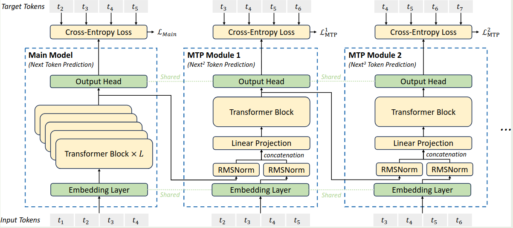
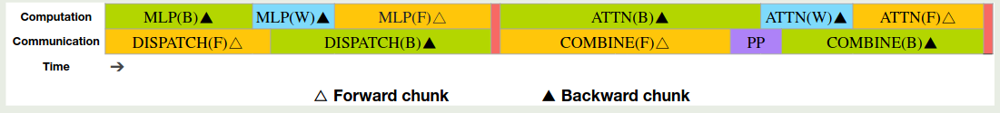
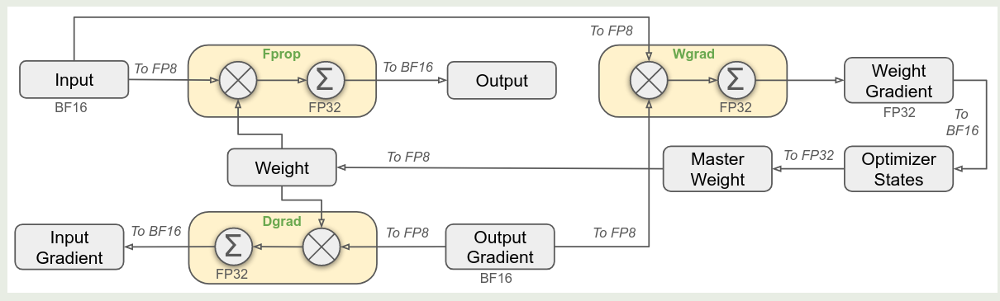
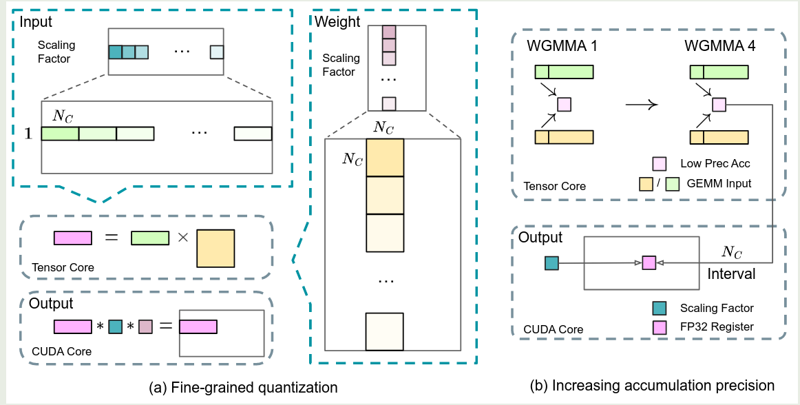
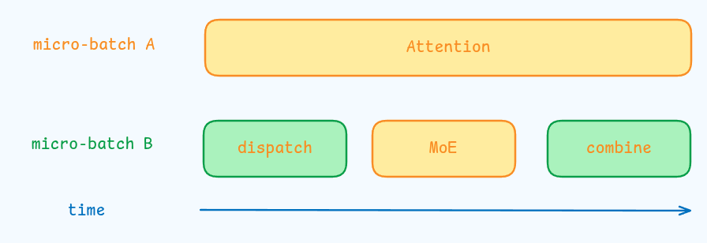
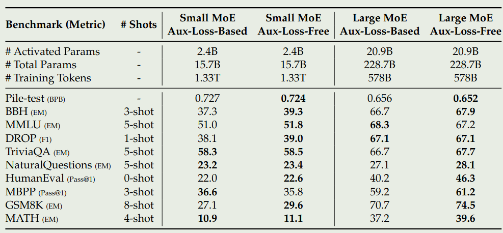
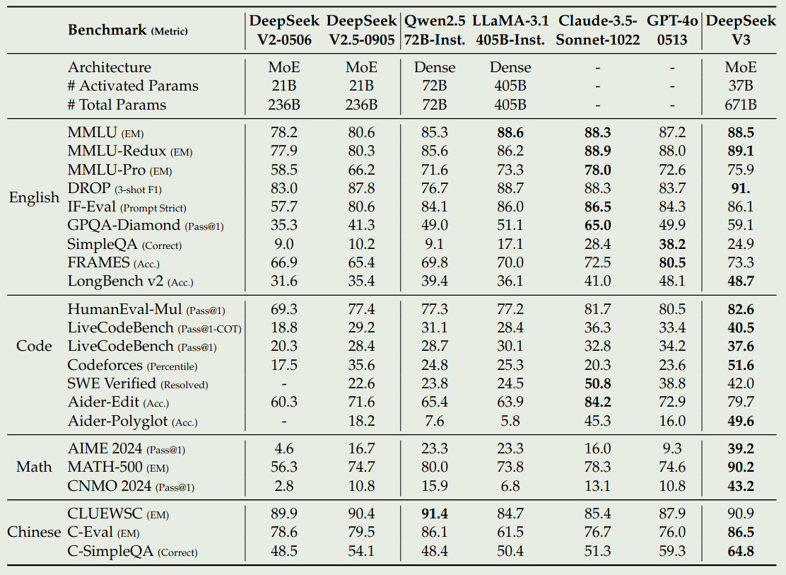

DeepSeek 在 24 年 11 月发布了 DeepSeek-V3, 一个仅花费 2.8M H800 hours 的大语言模型，且在各个 benchmark 上达到了 SOTA 表现

## Introduction

作者在本文中提出了 DeepSeek-V3, 一个 671B-A37B 的 MoE 大语言模型。

在训练目标和架构上，作者做了如下改进：

1. efficiency inference: 采用了 [DeepSeek-V2](https://maosong.website/p/notes-on-deepseek-v2/) 提出的 [MLA](https://maosong.website/p/notes-on-mla/)
2. cost-effective training: 采用了 [DeepSeekMoE](https://maosong.website/p/notes-on-deepseekmoe/) 提出了 MoE 架构
3. auxiliary-loss-free strategy: 采用了 [Loss-Free Balancing](https://maosong.website/p/notes-on-loss-free-balancing/) 提出的 loss balancing 策略
4. multi-token prediction: 采用了 MTP 的训练目标来提升模型的表现

在训练上，作者做了如下改进：

1. 使用了 FP8 混合精度进行训练并验证了其在大规模模型上的有效性
2. 作者构建了 DualPipe 算法用于高效的 pipeline parallelism
3. 构建了 cross-node all-to-all communication kernel 来高效使用 InfiniBand 以及 NVLink bandwidth
4. 优化了 memory footprint, 来避免使用 tensor parallelism

预训练阶段，DeepSeek-V3 使用了**14.8T** token. 在 mid-training 阶段，作者将模型的上下文长度由 8K 扩展到 32K, 再扩展到 128K.

后训练阶段，作者使用了 SFT 和 RL 两个阶段来提高模型的表现，作者还对 [DeepSeek-R1](https://maosong.website/p/notes-on-deepseek-r1/) 进行蒸馏来提高模型的 reasoning 能力

## Architecture

### Basic Architecture

DeepSeek-V3 的架构与 [DeepSeek-V2](https://maosong.website/p/notes-on-deepseek-v2/) 的架构一致，如下图所示


MLA 的介绍见 [MLA](https://maosong.website/p/notes-on-mla/), MoE 架构的介绍见 [DeepSeekMoE](https://maosong.website/p/notes-on-deepseekmoe/). DeepSeek-V3 在 DeepSeekMoE 的基础上做了两点改变：

1. 受 [Loss-Free Balancing](https://maosong.website/p/notes-on-loss-free-balancing/) 启发，作者使用了 sigmoid fu nction 来计算 affinity score
2. 对于 selected affinity score 应用了 normalization

在 [DeepSeekMoE](https://maosong.website/p/notes-on-deepseekmoe/) 的基础上，作者使用了 [Loss-Free Balancing](https://maosong.website/p/notes-on-loss-free-balancing/). 其表达式如下

$$
g_{i,t} = \begin{cases}
s_{i,t}, & s_{i,t}+b_i\in\mathrm{Topk}(\{s_{i,j}+b_j\mid 1\leq j\leq N\}, K)\\
0, &\text{otherwise}
\end{cases}
$$

其中 $b_i$ 仅影响 routing, 训练时，如果对应的 expert 负载不均衡，则对 $b_i$ 进行更新，更新方式为增加/减少 $\gamma$, 这里 $\gamma$ 是一个超参数

为了提高 routing 在 sequence 层面的负载均衡，作者还是用了一个 complementary sequence-wise balance loss:

$$
\begin{aligned}
\mathcal{L}_{\mathrm{Bal}} &= \alpha\sum_{i=1}^{N_r} f_iP_i\\
f_i &= \frac{}{}\sum_{t=1}^T\mathbb{1}(s_{i,t}\in\mathrm{TopK}(\{s_{j,t}\mid 1\leq j \leq N_r\}, K_r))\\
s_{i,y}' &= \frac{s_{i,t}}{\sum_{j=1}^{N_r}s_{j,t}}\\
P_i &= \frac1T\sum_{t=1}^T s_{i,t}'
\end{aligned}
$$

其中 $\alpha$ 是 balance factor, 为超参数，$T$ 是 sequence length, 加入这个损失后，每个 sequence 上的负载会变得更加均衡

与 [DeepSeekMoE](https://maosong.website/p/notes-on-deepseekmoe/) 一样，作者也在 node 层面实现负载均衡，具体做法就是，根据 node 中所包含 expert 的 affinity score 之和来选取最高的 $M$ 个 nodes, 这样就可以进一步提高 computation 和 communication 之间的 overlap.

由于 DeepSeek-V3 负载均衡比较好，因此作者使用了 no token-dropping strategy.

### MTP

受 MTP 启发，DeepSeek-V3 也构建了 MTP 模块，作者认为 MTP 模块有两个优势：

1. MTP objective 提供了更多的学习信号，进而提高了数据使用效率
2. MTP 可以让模型更好预测未来的 token

与 MTP 不同，DeepSeek-V3 【todo】, DeepSeek-V3 所使用的 MTP 模块架构图如下所示



MTP 模块使用了 $D$ sequential modules 来预测未来的 $D$ 个 token. 其中，第 $k$ 个 MTP 模块包含一个共享的 embedding layer $\mathrm{Emb}(\cdot)$ , 一个共享的 output head $\mathrm{OutHead}(\cdot)$, 一个 transformer block $\mathrm{TRM}_k(\cdot)$ 和一个 projection matrix $M_k\in\mathbb{R}^{d\times 2d}$.

对于第 $i$ 个 token 以及第 $k$ 个 MTP 模块，作者首先将第 $k-1$ 个 MTP 模块的第 $i$ 个 token 的 hidden states $h_i^{k-1}\in\mathbb{R}^d$ 和第 $i+k$ 个 token 的 embedding $\mathrm{Emb}(t_{i+1})\in\mathbb{R}^d$ 联合在一起

$$
h_i'^{k}=M_k[\mathrm{RMSNorm(h_{i}^{k-1});\mathrm{RMSNorm(\mathrm{Emb}(t_{i+k}))}}]
$$

其中 $[\cdot;\cdot]$ 代表 concatenation 操作。当 $k=1$ 时，$h_{i}^{k-1}$ 就代表了 main model 的输出。每个 MTP 模块的 embedding layer 和 main model 的 embedding layer 是共享的，接下来， $h_i'^k$ 作为第 $k$ 个 MTP 模块 transformer block 的输入，得到

$$
h_{i}^k = \mathrm{TRM}_k(h_{i}'^l)
$$

最后，共享的 output head 输出对应的概率分布：

$$
P_{i+k+1}^k = \mathrm{OutHead}(h_i^k)
$$

这里的 $\mathrm{OutHead}(\cdot)$ 的权重与 main model 也是共享的。作者这里提到，所使用的思想与 EAGLE 是类似的，但是不同的地方在于，EAGLE 主要是用于 speculative decoding, 而 MTP 主要用于提升训练。

MTP 的训练目标为未来 $T-k-1$ 个 token 的 cross-entropy loss:

$$
\mathcal{L}_{\mathrm{MTP}}^k = \mathrm{CrossEntropy}(P_{2+k:T+1}^k,t_{2+k:T+1}) = -\frac1T\sum_{t=k+2}^{T+1}\log P_i^k[t_i],
$$

其中 $T$ 是 sequence length, $t_i$ 是第 $i$ 个位置对应的 ground truth token, $P_i^k[t_i]$ 代表低 $k$ 个 MTP 模块给出的 $t_i$ 的预测概率。最后，作者对所有的 MTP loss 进行求和，得到

$$
\mathcal{L}_{\mathrm{MTP}} = \frac{\lambda}{D}\sum_{k=1}^D \mathcal{L}_{\mathrm{MTP}}^k.
$$

## Infra

DeepSeek-V3 训练使用了 2048 张 H800, 每个 node 包含 8 张 GPU, node 内部使用 NVLink 和 NVSwitch 进行连接，node 之间使用 InfiniBand 进行连接

与之前的 DeepSeek 系列相同，DeepSeek-V3 也是用了 HAI-LLM 框架来支持训练。训练时，DeepSeek-V3 使用了 16-way PP, 64-way EP (spanning 8 nodes, [GShard](https://maosong.website/p/gshard/)) 以及 ZeRO-1 DP.

作者主要进行了三点优化：

1. 构建了 DualPipe 用于高效 pipeline parallelism
2. 构建了 cross-node all-to-all communication kernels 来高效利用 IB 以及 NVLink bandwidth
3. 优化了训练时的 memory footprint, 使得训练时不再依赖 TP

### Training Framework

#### DualPipe

DeepSeek-V3 中，由于 cross-node EP, computation-to-communication ratio 近似为 1:1, 为了解决这个问题，作者提出了 DualPipe. DualPipe 的核心思想是将 forward 和 backward 过程中的 computation 以及 communication 进行重叠。与 ZeroBubble 类似，作者将每个 chunk 分为四个部分：attention, all-to-all dispatch, MLP 以及 all-to-all combine.  对于 attention 和 MLP, 作者还进一步将 backward 拆分为 针对权重和输入的 backward. 其示意图如下所示，这里橙色部分代表 forward, 绿色代表了针对输入的 backward, 蓝色代表了针对权重的 backward



示意图里包含两个 block, 我们记为 block1, block2, 前向计算过程为

```
dispatch(F, block1) -> MLP(F, block1) -> combine(F, block1) -> attention(F, block2)
```

其中，`dispatch(F, block1)` 与 MLP 的反向传播 `MLP(B, block1)` 计算重叠, `MLP(F, block1)` 与 MLP 反向传播的 dispatch  `dispatch(B, block1)` 通信重叠，`combine(F, block1)` 与 attention 反向传播的 `attention(B, block2)` 重叠，`attention(F, block2)` 与反向传播的 combine `combine(block2)` 重叠。下面是一个具体的例子


作者进一步对比了 DualPipe, 1F1B 和 ZeroBubble, 结果如下表所示

| Method          | Bubble                        | Parameter | Activation |
| --------------- | ----------------------------- | --------- | ---------- |
| 1F1B            | $(PP-1)(F+B)$                 | $1\times$ | $PP$       |
| ZB1P            | $(PP-1)(F+B-2W)$              | $1\times$ | $PP$       |
| DualPipe (Ours) | $(\frac{PP}{2}-1)(F\&B+B-3W)$ | $2\times$ | $PP+1$     |

这里 $F$ 是 forward chunk 的执行时间，$B$ 是 backward chunk 执行的时间，$W$ 是一个 chunk "backward for weights" 的执行时间，$F\&B$ 是一个 chunk 前向反向传播重叠的时间。可以看到，DualPipe 只使用了额外的 $1/PP$ 倍的 peak activation memory, 就大幅度降低了 bubble 时间

#### Cross-node All-to-all Communication

作者针对 DualPipe 构建了 cross-node all-to-all communication kernels 来提高通信效率。

作者提到，跨节点通信使用的是 IB, 节点内部通信使用的是 NVLink， 通信方式如下图所示。


对于 H800 来说,NVLink 的带宽为 160GB/s, IB 的带宽为 50GB/s, 因此 NVLInk 的通信效率是 IB 的 3.2 倍，即节点内部通信效率高于节点之间的通信效率。为了提高通信效率，作者限制每个 token 只能被分发到至多 4 个节点上（[DeepSeek-V2](https://maosong.website/p/notes-on-deepseek-v2/) 里提到的 device limited routing）。其具体通信方式为想传输到目标 node index 相同的 rank 上，然后再通过节点内部通信传输到目标的 rank 上。通过这种方式，我们可以让节点间通信与节点内部通信进行重叠，从而每个 token 可以从一个节点上选取 3.2 个专家，这样 DeepSeek-V3 可以在不损失效率的情况下最高选取 $13$ 个专家。

作者进一步采用了 warp specialization 技巧来将 20 个 SM 划分为 10 个通信 channel. 作者分别针对 dispatching 和 combing 阶段使用了不同数量的 warps.

#### Memory saving

作者使用了如下技巧来减少内存访问：

1. Recomputation of RMSNorm and MLA Up-Projection. 在 backward 过程中重新计算 RMSNorm operation 以及 MLA up projection 来避免存储器对应的输出
2. Exponential Moving Average in CPU. 作者将 EMA 参数保存在 CPU 中，然后进行异步更新来进一步减少内存访问
3. Shared Embedding and Output Head for Multi-Token Prediction. 作者将 embedding layer 和 output head 放在一个 PP rank 上，这样就可以提高 MTP 的内存访问效率

### FP8 Training

作者提出了一个基于 FP8 的混合精度训练框架。作者提出了两个改进方案：

1. 分组量化，将 tensor 按照 tile 分组或者按照 block 分组来分组量化，这样就避免了全局量化的精度损失
2. 高精度累加，作者在乘法计算时，使用了 FP8 格式，然后在累加阶段，使用了更高精度的格式

为了进一步减少内存和通信开销，对于 activation 的 cache 以及 dispatch, 作者使用了 FP8 数据格式，然后对于优化器状态，作者使用了 BF16 数据格式。下面是对上面改进的具体说明。

#### Mixed Precision Training

作者在本文中提出了使用 FP8 混合精度进行预训练，作者参考了 low precision training 构建 FP8 训练框架，即计算量高的使用 FP8 精度，计算量低的使用原本的数据精度, 框架如下图所示



其中各个模块使用的精度如下表所示

| Precision        | Modules                                                                                                                                                 |
| ---------------- | ------------------------------------------------------------------------------------------------------------------------------------------------------- |
| FP8              | Linear (Fprop, Dgrad, Wgrad)                                                                                                                            |
| higher precision | - embedding<br>- output head<br>- Moe gating<br>- normalization<br>- attention operator<br>- master weights<br>- weight gradients<br>- optimizer states |

#### Enhancing Low-precision Training Accuracy

作者介绍了几个策略用于提高 FP8 混合精度训练的表现：



1. fine-grained quantization: 对于激活值，作者将 tensor 分割为 $1\times 128$ 大小的 groups, 然后每个 group 内部进行 quantization; 对于权重，作者将其分割为 $128\times 128$ 大小的 groups, 然后进行 quantization, 这样可以降低 quantization error, 如上图左图所示
2. increasing accumulation precision: 低精度训练会带来 underflow 的问题，而 FP8 GEMM 累加仅能保留约 14bit 精度，远低于 FP32 的 32bit 精度。为了解决这个问题，作者采用了 Tensor Core 不分累加 +CUDA core 高精度聚合的协同策略。即在 Tensor Core 上执行 MMA 指令时，先按照 14bit 精度对 $N_C$ 个元素进行累加，当达到 $N_C$ 时，作者将结果复制到 CUDA core 的 FP32 寄存器中，在 FP32 精度下完成累加。过程如上图右图所示
3. Mantissa over exponents. 与之前的工作不同，作者使用了 E4M3 的数据格式来达到更高的精度
4. Online Quantization. 为了降低 quantization 的误差，作者实时计算了 activation block 以及 weight block 的最大绝对值来导出 scaling factor 并量化为 FP8 精度

#### Low Precision Storage and Communication

作者通过压缩 cached activation 和 optimizer states 来进一步减少内存访问以及通信访问次数

- Low-precision optimizer states: 对于 optimizer states, 作者使用了 BF16 数据格式来保存 [AdamW](https://maosong.website/p/notes-on-adamw/) 的优化器的一阶和二阶动量，但是对于 master weight 和 gradients 作者仍然使用了 FP32 来保证训练的数值稳定性
- Low-Precision Activation: 对于 linear operator, 作者将其 cache activation 使用 FP8 格式进行存储，对于 attention 的输出，作者使用了 E5M6 数据格式来存储 activations, 这些 activations 的 tile size 为 $1\times 128$, 作者还是用了 2 的幂次作为 scale factor 来减少 quantizationerror; 对于 SwiGLU, 作者将其输入也保存为 FP8 的数据格式来降低内存消耗
- Low-Precision Communication: 在 MoE up-projection 之前，作者将 attention 的输出量化为 FP8 数据格式再执行 dispatch 操作，这样可以降低通信开销。在反向传播的时候同理，先进行 FP8 量化，然后再进行反向 dispatch. 对于 combine 阶段，为了避免精度损失，作者还是使用了 BF16 数据格式

作者对比了 FP8 和 BF16 精度训练，结果如下图所示


实验结果显示，FP8 混合精度训练的损失降低不足 $0.25\%$.

### Inference and Deployment

作者在 H800 集群上部署 DeepSeek-V3, 作者分别针对 prefilling 和 decoding 两个阶段进行了优化

#### Prefilling

prefilling 阶段在 4 节点 32 GPU 上进行，并行策略如下

| 模块        | 并行策略                   | 说明              |
| --------- | ---------------------- | --------------- |
| Dense MLP | 1-wat TP               | 减少 TP 通信        |
| Attention | 4-way TP, SP, 8-way DP | SP 用于长文本处理      |
| MoE       | 32-way EP              | 每个 GPU 包含 8 个专家 |

为了实现负载均衡，作者提出了**redundant experts**的策略，具体就是将负载比较高的专家进行复制。模型会周期性进行统计，然后计算出负载比较高的专家，接下来每个 GPU 除了原来的 8 个专家之外，还会 host 一个额外的 redundant expert.

为了提高 throughput, 作者同时处理两个 micro-batch, 来重叠 attention, MoE 和 dispatch, combine 通信，如下图所示


作者还探索了 dynamic redundancy 策略，即每个 GPU host 更多的专家（比如 16 个）然后 inference 的每一步仅激活其中的 9 个，在进行 all-to-all operation 时，作者首先进行 global optimal routing 来计算最合适的专家。作者认为 prefilling 计算量很大，因此 routing 的计算量可以忽略不计

#### Decoding

在 decoding 阶段，作者在 40 个节点 320 GPU 上进行部署，并行策略如下

| 模块        | 并行策略                    | 说明              |
| --------- | ----------------------- | --------------- |
| Attention | 4-way TP, SP, 80-way DP | SP 用于长文本处理      |
| MoE       | 320-way EP              | 每个 GPU 包含 8 个专家 |

这个阶段，每个 GPU 只 host 一个专家，64 个 GPU 负责 host redundant expert 以及 shared expert. 作者通过在 IB 上直接进行 P2P 的传输来降低通信的开销，作者还是用了 IBGDA 来进一步最小化 latency 以及提高通信效率

在这个阶段，attention 的计算占据了大部分时间，因此，作者采取了如下的 overlap 策略



由于 decoding 阶段一般 batch size 比较小，因此整个 decoding 的瓶颈在于 memory access, 因此为了避免影响 attention 的计算效率，作者仅安排一小部分 SM 用于 dispatch-MoE-combine.

### Suggestions on Hardware Design

#### Communication Hardware

尽管作者将计算与通信重叠来提高训练效率，但是已有的通信仍然依赖于 SM, 这样限制了计算的效率。作者希望工能够构建专门针对通信的设备，另一方面，作者希望统一 IB 和 NVLink 来降低实现难度

#### Computation Hardware

1. 提升 FP8 GEMM 的累加精度，当前精度只有 14bit, 作者希望能够在 GPU 设计上进行改进，将这个精度提升到 34-bit
2. 支持 tile 以及 block 层面的 quantization, 尽管前文作者已经设计出了改进的算法，但是 Tensor Core 以及 CUDA 之前平凡的数据移动降低了计算效率，作者希望未来能够支持细粒度的 quantization
3. online quantization, 作者希望将 FP8 cast 以及 TMA 结合在一起，从而 quantization 可以在传输的时候完成计算，减少了内存读写。作者还建议使用 warp-level cast instruction
4. Transposed GEMM operations. 本文中，矩阵被切分为不同的 tiles, 在计算的时候需要先加载这些 tiles 然后进行 dequantization, transpose 等操作，作者希望未来能够直接支持 transposed reads of matrices

## Pre-training

### Pre-training Data

相比于 [DeepSeek-V2](https://maosong.website/p/notes-on-deepseek-v2/), DeepSeek-V3 提升了数学和代码数据的比例，以及增加了多语种数据。最终训练数据一共包括 **14.8T**

作者还使用了 DeepSeekCoder-V2 里应用的 Fill in the middle 策略来让模型基于上下文越策中间的文本，对应的数据格式如下

```
<|fim_begin|>f_pre<|fim_hole|>f_suf<|fim_hole|>f_middle<|fim_end|>
```

这个结构与 sequence packing 结合在一起。

Tokenizer 基于 BBPE, 大小为 128K tokens. 在训练时，作者将随机一部分 combine token 进行切分来减少 token boundary bias 问题

### Hyper-parameters

模型参数如下表所示，最终 DeepSeek-V3 拥有 671B 总参数，激活参数为 37B

| variable                         | notation  | value |
| -------------------------------- | --------- | ----- |
| layers                           | $\ell$    | 61    |
| dense layers                     | -         | 3     |
| hidden dimension                 | $d$       | 7168  |
| num of attention heads           | $n_h$     | 128   |
| head dimension                   | $d_h$     | 128   |
| KV compression dimension         | $d_c$     | 512   |
| query compression dimension      | $d_c'$    | 1536  |
| decouple query and key dimension | $d_h^R$   | 64    |
| routed expert                    | $N_r$     | 256   |
| shared expert                    | $N_s$     | 1     |
| MoE hidden dimension             | $d_{MoE}$ | 2048  |
| activated experts                | $K$       | 8     |
| limited node routing             | $M$       | 4     |
| MTP depth                        | $D$       | 1     |

训练时，作者使用了 learning rate scheduling, batch size scheduling 等方法。对于 PP, routed expert 会均匀分布为 8node 对应的 64 个 GPU 上，预训练时模型的上下文长度为 4k

### Long Context Extension

作者使用了 [YARN](https://maosong.website/p/notes-on-yarn/) 来扩展模型的上下文长度，模型上下文长度经过两个额外的训练阶段从 4K 扩展到 32K 再扩展到 128K, 均训练了 1000 步。

YARN 配置与 [DeepSeek-V2](https://maosong.website/p/notes-on-deepseek-v2/) 基本一致，在额外的 decoupled query and key 上作者没有应用这一点。参数配置如下表

| parameter | $s$ | $\alpha$ | $\beta$ | $\sqrt{t}$   |
| --------- | --- | -------- | ------- | ------------ |
| value     | 40  | 1        | 32      | $0.1\ln s+1$ |

第一阶段的上下文长度为 32K, batch size 为 1920, 第二个阶段的上下文长度为 128K, batch size 为 480.

### Performance

DeepSeek-V3 base 的表现下图所示，作者对比了 [DeepSeek-V2](https://maosong.website/p/notes-on-deepseek-v2/), [Qwen2.5](https://maosong.website/p/notes-on-qwen2.5/), [LLaMA 3.1](LLaMA%203.1)


### Discussion

作者首先验证了 MTP 的有效性，结果如下图所示


可以看到，在模型架构相同，训练数据相同的情况下，1-MTP 的效果超过了 baseline 的表现，说明了 MTP 策略的有效性

接下来，作者还验证了 [Loss-Free Balancing](https://maosong.website/p/notes-on-loss-free-balancing/) 的有效性，结果如下图所示



可以看到，loss-free Balancing 的效果比 loss balancing 的效果更好

接下来，作者对比了 loss-free balancing 和 sequence-wise auxiliary loss, 即 batch-wise v.s. sequence-wise. 作者认为，前者的约束更灵活，因为其不要求 in-domain balance. 作者在测试集上进行可视化，结果如下图所示


实验结果发现，loss-free 策略对应的 expert specialization 更强。作者进一步设计了一个 batch-wise auxiliary loss 来实现 batch-wise load balance, 结果发现，这种策略也能达到和 loss-free balancing 一样的效果，这说明了 batch-wise load balancing 效果更好

最后，作者提了两点 loss-free 策略的问题：

1. 在特定的 sequence 或者小 batch 里出现负载不均衡。作者通通过增大 batch size 来解决这个问题
2. 在推理阶段因为 domain-shift 导致的负载不均衡。作者实现了一个基于 redundant expert 的推理框架来解决这个问题

## Post-training

### SFT

post-training 包含 1.5M 样本，数据包括 reasoning 数据以及 non-reasoning 数据，前者由 [DeepSeek-R1](https://maosong.website/p/notes-on-deepseek-r1/) 合成，后者由 DeepSeek-V2.5 合成

SFT 时，作者训练了两个 epoch, 使用了 sequence packing 技巧

### RL

Reward model 包含 rule-based reward model 和 model-based reward model.

RL 训练使用的算法为 GRPO

### Post-training Performance



### Post-training Discussion

作者首先探究了 Distillation 对模型表现的影响，作者使用 [DeepSeek-R1](https://maosong.website/p/notes-on-deepseek-r1/) 来蒸馏 DeepSeek-V2.5, 结果如下图所示

| Model                     | LiveCodeBench-CoT |        | MATH-500 |        |
| ------------------------- | ----------------- | ------ | -------- | ------ |
|                           | Pass@1            | Length | Pass@1   | Length |
| DeepSeek-V2.5 Baseline    | 31.1              | 718    | 74.6     | 769    |
| DeepSeek-V2.5 +R1 Distill | 37.4              | 783    | 83.2     | 1510   |

可以看到，distillation 可以显著提高模型的表现。但是其问题在于也会让模型输出的长度增加。作者认为知识蒸馏是 post-training optimization 的一个重要方向。

接下来，作者讨论了 self-rewarding, 具体做法就是使用 DeepSeek-V3 来对评估结果进行投票，结果发现最终的效果很好，作者认为 LLM 可以很好地将非结构化信息转换为 rewards.

最后，作者讨论了 MTP. MTP 可以于 speculative decoding 结合，进一步提高 decoding 的速度。通过实验作者发现，second token prediction 的接受率在 $85\%\sim 90\%$ 之间，说明了其有效性。

## Conclusion

在本文中，作者提出了 DeepSeek-V3, 一个 671B-A37B 的 MoE 大语言模型，训练 token 数为 **14.8T**. 作者使用了 loss-free-balancing strategy 来实现负载均衡。训练时作者使用了 FP8 混合精度。评估发现 DeepSeek-V3 的达到了 SOTA 表现。

作者认为，DeepSeek-V3 model size 太大，不适合部署。第二，部署策略需要进一步改进。

最后，作者认为未来工作有以下几点：

1. 改进模型架构，进一步提高训练以及推理效率，扩展模型的上下文
2. 提升训练数据的数量和质量
3. 提高模型的 reasoning 能力
4. 更详尽的评估

## References

- [Arxiv](http://arxiv.org/abs/2412.19437)
