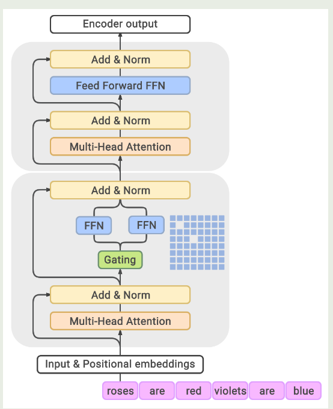
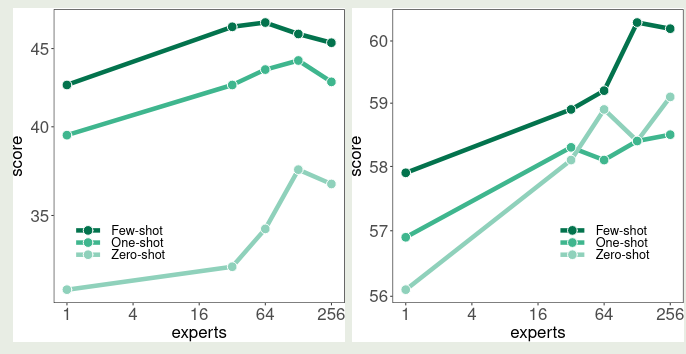

Google 在 2022 年 8 提出了 GLaM，一个基于 MoE 架构的大语言模型系列，模型超过了 GPT-3 的表现

## Introduction

作者在本文中证明了基于 MoE 架构的大语言模型可以达到与 dense 模型相同的性能，且计算更加高效。作者构建了 GLaM 大语言模型系列，包括 1.9B-A0.1B, 105B-A1.9B, 143B-A9.8B 以及 1.2T-A96.6B 等模型，尽管只激活了不到 $8\%$ 的参数，模型的 zero-shot, one-shot 和 few-shot 表现均超过了 GPT-3.

作者认为，在相同的算力下，MoE 模型比 dense 模型的表现更好，MoE 模型是一个非常具有前景的方向。

## Method

训练数据集包括 1.6T token, 具体分布如下表所示

| Dataset           | Tokens (B) | Weight in mixture |
| ----------------- | ---------- | ----------------- |
| Filtered Webpages | 143        | 0.42              |
| Wikipedia         | 3          | 0.06              |
| Conversations     | 174        | 0.28              |
| Forums            | 247        | 0.02              |
| Books             | 390        | 0.20              |
| News              | 650        | 0.02              |

模型架构如下图所示

GLaM 的模型架构与 [GShard](https://maosong.website/p/gshard/) 基本相同，作者将 transformer block 按照两个为一组，一组中一个 block 为 dense FFN, 另一个为 MoE layer, 交替进行。MoE layer 中，总专家个数为 64 个，激活专家个数为 2 个。

模型配置如下表所示

| GLaM Model | Type  | $n_{\text{params}}$ | $n_{\text{act-params}}$ | $L$ | $M$   | $H$    | $n_{\text{heads}}$ | $d_{\text{head}}$ | $E$ |     |
| ---------- | ----- | ------------------- | ----------------------- | --- | ----- | ------ | ------------------ | ----------------- | --- | --- |
| 0.1B       | Dense | 130M                | 130M                    | 12  | 768   | 3,072  | 12                 | 64                | $-$ |     |
| 0.1B/64E   | MoE   | 1.9B                | 145M                    | 12  | 768   | 3,072  | 12                 | 64                | 64  |     |
| 1.7B       | Dense | 1.7B                | 1.700B                  |     |       |        |                    |                   | $-$ |     |
| 1.7B/32E   | MoE   | 20B                 | 1.878B                  |     |       |        |                    |                   | 32  |     |
| 1.7B/64E   | MoE   | 27B                 | 1.879B                  | 24  | 2,048 | 8,192  | 16                 | 128               | 64  |     |
| 1.7B/128E  | MoE   | 53B                 | 1.881B                  |     |       |        |                    |                   | 128 |     |
| 1.7B/256E  | MoE   | 105B                | 1.886B                  |     |       |        |                    |                   | 256 |     |
| 8B         | Dense | 8.7B                | 8.7B                    | 32  | 4,096 | 16,384 | 32                 | 128               | $-$ |     |
| 8B/64E     | MoE   | 143B                | 9.8B                    | 32  | 4,096 | 16,384 | 32                 | 128               | 64  |     |
| 137B       | Dense | 137B                | 137B                    | 64  | 8,192 | 65,536 | 128                | 128               | $-$ |     |
| 64B/64E    | MoE   | 1.2T                | 96.6B                   | 64  | 8,192 | 32,768 | 128                | 128               | 64  |     |

作者用 GLaM(8B/64E) 来表示一个 8B 参数的 dense model 中每隔一层被转换为 MoE layer

## Experiments

训练时，作者设置模型的上下文为 1024 token, batch size 为 1M, 优化器为 Adafactor, 作者还使用了 [GShard](https://maosong.website/p/gshard/) 中提出来的 load balancing loss, tokenizer 为 SentencePiece

GLaM 与 GPT-3 的对比如下表所示

|                     |                    | GPT-3 | GLAM     | relative |
| ------------------- | ------------------ | ----- | -------- | -------- |
| cost                | FLOPs / token (G)  | 350   | **180**  | -48.6%   |
|                     | Train energy (MWh) | 1287  | **456**  | -64.6%   |
| accuracy on average | Zero-shot          | 56.9  | **62.7** | +10.2%   |
|                     | One-shot           | 61.6  | **65.5** | +6.3%    |
|                     | Few-shot           | 65.2  | **68.1** | +4.4%    |

实验结果显示，GLaM 的训练效率更高，且表现更好

作者还探究了提升 expert 个数对最终表现的影响，结果如下图所示

可以看到，随着专家个数提升，模型的表现逐渐增强，但是当专家个数超过 64 个之后，模型的表现反而有所下降。

## Conclusion

作者在本文中提出了 GLaM 大语言模型系列，验证了 MoE 模型的有效性和效率，结果发现，MoE 模型可以在相同的算力下达到更好的表现，并且学习效率更高。

## References

- [arxiv](https://arxiv.org/abs/2112.06905)
