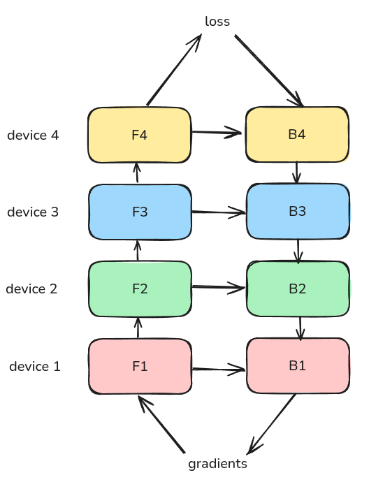
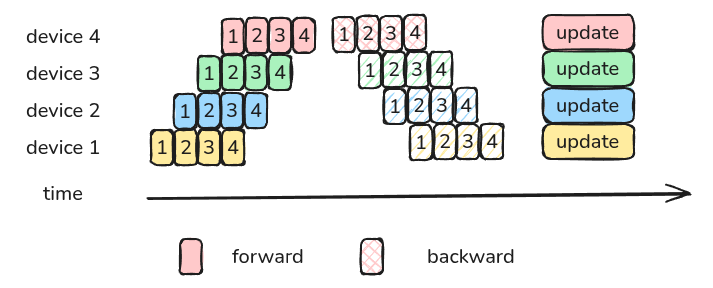
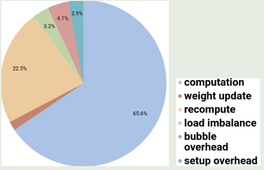

google 在 2018 年提出了 GPipe, 一个使用 pipeline parallelism 来训练大规模神经网络的并行策略

## Introduction

大规模神经网络已经在计算机视觉和自然语言处理等任务上取得了突破性进展。但是目前训练大规模神经网络存在的问题时，我们无法在单一 GPU 上训练我们的模型。基于多 GPU 训练模型需要考虑模型的切分以及通信优化。

为了解决这个问题，作者提出了 GPipe, 一个用于将大规模性模型分割部署到不同设备上的并行计算策略。

## Method

### Notation

作者首先定义 notation 如下表所示

| notation                      | description                 |
| ----------------------------- | --------------------------- |
| $L$                           | number of layers            |
| $w_i$                         | weights of a layer          |
| $f_i$                         | forward function of a layer |
| $F_k=f_j\circ\cdots\circ f_i$ | forward of a partition      |
| $B_k$                         | backward of a partition     |
| $K$                           | number of partitions        |
| $N$                           | batch size                  |
| $M$                           | micro batch size            |

### GPipe

首先是 naive pipeline parallelism (naive PP), 我们的输入为一个 batch, 然后我们依次计算 $F_1$, 通信传输，计算 $F_2$, 计算完成之后，我们再进行反向传播，更新参数。最后继续下一个 batch 的计算。

总体的过程如下图所示

下面是一个按照时间轴给出的例子

naive PP 的问题在于，每个时刻只有一个 GPU 在工作，GPU 的利用效率很低。因此，GPipe 的做法在于将一个 batch 切分为 $M$ 个更小的 micro-batch,  下面是一个 $M=4$ 的例子

通过切分更小的 batch，我们可以提高 GPU 的利用率

### Analysis

#### Bubble

接下来作者分析了 GPipe 的 bubble 情况，bubble 指的是 PP 过程中的 GPU idle time.

对于 naive PP 来说，一个 GPU 工作时，其余 GPU 都处于空闲状态，因此其 bubble 为

$$
T_{bubble} = (K-1)(F+B)
$$

总的计算时间为

$$
T_{total} = K(F+B)
$$

从而 bubble rate 为

$$
Bubble_{naive} = \frac{T_{bubble}}{T_{total}} = \frac{K-1}{K}
$$

当 $K=8$ 时，我们有 $Bubble_{naive}=87.5\%$, 也就是说，当前训练的 GPU 空闲率为 $87.5\%$.

对于 GPipe 来说，由于我们将一个 batch 拆分为了更小的 batch, 我们可以提高 GPU 的利用率。

此时，我们的 bubble time 仍然是 $T_{bubble} = (K-1)(F+B)$. 但是，现在同一时刻工作的 GPU 变多了，从上面的示意图可以看到，前向过程所需要的时间为第一个 micro batch 运行的时间加上 $M-1$ 个 batch 运行所需要的时间，反向同理，因此，GPipe 的总计算时间为

$$
T_{total} = (M+K-1)(F+B)
$$

从而 GPipe 的 bubble rate 为

$$
Bubble_{naive} = \frac{T_{bubble}}{T_{total}} = \frac{K-1}{M+K-1}
$$

当我们令 $M=8, K=8$ 时，我们有 $Bubble_{naive}=46.7\%$, 可以看到，通过提高 micro batch 数量，我们可以显著降低 bubble rate.

#### Activation Memory

对于 naive PP 来说，我们需要缓存每一层的输入，因此 activation memory 为 $\mathcal{O}(N\times L/K)$, 而使用 activation checkpointing 之后，我们现在的 activation memory 为

$$
\mathcal{O}(N + \frac{L}{K}\times\frac{N}{M})
$$

其中第一项代表了 boundary activation, 第二项代表了 Internal activation.

## Experiments

作者在 image classification, machine translation 任务上进行了实验。

作者还进一步分析了影响 GPipe 性能的因素，结果如下图所示

可以看到，activation checkpointing 是 GPipe 的主要开销来源。

## Conclusion

作者在本文中提出了 GPipe, 一个针对大规模神经网络训练的并行策略。通过将模型切分部署在不同的设备上以及使用 micro batch, 我们可以显著提高硬件的利用效率以及训练稳定性。

## References

- [GPipe: Efficient Training of Giant Neural Networks using Pipeline Parallelism](https://arxiv.org/abs/1811.06965)
- [Pipeline-Parallelism: Distributed Training via Model Partitioning](https://siboehm.com/articles/22/pipeline-parallel-training)
