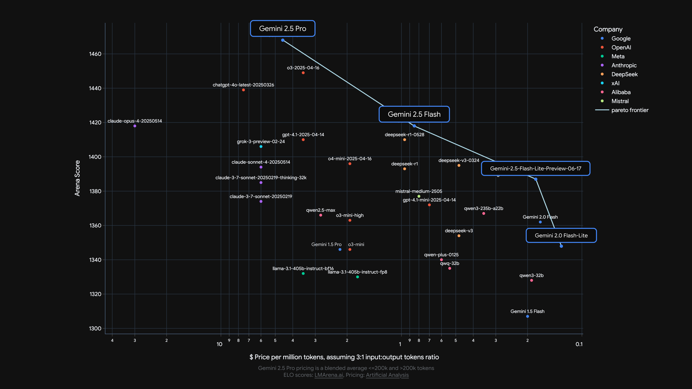
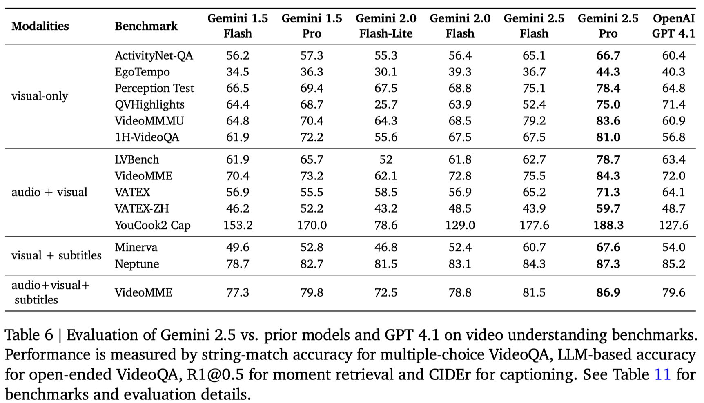

## 介绍

DeepMind 在 6 月 17 号发布了 Gemini2.x 系列的技术报告，包括

- Gemini 2.5 Pro
- Gemini 2.5 Flash
- Gemini 2.0 Flash (earlier)
- Gemini 2.0 Flash-Lite (earlier)

技术报告简单说了一些技术细节，主要还是模型的评估

> 注：Gemini 2.0 Flash 和 Gemini 2.0 Flash-Lite 将要被 Gemini 2.5 Flash 和 Gemini 2.5 Flash-Lite 取缔，见最新的 blog

Gemini2.x 系列亮点：

1. 领先的 coding 和 reasoning 能力
2. 超过 1M 的上下文，可以处理超过 3 个小时的 video
3. 集成 long context, multimodal 和 reasoning 三种能力的 agentic workflow 能力

模型能力对比

| Model              | Gemini 1.5 Flash          | Gemini 1.5 Pro            | Gemini 2.0 Flash-Lite     | Gemini 2.0 Flash          | Gemini 2.5 Flash          | Gemini 2.5 Pro            |
| ------------------ | ------------------------- | ------------------------- | ------------------------- | ------------------------- | ------------------------- | ------------------------- |
| Input Modalities   | Text, Image, Video, Audio | Text, Image, Video, Audio | Text, Image, Video, Audio | Text, Image, Video, Audio | Text, Image, Video, Audio | Text, Image, Video, Audio |
| Input length       | 1M                        | 2M                        | 1M                        | 1M                        | 1M                        | 1M                        |
| Output modalities  | Text                      | Text                      | Text                      | Text, Image*              | Text, Audio*              | Text, Audio               |
| Output length      | 8K                        | 8K                        | 8K                        | 8K                        | 64K                       | 64K                       |
| Thinking           | No                        | No                        | No                        | Yes                       | Dynamic                   | Dynamic                   |
| Supports tool use? | No                        | No                        | No                        | Yes                       | Yes                       | Yes                       |
| Knowledge cutoff   | November 2023             | November 2023             | June 2024                 | June 2024                 | January 2025              | January 2025              |

模型场景使用对比

| Model    | Gemini 2.5 Flash-Lite | Gemini 2.5 Flash | Gemini 2.5          |
| -------- | --------------------- | ---------------- | ------------------- |
| Thinking | No                    | Yes              | Yes                 |
| 使用场景     | 大规模调用                 | 日常使用             | coding 或者 reasoning 人物 |
| 速度       | 非常快                   | 快                | 一半                  |
| 表现       | 一半                    | 强                | 非常强                 |
| 输入价格     | 0.1                   | 0.3              | 1.25                |
| 输出价格     | 0.4                   | 2.5              | 10                  |

模型表现

模型吞吐量对比

## 架构，数据与训练

### 架构

Gemini2.5 是一个**基于 MoE 的 transformer 架构**，支持 text, vision, audio 模态

Flash 系列使用的是知识蒸馏的方法训练得到的，训练时使用了 $k$-sparse 的策略，也就是只保留教师模型输出概率最高的 $k$ 的词以及对应的概率。作者认为知识蒸馏可以有效提高小模型的能力。

### Infra

Gemini 系列在 TPUv5p 的架构上进行训练。作者主要提了两点：

1. Slice-Granularity Elasticity：可以在部分 TPU 出现故障时快速切换并继续训练
2. Split-Phase SDC detection：通过轻量级重放和校验机制，在几分钟内就能识别出有问题的硬件设备

### Post-training

post-training 包含 SFT，reward model 以及 RL 的训练。

在 RL 阶段，奖励来自 verifiable rewards 和 model-based generative rewards

### 能力提升

技术报告提到了几个方面能力的提升

**code**
pre-training 阶段，加入了大量的代码数据，作者还评估了代码数据的质量
post-training 阶段，作者基于 reasoning 能力构建了一系列的工程任务，来提高模型解决问题的能力

**Factuality**
通过 search 和 tool use，reason about output 以及 issue follow-up queries 来验证 factual accuracy

**Multilinguality**
预训练时使用了 400 多种语言的语料进行训练

**Audio**
训练模型完成 audio generation 任务，生成的时候使用了**causal audio representation**，训练数据覆盖了 200 多种语言

**Video**
通过降低每帧视频对应的 visual token 个数（258-> 66），来让模型可以处理 3 个小时的视频

## Evaluation

对比了 Claude_4, o3, [DeepSeek-R1](https://maosong.website/p/notes-on-deepseek-r1/) 和 Grok-1

## Conclusion

结论里作者主要提到了两点

1. 模型能力的提升已经超过了 benchmark 的构建速度和成本
2. 未来如何设计经济的，覆盖广的，能动态调整难度的 benchmark 是一个关键问题

技术报告中作者还提到了 Gemini Plays Pokemon 的 case study，作者提到了两点问题：

1. 作者发模型对视觉信息的依赖程度并不是很高
2. 尽管模型上下文长度超过了 1M，但是对于这种复杂的 long horizon 问题，当输入超过了 100K token 之后，模型倾向于重复过去的行为，而不是生成新的计划
因此，未来如何解决 multi-turn, long-horizon 的 agentic task 也是一个值得探究的方向。

## Reference

- [Gemini 2.5 Flash/Flash Lite](https://blog.google/products/gemini/gemini-2-5-model-family-expands/)
- [Gemini 2.5 Technical Report](https://blog.google/products/gemini/gemini-2-5-model-family-expands/)
