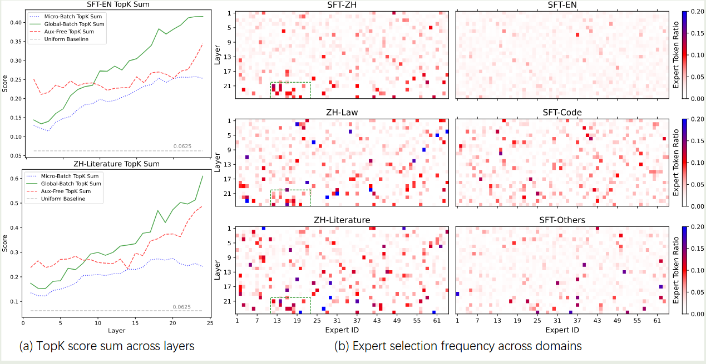

Qwen 在 25 年 2 月提出了 global batching load balancing loss strategy, 其在 global level 上考虑每个专家的负载均衡，从而提高模型的表现

## Introduction

实现 MoE 模型负载均衡的原因有两点：

1. Effectiveness: 通过负载均衡才能更高效地利用各个专家
2. Efficiency: 一般需要使用 expert parallel 来部署 MoE 模型，不均衡的负载会大幅度降低前向过程

已有的框架如 DeepSpeed, Megablocks 和 Megatron-Core 都是在 micro-batch level 上计算负载均衡损失的，但是，一个 micro-batch 通常只包含少数序列，因此 load balancing loss 就要求各个专家在每个序列上均匀分布。

针对这个问题，作者在本文中提出的解决方法是在 global-batch 层面考虑负载均衡，

## Method

MoE 模型定义如下

$$
y = \sum_{i\in N_E,g_i\in\mathrm{TopK}(g)}g_i(x)E_i(x)
$$

其中 $E_i$ 是对应的专家, $g_i$ 是对应的权重

Load balancing loss 定义如下

$$
\mathrm{LBL} = N_E\sum_{i=1}^{N_E}f_iP_i
$$

一般来说，MoE 模型训练时会使用 expert parallel 策略，此时 load balancing loss 修改为

$$
\mathrm{LBL}_{\mathrm{micro}}=  \frac{1}{N_P}\sum_{j=1}^{N_P}\left(N_E\sum_{i=1}^{N_E}f_i^hP_i^j\right)
$$

其中 $N_P$ 是 parallel groups 的个数。在这种情况下，模型需要再每个 parallel group 中实现负载均衡。但是某一个 mircro-batch 里可能只包含某一个 domain 的序列，因此各个专家被强制要求在每一个 domain 中也均衡分布。作者认为，这种方式会限制专家的能力，进而影响模型的表现。

作者的解决方法在于，获取每个 parallel group 的 $f_i$ 然后求 global-batch 的 $\bar{f}_i$.

$$
\mathrm{LBL}_{\mathrm{global}}=N_E\sum_{i=1}^{N_E}\bar{f}_i\bar{P}_i=N_E\sum_{i=1}^{N_E}\bar{f}_i\left(\frac{1}{N_P}\sum_{j=1}^{N_P}P_j\right) = \frac{1}{N_P}\sum_{j=1}^{N_P}\left(N_E\sum_{i=1}^{N_E}\bar{f}_iP_i^j\right)
$$

实际中，由于计算节点数量有限，micro-batch size 之和可能会小于 global-batch size, 因此我们会使用 gradient accumulation. 在这种情况下， 作者使用了一个 buffer 来保存多个 micro-batch 的专家选择次数，最终算法实现过程如下所示

## Experiments

作者使用了不同大小的模型来进行实验，作者用 **Balance BSZ** 来表现计算 expert selection frequency 时的 token 数，结果如下图所示

可以看到，global LBL 可以提高模型的表现，并且，当 Balance BSZ 增加时，模型的表现也会提升。作者发现对于 [Loss-Free Balancing](https://maosong.website/p/notes-on-loss-free-balancing/) 来说，使用 global batch 的效果也更好。

作者还发现，global LBL 会提高专家的特化程度，结果如下图所示

可以看到，使用默认的 LBL loss, 各个专家的特化程度很低，而使用本文的 global LBL 之后，专家的特化程度有了大幅度的提高。

作者还进一步发现，随着 Balance BSZ 的提高，模型表现也持续提升，结果如下图所示

作者认为，synchronization 和 buffer 机制相比于 micro-batch 来说可以带来大幅度提升。

## Analysis

首先，为了分析 global batch LBL 优于 Micro batch 的关键原因，作者先同步所有 group 的矩阵 $G$, 然后再从全局 token 中随机选一批，用这批 token 计算专家选择频率。通过这个方法，我们可以保证 token 数量与 micro-batch 一致，但是分布于 Global-batch 一致。实验结果发现，这种方法的表现优于 micro-batch LBL, 说明 global batch LBL 的优势在于 Token 分布更全局，而不是 token 数量更多。

作者还分析了 global batch LBL 和 micro batch LBL 两种模式，作者认为前者是后者的一个宽松版约束，作者发现从后者切换为前者之后，模型的表现可以得到进一步提升，但是其表现仍然不如一开始就使用 global batch LBL 更好。作者分析原因认为，这是因为 expert 收敛速度比较快。

作者进一步通过降低 micro batch LBL 权重来探究是否可以达到同样的表现，结果发现适度江都权重确实可以提高模型的表现，但是降低太多会损害模型的表现，即此时出现了负载不均衡的现象

作者对比了 global batch LBL 和 micro batch LBL 效率发现，前者比后者慢 $2\%$ 左右，这个差距几乎可以忽略不计

作者进一步分析了不同 balancing 方式的专家特化程度，结果如下图所示

实验结果发现：

1. 使用 global batch LBL 之后，topK sum 明显变大，这说明 routing 和 language modeling 任务对齐地更好
2. global batch LBL 的专家在不同任务上的特化程度更明显
3. micro batch LBL 的 topK sum 比较小
4. Loss-free balancing 的 topK sum 介于 micro batch LBL 和 global batch LBL 之间

## Conclusion

作者在本文中提出了 global LBL 来在全局为负载均衡提供指导，结果发现通过在更大的范围进行负载均衡的计算，我们可以有效提高专家的特化程度以及提高模型在下游任务上的表现

## References

- [Arxiv](http://arxiv.org/abs/2501.11873)
