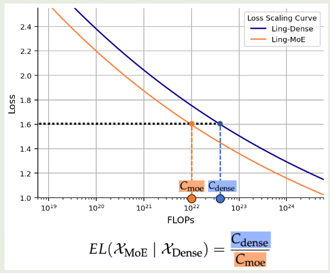
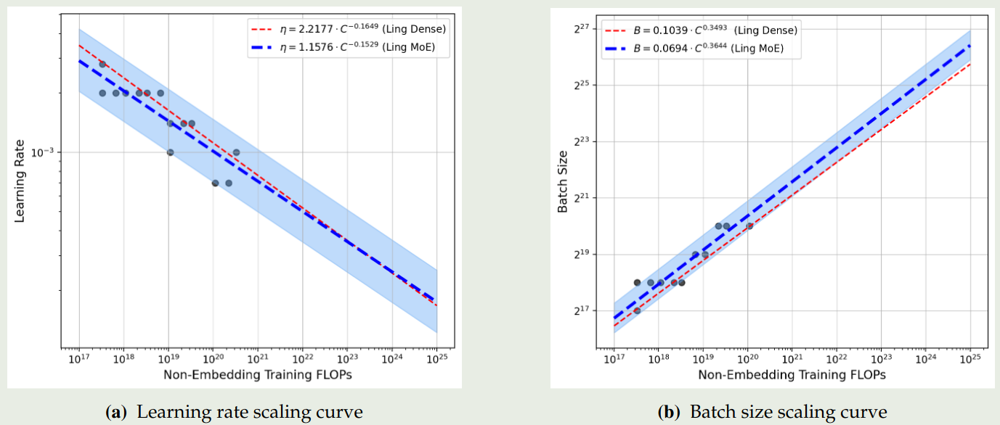
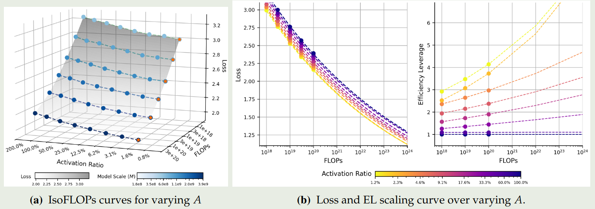
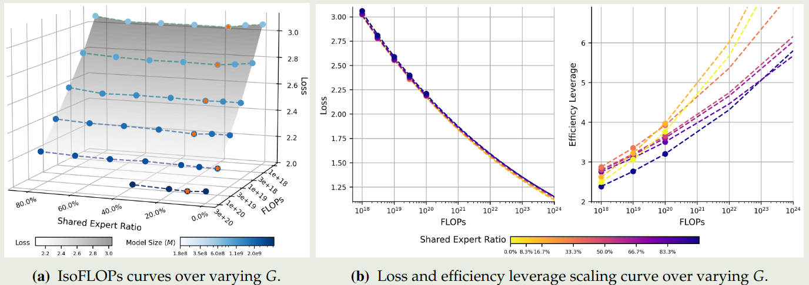

## Introduction

目前已经有了针对 dense LLM 的 scaling law, 如 [Kaplan scaling law](https://maosong.website/p/kaplan-scaling-law/) 和 [Chinchilla scaling law](https://maosong.website/p/chinchilla-scaling-law/).

但是，对于 MoE 模型，目前还缺乏一个比较系统的 scaling law.

为了解决这个问题，作者提出了 efficiency leverage (EL),  用于衡量 MoE 模型的效率，其定义为

$$
EL(\mathcal{X}_{\mathrm{MoE}}\mid \mathrm{Dense})=\frac{C_{\mathrm{Dense}}}{C_{{\mathrm{MoE}}}}
$$

其中 $C_{\mathrm{Dense}}, C_{{\mathrm{MoE}}}$ 分别代表了训练模型所需要的算力。EL 衡量了 moe 模型达到对应 dense 模型表现所需要的算力，EL 值越大，说明 MoE 模型效率越高。EL 的可视化如下图所示

作者通过训练多个模型，探究了 MoE 架构与 EL 之间的关系。作者发现，MoE 模型的表现主要与专家激活比例以及算力相关。基于 scaling law, 作者训练了 Ling-mini-beta, 一个 17.5B-A0.85B 的 MoE 模型，其表现超过了 6.1B dense 模型的表现。

## Preliminary

| Notation | description       |
| -------- | ----------------- |
| $N$      | total parameters  |
| $N_a$    | active parameters |
| $E$      | routed experts    |
| $E_a$    | activated experts |
| $E_s$    | shared experts    |

作者定义 activation ratio 如下:

$$
A = \frac{E_a+E_s}{E+E_s}
$$

定义 sharing ratio 如下

$$
S=\frac{E_s}{E_a+E_s}
$$

定义 expert granularity 如下

$$
G = \frac{d_{\mathrm{model}}}{d_{\mathrm{Expert}}}
$$

与 [DeepSeek-LLM](https://maosong.website/p/notes-on-deepseek-llm/) 一样，作者使用 $C=MD$ 来表示算力，non-embedding FLOPs $M$ 和训练 token 数 $D$ 之间的关系。

### Hyper Parameters

作者首先探究了针对 MoE 模型的超参数配置，最终你和出来的结果如下图

实验结果说明，相比于 dense model, MoE model 需要更大的 batch size.

作者基于这个 scaling law 进行了验证，结果说明这个 scaling law 比较准确。

### Parameters and Dataset Size

接下来作者探究了对于模型参数量以及训练 token 个数之间的 scaling law, 求解的问题如下

$$
(M^{opt}, D^{opt}) = \arg\min_{M,D}\mathcal{L}(M,D;C,A,G,S)\quad s.t.\ C=MD
$$

实验结果如下图所示

结果说明，不同架构对应的系数接近 $0.5$, 说明我们应该将算力均衡分配到数据和 model size 上。领一方面，MoE 模型可以通过使用更多的数据来达到更优的表现。

## Efficiency Leverage

作者将 Efficiency Leverage (EL) 定义为给定算力 $C_{target}$ 和一个 MoE 模型 $\mathcal{X}_{MoE}$,  对应 dense 模型达到 $\mathcal{X}_{MoE}$ 相同的表现所需要的算力 $C_{dense}$, 即

$$
\begin{aligned}
&EL(\mathcal{X}_{\mathrm{MoE}}\mid \mathrm{Dense};C_{target})=\frac{C_{\mathrm{Dense}}}{C_{{\mathrm{MoE}}}}\\
s.t.\ & |\mathcal{L}(C_{MoE}, \mathcal{X}_{\mathrm{MoE}})-\mathcal{L}(C_{dense}, \mathcal{X}_{\mathrm{dense}})|\leq \epsilon (\epsilon\to 0)
\end{aligned}
$$

EL 值越高说明 MoE 模型越有效。为了公平起见，dense 模型和 MoE 模型的架构参数基本相同，作者只改变 $d_{model}, d_{ffn}, d_{expert}$ 以及 $n_{layer}$.

接下来，作者就探究了给定算力的情况下，最优的 MoE 配置，即

$$
(A^{opt}, G^{opt}, S^{opt}) = \arg\min_{(A,G,S)\in\mathcal{X}_{\mathrm{MoE}}}EL(\mathcal{X}_{\mathrm{MoE}}\mid \mathrm{Dense};C)
$$

## Scaling Law

首先，坐着探究了最优的 activation ratio $A$, 即

$$
A^{opt} = \arg\min_{A}\mathcal{L}(A;C,M,G,S)
$$

拟合的结果如下图所示

实验结果表明：

1. 模型表现随激活比例降低 er 提高
2. 更系数的模型对于算力的提升其效率也提升更快

然后，作者探究了最优的 granularity ratio, 即

$$
G^{opt} = \arg\min_{G}\mathcal{L}(G;C,M,A,S)
$$

拟合的结果如下图所示

可以看到，无限制提升 granularity 并不会提高模型的表现。并且，不同的算力对应的最优 granularity 处于一个固定的范围

接下来，作者探究了最优的 shared expert ratio, 即

$$
S^{opt} = \arg\min_{S}\mathcal{L}(S;C,M,A,G)
$$

拟合的结果如下图所示

结果说明 shared expert 的比例也不是越多越好，其存在最优值。并且给定算力的情况下，非零最小值的 shared expert 表现最好。因此作者认为，一个 shared expert 的效果最好。

作者还探究了其他可能的因素，结论如下：

1. 与 [DeepSeek-V3](https://maosong.website/p/notes-on-deepseek-v3/) 一样，将 early layer 替换为 dense layer 可以避免 routing imbalance, 并且不会损害模型的表现
2. attention 应该占 $30\%\sim40\%$ 左右的算力才能保证模型的表现和效率。进一步提升 attention 的算力占比虽然会提升表现但是会降低推理效率。

通过前面的发现，作者将 shared expert 设置为 1 个，然后探究 EL 与 activation ratio $A$, granularity $G$, FLOPs $C$ 之间的关系。

首先，作者分别假设 $EL$ 与 $A$, $G$, $C$ 之间存在如下关系：

$$
\begin{aligned}
\log EL_{C,G}(\hat{A}) &= a_A\log\hat{A}, \text{ where }\frac{1}{\hat{A}}=\frac{1}{A+(1/A_{start}-1/A_{\max})^{-1}}+\frac{1}{A_{\max}}\\
\log EL_{C,A}(\hat{G}) &= a_G+b_G(\log G(\log G+c_G))\\
\log EL_{A,G}(C) &= a_C\log C+c_C
\end{aligned}
$$

拟合的结果如下图所示

结果显示：

1. 提升算力以及降低 activation ratio 都可以提高 EL
2. granularity 对 EL 的影响在不同算力的情况下都是一致的
3. 对于 MoE 模型，提升算力可以提高 EL

作者的结论为，activation ratio 是影响 MoE EL 的核心因素。并且随着算力的提升，MoE EL 会越来越明显。

作者因此构建了一个统一的公式来统一三个因素

$$
EL(A,G,C) = \hat{A}^{\alpha+\gamma(\log G)^2+\beta \log G}
$$

其中 $\alpha=a+d\log C$ 代表了 EL 和 activation ratio 之间的关系。拟合出来的参数如下表所示

| $\alpha$ | $d$      | $\gamma$ | $\beta$  | $A_{start}$ | $A_{\max}$ |
| -------- | -------- | -------- | -------- | ----------- | ---------- |
| 1.23     | -7.61e-2 | 1.67e-2  | -1.17e-1 | 1.63e-2     | 5.28e+16   |

基于这个结果，作者发现在 1e22 FLOPs 的算力下，一个 activation ratio 为 $3.1\%$, granularity 为 $12$ 的 MoE 模型，其 EL 为 $7$.

## Ling-mini-beta

基于上一节的发现，作者构建了 Ling-mini-beta, 一个 17.5B 总参数，激活参数为 0.85B 的 MoE 模型。训练使用了 1T token, 模型参数如下表所示

| Model                  | $n_{\text{layers}}$ | $d_{\text{model}}$ | $d_{\text{ffn}}$ | $d_{\text{expert}}$ | $n_{\text{heads}}$ | $n_{\text{kv\_head}}$ | $E$ | $E_a$ | $E_s$ | $N$   | $N_a$ |
| ---------------------- | ------------------- | ------------------ | ---------------- | ------------------- | ------------------ | --------------------- | --- | ----- | ----- | ----- | ----- |
| Dense 6.1B             | 28                  | 4096               | 14336            | -                   | 32                 | 8                     | -   | -     | -     | 6.11B | 6.11B |
| Ling-mini-beta (A0.8B) | 20                  | 2048               | 5120             | 384                 | 16                 | 4                     | 384 | 12    | 1     | 17.5B | 0.85B |

训练的损失变化情况如下图所示

从图中我们可以看出，dense model 一开始的损失下降比较快，但是其最终表现不如 moe 模型。

## Conclusion

在本文中，作者提出了 Efficiency Leverage, 一个衡量 MoE 模型相对于 dense 模型计算效率的 metric, 作者构建了针对 MoE 模型的 scaling law. scaling 揭示了两个主要影响 MoE 模型效率的因素：算力与激活参数比例。基于 scaling law, 作者构建了 Ling-mini-beta, 一个 17B-A0.8B 的 MoE 模型，其效率超过了对应 dense 模型的 7 倍。

## References

- [arxiv](http://arxiv.org/abs/2507.17702)
