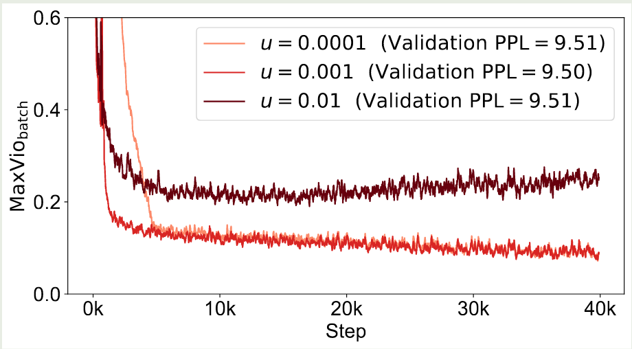

## Introduction

已有的 MoE 模型往往都会使用 load balancing loss 来避免 Imbalanced routing, 但是加入这个额外的损失之后，模型训练的梯度也会受到影响。

DeepSeek 基于这个问题提出了 Loss-Free Balancing, 该方法不引入额外的 loss item, 而是在 routing 的结果上加入一个 bias item, bias item 可以根据 expert load 来动态更新进而实现 load balancing.

## Method

MoE definition

$$
\begin{aligned}
h_t &= u_t + \sum_{i=1}^Ng_{i,t}\mathrm{FFN}_i(u_t),\\
g_{i,t} &= \begin{cases}
s_{i,t}, & s_{i,t}\in\mathrm{Topk}(\{s_{i,j}\mid 1\leq j\leq N\}, K)\\
0, &\text{otherwise}
\end{cases}\\
s_{i,t} &= G(u_t^Te_i),
\end{aligned}
$$

其中 $G$ 是 gating function, $e_i$ 是第 $i$ 个专家对应 gating function 的权重

load balancing loss 有两个作用：

1. 避免 routing collapse, 即模型只选择固定的少数专家完成任务
2. 减少通信开销

但是引入 load balancing loss 会对 LLM 的训练产生影响，为了避免对模型性能造成影响，我们需要小心设置 load balancing loss 的权重，实验结果如下图所示

为了解决这个问题，作者提出了 Loss-Free Balancing, 具体做法就是在每个专家的 gating score 上加入一个 bias term, 然后再决定对应的专家：

$$
g_{i,t} = \begin{cases}
s_{i,t}, & s_{i,t}+b_i\in\mathrm{Topk}(\{s_{i,j}+b_j\mid 1\leq j\leq N\}, K)\\
0, &\text{otherwise}
\end{cases}
$$

注意这里的 bias item 仅影响 top-K 操作，其对最终的输出没有影响。

为了实现负载均衡，作者根据上一个 batch 的 expert load 情况来调整 bias item, 如果某一个专家的 load 太大，则对应的 bias item 会变小。 其算法实现过程如下：

作者对比不同的负载均衡算法如下表所示

| Load Balancing Methods                  | Balanced Expert Load | Interference Gradients | Future Token Leakage |
| --------------------------------------- | -------------------- | ---------------------- | -------------------- |
| Loss-Controlled (strong auxiliary loss) | balanced             | strong                 | no leakage           |
| Loss-Controlled (weak auxiliary loss)   | imbalanced           | weak                   | no leakage           |
| Expert Choice                           | balanced             | none                   | with leakage         |
| Loss-Free (Ours)                        | balanced             | none                   | no leakage           |

## Experiments

作者使用了 [DeepSeekMoE](https://maosong.website/p/notes-on-deepseekmoe/) 来进行实验，作者使用了 sigmoid function 作为 gating function, 因为作者发现 sigmoid function 效果比 softmax 效果更好。

作者提出了 maximal violation (MaxVio) 来量化一个 MoE layer 的负载均衡程度

$$
\mathrm{MaxVio} = \frac{\max_i\mathrm{Load}_i-\overline{\mathrm{Load}_i}}{\overline{\mathrm{Load}_i}}
$$

其中 $\mathrm{Load}_i$ 代表了分配给第 $i$ 个专家的 token 个数，$\overline{\mathrm{Load}_i}$ 代表了理想情况下的负载均衡。

实验结果如下图所示

| Model Size | Load Balancing Methods | Validation Perplexity | MaxVioglobal |
| ---------- | ---------------------- | --------------------- | ----------------------- |
| 1B         | Loss-Controlled        | 9.56                  | 0.72                    |
| 1B         | Loss-Free              | **9.50**              | **0.04**                |
| 3B         | Loss-Controlled        | 7.97                  | 0.52                    |
| 3B         | Loss-Free              | **7.92**              | **0.04**                |

实验结果显示，本文提出的 Loss-Free Balancing 效果更好，且负载均衡更高

作者还展示了训练过程的负载情况如下

可以看到，Loss-Free 的负载一直比 load balancing loss 效果更好

### Ablation Study

作者首先探究了 bias term 更新速率对模型表现的影响，结果如下图所示

结果显示，使用过大的 update rate 会影响最终的负载均衡，而较小的 update rate 收敛速率比较慢。因此作者在本文中使用了 $u=0.001$ 这个设置

作者还对比了 baseline model 使用 softmax 个 sigmoid gating 两种方式，结果如下图所示

实验结果显示，Sigmoid function 对于超参数更加 robust, 且表现也更好一些。

作者还尝试了不同的 bias 更新方式，结果显示尽管不同的更新方式有可能会提高 load balance, 但是最终模型表现提升不大。

## Conclusion

作者在本文中提出了 Loss-Free Balancing 策略，一个针对 MoE 负载均衡而不需要额外损失项的方法

## References

- [Arxiv](http://arxiv.org/abs/2408.15664)
