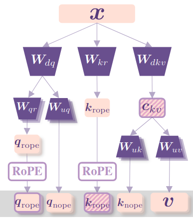

DeepSeek 在 2024 年 5 月提出了 multi-head latent attention (MLA), 用于提高 attention 的 Inference 效率

## Introduction

传统的 multi head attention (MHA) 虽然效果好，但是在 inference 时，其 KV cache 会变成瓶颈，影响推理效率。为了解决这个问题，已有的工作如 [MQA](https://maosong2022.github.io/p/notes-on-mqa/) 和 [GQA](https://maosong2022.github.io/p/notes-on-gqa/) 通过共享权重来减少 KV cache 内存占用，但是结果发现模型的表现也会降低。

为了解决这个问题，作者提出了 multi-head latent attention (MLA), 来压缩 KV cache.

## Related Work

### MHA

令 $d$ 为 hidden size, $n_h$ 为 attention heads 的个数，$\ell$ 为 transformer layer 的层数，$d_h$ 为每个 head 的 dimension, $h_t\in\mathbb{R}^d$ 为 attention layer 中第 $t$ 个 token 对应的 hidden states。对于标准的 MHA, 我们首先计算 Q, K, V 如下：

$$
q_t=W^{Q}h_t,\quad k_t=W^Kh_t,\quad v_t = W^Vh_t
$$

其中，$W^Q,W^K,W^V\in\mathbb{R}^{d_hn_h\times d}$ 分别为 query, key, value projection layer 的权重。接下来 MHA 的计算方式如下

$$
\begin{aligned}
o_{t,i} &= \sum_{j=1}^t\mathrm{softmax}_j\left(\frac{q_{t,i}^Tk_{j,i}}{\sqrt{d_h}}\right)v_{j,i},\\
u_t&= W^O[o_{t,1};o_{t,2};\dots,;o_{t,n_h}]
\end{aligned}
$$

其中 $q_t=[q_{t,1};q_{t,2};\dots,;q_{t,n_h}]$,  $k_t=[k_{t,1};k_{t,2};\dots,;k_{t,n_h}]$, $v_t=[v_{t,1};v_{t,2};\dots,;v_{t,n_h}]$. $W^O\in\mathbb{R}^{d\times d_hn_h}$ 为 output projection 的权重。在 inference 阶段，每个 token 需要缓存其 key 以及 value 对应的值，从而每个 token 的 kv cache 占用为 $2n_hd_h\ell$. 当序列长度过大时，KV cache 会影响整体的 inference efficiency.

### MQA & GQA

MQA 通过在所有的 heads 中共享 key 和 value 来实现降低 kv cache 的作用，在 MQA 中，$W^K, W^V\in\mathbb{R}^{d_h\times d}$, 在计算时，对应的 $k_t$ 和 $v_t$ 通过广播机制参与 attention 的计算。此时，KV cache 占用为 MHA 的 $1/n_h$, 即 $2d_h\ell$.

但是，MQA 的问题是表达能力太弱（表现差），因此后续 GQA 进行了改进，GQA 在 MQA 和 MHA 之间进行了权衡，即将 heads 分为若干个 group, 每个 group 中共享 key 和 value, 即 $W^K, W^V\in\mathbb{R}^{n_gd_h\times d}$,  这里 $n_g$ 是 group 个数，在计算 attention 时，key 和 value 在 group 内部共享，此时，GQA 的 KV cache 占用是 MQA 的 $n_g$ 倍，即 $2n_gd_h\ell$.

这部分具体介绍见 [MQA](https://maosong2022.github.io/p/notes-on-mqa/) 和 [GQA](https://maosong2022.github.io/p/notes-on-gqa/).

## MLA

MLA 的架构图如下所示



MLA 使用 low-rank joint compression 来压缩 key 以及 value 的 KV cache:

$$
c_t^{KV} = W^{DKV}h_t,\quad k_t^C = W^{UK}c_t^{KV}, v_t^C = W^{UV}c_t^{KV}
$$

这里 $c_t^{KV}\in\mathbb{R}^{d_c}$ 为 key 以及 value 压缩后的 latent vector. $d_c<<d_hn_h$ 为 KV cache compression dimension. $W^{DKV}\in\mathbb{R}^{d_c\times d}$ 为 down projection matrix, 这个矩阵是 key 和 value 共享的，$W^{UK}, W^{UV}\in\mathbb{R}^{d_hn_h\times d_c}$ 为 key, value 对应的 up projection matrix.

另外，为了减少训练时的 activation memory, 作者对于 query 同样也执行了 low-rank compression, 压缩方式如下

$$
c_t^Q = W^{DQ}h_t,\quad q_t^C = W^{UQ}c_t^Q
$$

其中 $c_t^Q\in\mathbb{R}^{d_c'}$ 为 query 压缩后的 latent vector, $d_c'<< d_hn_h$ 为 query compression dimension, $W^{DQ}\in\mathbb{R}^{d_c'\times d}$, $W^{UQ}\in\mathbb{R}^{d_hn_h\times d_c'}$ 分别时 down projection, up projection matrix.

最后 attention 的计算与 MHA 保持一致：

$$
\begin{aligned}
o_{t,i} &= \sum_{j=1}^t\mathrm{softmax}_j\left(\frac{q_{t,i}^Tk_{j,i}}{\sqrt{d_h}}\right)v_{j,i},\\
u_t&= W^O[o_{t,1};o_{t,2};\dots,;o_{t,n_h}]
\end{aligned}
$$

在推理的时候，我们只需要缓存 $c_t^{KV}$ 即可，这样每个 token 的 KV cache 为 $d_c\ell$.  并且在 inference 时，我们可以将 $W^{UK}$ 和 $W^{Q}$ 融合在一起，将 $W^{UV}$ 和 $W^{O}$ 融合在一起，也就是说我们不需要显式的计算出 $k_t$ 以及 $v_t$, 即

$$
q_t^Tk_t = (W^{UQ}c_t^Q)^T(W^{UK}c_t^{KV}) = (c_t^Q)^T((W^{UQ})^TW^{UK})\boxed{c_t^{KV}}
$$

以及

$$
\begin{aligned}
u_t &= W^O[o_{t,1};o_{t,2};\dots,;o_{t,n_h}] \\
&= \sum_{i=1}^tW_i^Oo_{t,i}\\
&= \sum_{i=1}^tW_i^O\sum_{j=1}^t\mathrm{softmax}_j\left(\frac{q_{t,i}^Tk_{j,i}}{\sqrt{d_h}}\right)v_{j,i}\\
&= \sum_{i=1}^tW_i^O\sum_{j=1}^t\mathrm{softmax}_j\left(\frac{q_{t,i}^Tk_{j,i}}{\sqrt{d_h}}\right)W_i^{KV}c_t^{KV}\\
&= \sum_{i=1}^t(W_i^OW_i^{KV})\sum_{j=1}^t\mathrm{softmax}_j\left(\frac{q_{t,i}^Tk_{j,i}}{\sqrt{d_h}}\right)\boxed{c_t^{KV}}
\end{aligned}
$$

这里 $W^O = [W^O_1,\dots,W^O_{n_h}]$, $W^{UV}=[W^{KV}_1;\dots;W^{KV}_{n_h}]$, $W_i^O\in\mathbb{R}^{d\times d_h}$, $W^{UV}_i\in\mathbb{R}^{d_h\times d_c}$.

### Decoupled Position Embedding

接下来，作者介绍了如何解决 RoPE 不相容的问题。如果说我们直接在 $k_t^C$ 上进行 RoPE, 那么我们有

$$
q_t^Tk_t = (R_mW^{UQ}c_t^Q)^T(R_nW^{UK}c_t^{KV}) = (c_t^Q)^T((W^{UQ})^TR_{m-n}W^{UK})\boxed{c_t^{KV}}
$$

此时，我们没有办法将 $W^{UK}$ 吸收到 $W^{UQ}$ 中，这样就导致在 inference 时我们必须重新计算所有 prefix token 对应的 key, 这显然会降低 inference efficiency

为了解决这个问题，作者使用了partial RoPE的技巧，即将query和key拆解为NoPE以及RoPE两部分，前者由MLA产生，后者携带位置信息。RoPE部分包括query $q_{t,i}^R\in\mathbb{R}^{d_h^R}$ 以及一个共享的 key $k_t^R\in\mathbb{R}^{d_h^R}$, 其中 $d_h^R$ 是 decoupled query 以及 decoupled key 的 head dimension.

> [!remark]
> 这里 key 对应的 RoPE 共享的原因是这部分信息也需要使用 KV cache 进行缓存，通过共享可以降低 KV cache 占用；而 query 对应的 RoPE 不共享的原因是提高 head 的表达能力，与 MHA 原理一致。
>

对应 MLA 的计算公式如下

$$
\begin{aligned}
q_t^R&=\mathrm{RoPE}(W^{QR}c_t^Q)\\
k_t^R &= \mathrm{RoPE}(W^{KR}h_t)\\
q_{t,i} &= [q_{t,i}^C;q_{t,i}^R]\\
k_{t,i} &= [k_{t,i}^C;k_{t}^R]\\
o_{t,i} &= \sum_{j=1}^t\mathrm{softmax}_j\left(\frac{q_{t,i}^Tk_{j,i}}{\sqrt{d_h+d_h^R}}\right)v_{j,i}^C,\\
u_t&= W^O[o_{t,1};o_{t,2};\dots,;o_{t,n_h}]
\end{aligned}
$$

其中 $q_t^R=[q_{t,1}^R;q_{t,2}^R;\dots,;q_{t,n_h}^R]$, $W^{QR}\in\mathbb{R}^{d_h^Rn_h\times d_c'}$, $W^{KR}\in\mathbb{R}^{d_h^R\times d}$ . $\mathrm{RoPE}(\cdot)$ 只执行 RoPE 矩阵乘法的操作。

在这种情形下，attention 的计算如下所示

$$
\begin{aligned}
q_{t,i}^Tk_{t,i} &= [q_{t,i}^C;q_{t,i}^R]^T[k_{t,i}^C;k_{t}^R]\\
&= (q_{t,i}^C)^Tk_{t,i}^C + (q_{t,i}^R)^Tk_{t}^R
\end{aligned}
$$

可以看到，现在 attention 的计算分为了两部分，一部分是 MLA 自身的计算，这部分计算前面已经证明可以通过矩阵吸收的方式来进行优化，第二部分是关于 RoPE 部分的计算，这部分计算量不是很大

最终，MLA 完整的计算公式如下

$$
\begin{aligned}
c_t^Q=W^{DQ}h_t\\
[q_{t,1}^C;\dots;q_{t,n_h}^C]=q_t^C&= W^{UQ}c_t^Q\\
[q_{t,1}^R;\dots;q_{t,n_h}^R]=q_t^R&= \mathrm{RoPE}(W^{QR}c_t^Q)\\
q_{t,i} &= [q_{t,i}^C;q_{t,i}^R]\\
\boxed{c_t^{KV}} &= W^{DKV}h_t\\
[k_{t,1}^C;\dots;k_{t,n_h}^C]=k_t^C&= W^{UK}c_t^{KV}\\
\boxed{k_t^R} &= \mathrm{RoPE}(W^{KR}h_t)\\
k_{t,i} &= [k_{t,i}^C;k_{t}^R]\\
[v_{t,1}^C;\dots;v_{t,n_h}^C]=v_t^C&= W^{UV}c_t^{KV}\\
o_{t,i} &= \sum_{j=1}^t\mathrm{softmax}_j\left(\frac{q_{t,i}^Tk_{j,i}}{\sqrt{d_h+d_h^R}}\right)v_{j,i}^C,\\
u_t&= W^O[o_{t,1};o_{t,2};\dots,;o_{t,n_h}]
\end{aligned}
$$

在 inference 时，decoupled key 也需要被缓存，因此 DeepSeek-V2 每个 token 所需要的 KV cache 为 $(d_c+d_h^R)\ell$, 框选的部分即为 Inference 阶段需要缓存的内容

MLA 与 MHA, MQA, GQA 的对比如下图所示


### Comparison of KV Cache

接下来，作者对比了不同 attention 机制的 KV cache, 结果如下表所示

| Attention Mechanism           | KV Cache per Token (# Element)      | Capability |
| ----------------------------- | ----------------------------------- | ---------- |
| Multi-Head Attention (MHA)    | $2n_hd_h\ell$                       | Strong     |
| Grouped-Query Attention (GQA) | $2n_gd_h\ell$                       | Moderate   |
| Multi-Query Attention (MQA)   | $2d_h\ell$                          | Weak       |
| MLA (Ours)                    | $(d_c+d_h^R)\ell\approx 9/2d_h\ell$ | Stronger   |

这里作者将 $d_c$ 设置为 $4d_h$, $d_h^R$ 设置为 $d_h/2$, 因此得到了上面的 $9/2d_h\ell$ 的近似。与 GQA 相比，相当于 MLA 使用了 2.25 个 group, 但是可以得到更强的效果。

为了避免 low-rank compression 以及 fine-grained expert segmentation 对输出的 scale 产生影响，作者对 compressed latent vectors $c_t^Q, c_t^{KV}$ 进行了 normalization.

## Code

首先是代码变量与公式变量的对应关系

| code name             | variable name | Value |
| --------------------- | ------------- | ----- |
| `hidden_size`         | $d$           | 5120  |
| `kv_lora_rank`        | $d_c$         | 512   |
| `q_lora_rank`         | $d_c'$        | 1536  |
| `qk_nope_head_dim`    | $d_h$         | 128   |
| `qk_rope_head_dim`    | $d_h^R$       | 64    |
| `v_head_dim`          | $d_h$         | 128   |
| `num_attention_heads` | $n_h$         | 128   |

在具体实现时，作者对计算过程进行了优化，具体就是先合并计算然后通过 `split` 进行拆分，这部分策略应用于三个部分：

$$
\begin{aligned}
\begin{bmatrix}
q_t^c\\
q_t^R
\end{bmatrix} &= \begin{bmatrix}
W^{UQ}\\
W^{QR}
\end{bmatrix}W^{DQ}h_t\\
\begin{bmatrix}
c_t^{KV}\\
k_t^R
\end{bmatrix} &= \begin{bmatrix}
W^{DKV}\\
W^{KR}
\end{bmatrix}h_t\\
\begin{bmatrix}
k_t^c\\
v_t^c
\end{bmatrix} &= \begin{bmatrix}
W^{UK}\\
W^{UV}
\end{bmatrix}c_t^{KV}
\end{aligned}
$$

代码如下所示

```python
class DeepseekV2Attention(nn.Module):
    def __init__(self, config, layer_idx):
        # d_h + d_h^R
        self.q_head_dim = config.qk_nope_head_dim + config.qk_rope_head_dim
        # W^{DQ}
        self.q_a_proj = nn.Linear(
            self.hidden_size, config.q_lora_rank, bias=config.attention_bias
            )
        # [W^{UQ}; W^{QR}]
        self.q_b_proj = nn.Linear(
            config.q_lora_rank, self.num_heads * self.q_head_dim, bias=False)
        # [W^{DKV}; W^{KR}]
        self.kv_a_proj_with_mqa = nn.Linear(self.hidden_size, config.kv_lora_rank + config.qk_rope_head_dim, bias=config.attention_bias)
        # [W^{UK}; W^{UV}]
        self.kv_b_proj = nn.Linear(config.kv_lora_rank, self.num_heads * (self.q_head_dim - self.qk_rope_head_dim + self.v_head_dim), bias=False)
        # W^O
        self.o_proj = nn.Linear(self.num_heads * self.v_head_dim, self.hidden_size, bias=config.attention_bias)
        
    def forward(self, hidden_states, ...):
        # [q_t^c; q_t^R]
        q = self.q_b_proj(self.q_a_layernorm(self.q_a_proj(hidden_states)))
        q = q.view(bsz, q_len, self.num_heads, self.q_head_dim).transpose(1, 2)
        q_nope, q_pe = torch.split(q, [self.qk_nope_head_dim, self.qk_rope_head_dim], dim=-1)
        
        # [c_t^{KV}; k_t^R]
        compressed_kv = self.kv_a_proj_with_mqa(hidden_states)
        compressed_kv, k_pe = torch.split(compressed_kv, [self.kv_lora_rank, self.qk_rope_head_dim], dim=-1)
        k_pe = k_pe.view(bsz, q_len, 1, self.qk_rope_head_dim).transpose(1, 2)

        # [k_t^c; v_t^c]
        kv = (self.kv_b_proj(self.kv_a_layernorm(compressed_kv)).view(bsz, q_len, self.num_heads, self.qk_nope_head_dim + self.v_head_dim).transpose(1, 2))
        k_nope, value_states = torch.split(kv, [self.qk_nope_head_dim, self.v_head_dim], dim=-1)

        # q_t^R, k_t^R
        q_pe, k_pe = apply_rotary_pos_emb(q_pe, k_pe, cos, sin, position_ids)

        # q_{t, i}
        query_states = k_pe.new_empty(bsz, self.num_heads, q_len, self.q_head_dim)
        query_states[:, :, :, : self.qk_nope_head_dim] = q_nope
        query_states[:, :, :, self.qk_nope_head_dim :] = q_pe
        
        # k_{t, i}
        key_states = k_pe.new_empty(bsz, self.num_heads, q_len, self.q_head_dim)
        key_states[:, :, :, : self.qk_nope_head_dim] = k_nope
        key_states[:, :, :, self.qk_nope_head_dim :] = k_pe
        
        # Q^TK
        attn_weights = (torch.matmul(query_states, key_states.transpose(2, 3)) * self.softmax_scale)
        # softmax(...) in FP32
        attn_weights = nn.functional.softmax(attn_weights, dim=-1, dtype=torch.float32).to(query_states.dtype)
        
        # o_{t, i}
        attn_output = torch.matmul(attn_weights, value_states)
        
        # u_t
        attn_output = self.o_proj(attn_output)
                
        return attn_output, attn_weights, past_key_value
        
```

### 参数量计算

首先，我们结合 DeepSeek-V2 的 `config` 计算一下 MLA 部分的参数量：

| Matrix    | Parameters                               | values    | ratio  |
| --------- | ---------------------------------------- | --------- | ------ |
| $W^{DKV}$ | $dd_c$                                   | 2621440   | 1.91%  |
| $W^{UK}$  | $d_hn_hd_c$                              | 8388608   | 6.12%  |
| $W^{UV}$  | $d_hn_hd_c$                              | 8388608   | 6.12%  |
| $W^{DQ}$  | $d_c'd$                                  | 7864320   | 5.74%  |
| $W^{UQ}$  | $d_hn_hd_c'$                             | 25165824  | 18.37% |
| $W^{KR}$  | $d_h^Rd$                                 | 327680    | 0.24%  |
| $W^{QR}$  | $d_h^Rd$                                 | 327680    | 0.24%  |
| $W^{O}$   | $dd_hn_h$                                | 83886080  | 61.24% |
| Total     | $d(d_c+d_c'+2h_h^R)+d_hn_h(2d_c+d_c'+d)$ | 136970240 | 100%   |

我们接下来对比一下各个模型架构之间 attention 部分的参数量，可以看到与 MHA 一致，大部分参数量都集中在最后的 Output projection layer 上

## Experiments

作者首先对比了 MHA, GQA, MQA 的表现，作者基于一个 7B 的 dense 模型，使用 1.33T token 进行训练，实验结果如下

| Benchmark (Metric) | # Shots | MQA  | GQA(8 Groups) | MHA      |
| ------------------ | ------- | ---- | ------------- | -------- |
| # Params           | -       | 7.1B | 6.9B          | 6.9B     |
| BBH (EM)           | 3-shot  | 33.2 | 35.6          | **37.0** |
| MMLU (Acc.)        | 5-shot  | 37.9 | 41.2          | **45.2** |
| C-Eval (Acc.)      | 5-shot  | 30.0 | 37.7          | **42.9** |
| CMMLU (Acc.)       | 5-shot  | 34.6 | 38.4          | **43.5** |

实验结果显示，MHA 的表现显著优于 GQA 和 MQA. 这说明了 MQA 和 GQA 虽然减少了 KV cache 的占用，但是相应地，它们对应的表现也有所降低。

接下来，作者对比了 MLA 和 MHA 的表现，实验结果如下

| Benchmark (Metric)             | # Shots | MHA      | MLA      | MHA    | MLA      |
| ------------------------------ | ------- | -------- | -------- | ------ | -------- |
| # Activated Params             | -       | 2.5B     | 2.4B     | 25.0B  | 21.5B    |
| # Total Params                 | -       | 15.8B    | 15.7B    | 250.8B | 247.4B   |
| KV Cache per Token (# Element) | -       | 110.6K   | 15.6K    | 860.2K | 34.6K    |
| BBH (EM)                       | 3-shot  | 37.9     | **39.0** | 46.6   | **50.7** |
| MMLU (Acc.)                    | 5-shot  | 48.7     | **50.0** | 57.5   | **59.0** |
| C-Eval (Acc.)                  | 5-shot  | **51.6** | 50.9     | 57.9   | **59.2** |
| CMMLU (Acc.)                   | 5-shot  | 52.3     | **53.4** | 60.7   | **62.5** |

可以看到，MLA 的表现比 MHA 的表现更好，并且 KV cache 也更少。

## Conclusion

作者提出了 MLA, 一个基于 low rank compression 的注意力机制，通过将 key value vector 压缩到低维空间，MLA 可以有效降低 Inference latency, 作者通过实现证明 MLA 的表现可以与 MHA 相比，并且 KV cache 更小。

## References

- [DeepSeek-V2](http://arxiv.org/abs/2405.04434)
- [MHA2MLA](http://arxiv.org/abs/2502.14837)
- [探秘Transformer系列之（28）--- DeepSeek MLA](https://www.cnblogs.com/rossiXYZ/p/18827618)
