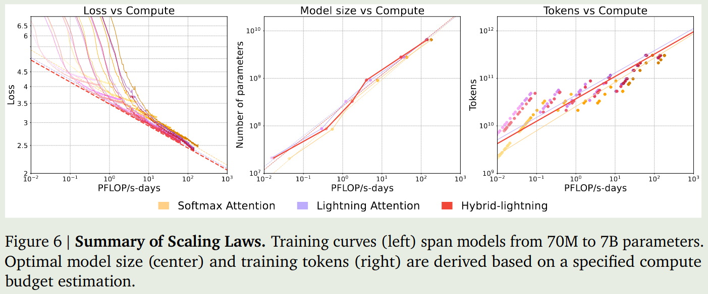
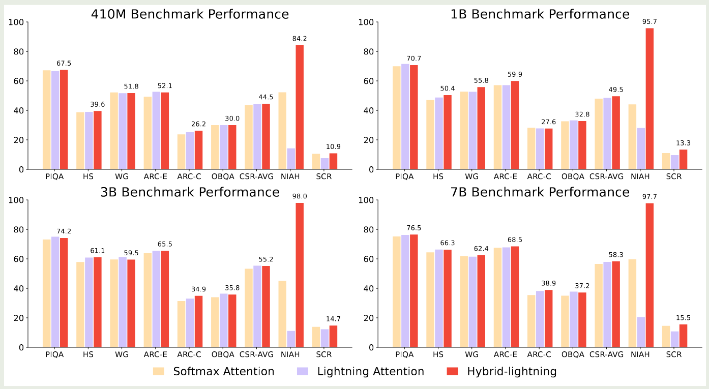
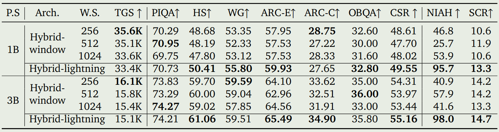
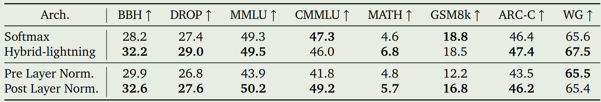
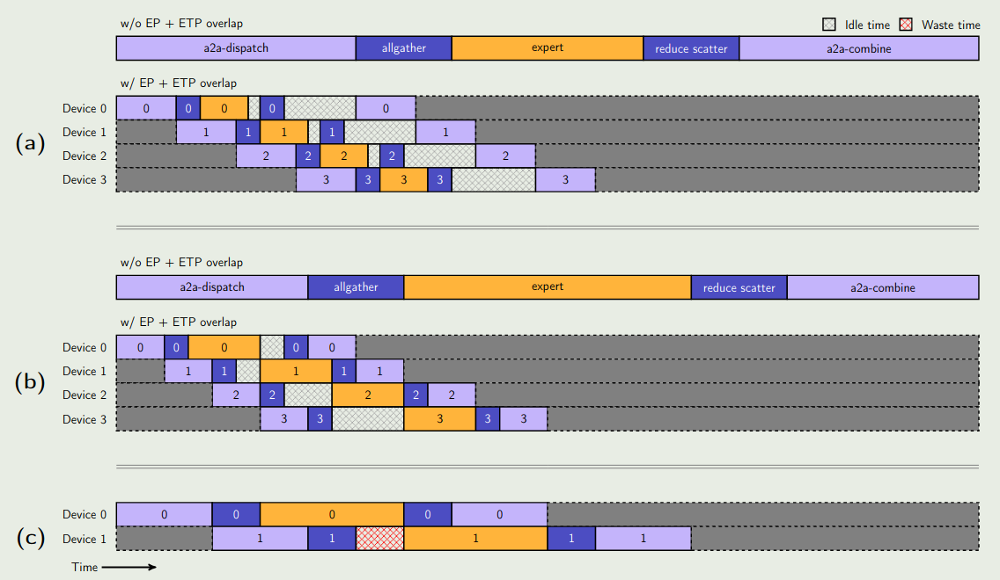
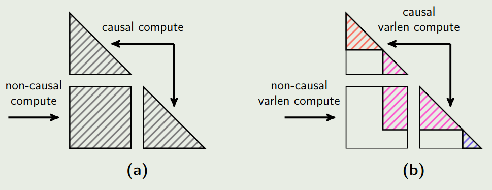
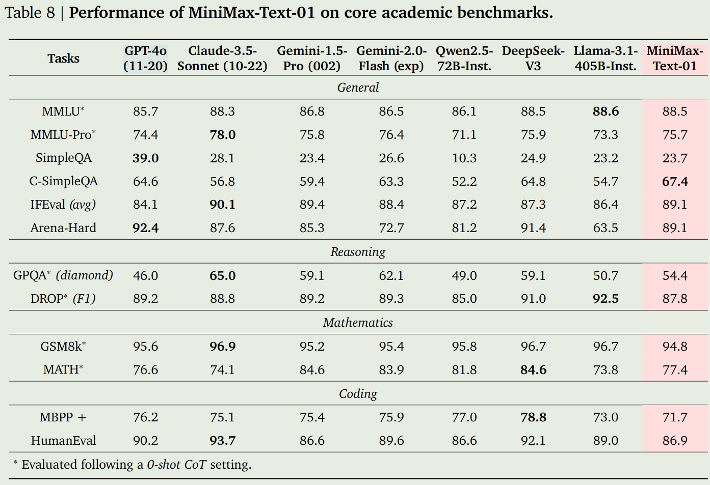

MiniMax-01 是一个基于 hybrid attention 架构的大模型系列，包含 MiniMax-Text-01 和 MiniMax-VL-01 两个模型，其中 MiniMax-Text-01 推理时支持 4M 的上下文长度，MiniMax-VL-01 支持 512B 的上下文长度

## Introduction

现有大部分模型的上下文长度为 32K-256K, 但实际上我们对于长上下文的需求已经超过了这个范围。已有的模型主要基于 self-attention, 这是一个平方复杂度的算法。

为了解决 self-attention 的问题，相关工作如 sparse attention, linear attention, state space models 等都提出了对应的解决办法。但是已有的这些解决方法的问题就是表现不是很强劲。

因此，作者在本文中就提出了一个基于 hybrid attention 架构的大语言模型系列 MiniMax-01. 作者主要从架构，数据和 infra 三个方面进行了改进。

在架构上，作者使用了基于 Lightning Attention 的混合架构。作者还基于实际部署来决定模型的参数。为了最大化模型的表现，作者使用了 MoE 架构。

已有的 infra 主要是针对基于 softmax 的 attention 进行优化的，MiniMax-01 包含 softmax attention, linear attention 和 MoE, 架构比较复杂，因此作者实现了 expert parallel 和 expert tensor parallel 来提高整体的计算效率和 GPU 之间的通信效率。作者还实现了 varlen ring attention 来减少计算冗余。最终，作者发现模型在 NVIDIA-H20 上的 MFU 超过了 75%.

基于前面提到的架构设计，作者训练得到了 MiniMax-Text-01, 模型总参数为 456B, 激活参数为 45.9B, 专家个数为 32 个，激活专家个数为 2 个。 作者首先构建了高质量的数据集，然后构建了一个三阶段的训练 pipeline。

基于 MiniMax-Text-01, 作者扩展得到了 MiniMax-VL-01,训练使用了**512B** token

作者总结本文的贡献如下：

1. 作者构建了一个领先的大模型系列，支持超过 4M 上下文
2. 作者构建了第一个大规模的基于 linear attention 的大语言模型系列
3. 作者详细介绍了使用的数据，模型和训练策略
4. 作者开源了模型

## Architecture

模型架构如下图所示

相比于原始的 transformer, MiniMax-01 做出了以下改进：

1. 将 attention block 按照 8 个 block 为一组，每组里只有最后 1 个 block 使用 softmax attention, 其余 7 个 block 使用 lightning attention
2. 使用 MoE 替换 FFN, MoE 总专家个数为 32 个，激活专家个数为 2 个
3. softmax attention 使用了 [GQA](https://maosong.website/p/notes-on-gqa/), 来提高内存加载效率, group size 为 8
4. 使用了 RoPE 作为 position embedding
5. 使用了 RMSNorm 替换了 LayerNorm

FFN: MoE (32 个专家，激活 2 个专家)

transformer: 8 个 block 为一组，一组里前 7 个使用 Lightning attention，第 8 个使用 softmax attention，80 layers

Attention ： GQA，group size=8，64 heads，

### MoE

在训练基于 MoE 的 LLM 时，有两种策略，分别是 token-drop 和 dropless, 前者保证每个专家处理的 token 个数差不多，可以提高效率，缺点是某些 token 不会被任何专家处理，某些 token 会被多个专家处理；后者是保证每个 token 都会被处理。

在本文中，作者采取了 token-drop 的方式，作者为每个专家设置一个 capacity limit，超过这个 limit 之后该专家就不再处理新的 token.

为了评估 MoE 模型的有效性，作者对比了 MoE 和 dense 模型的表现，结果如下图所示：

结果发现，相同的算力下，MoE 模型比 dense 模型好。

但是，当 scaling up 到更大的模型是，作者发现训练产生了 routing collapse 的情况，这是因为 routing 的分布过于集中。为了解决这个问题，作者使用了 auxiliary loss 以及 global router 两个方法

**Auxiliary loss**
作者首先构建了 auxiliary loss 来提高负载均衡, 也就是

$$
\mathcal{L}_{B} = K\sum_{i=1}^K f_i P_i
$$

这里 $f_i$ 是分配给第 $i$ 个专家的 token 比例， $P_i$ 是第 $i$ 个专家的平均 routing 概率。

**Global router**
作者还基于 [GShard](https://maosong.website/p/gshard/) 构建了一个 global routing 策略，由于 GPU memory 限制，对于每一个 micro batch size, token 分布不仅在一个 EP group 内分布不平衡，在不同 EP group 之间可能也不平衡。因此，作者实现了一个 global token dispatching 策略。具体来说，在 token 分发到不同的 EP group 之前，作者使用 `allgather` 来计算每个专家需要处理的 token. 这样就可以基于全局信息智能分配 token, 避免某些专家过载。

### Linear Attention

本文中使用的 linear attention 由 Lightning Attention 提出，其表达式为

$$
O = \mathrm{Norm}((QK^T)V)
$$

这里 $Q,K,V\in\mathbb{R}^{n\times n}$ 分别是 query, key 和 value, $n$ 和 $d$ 分别是序列长度和 hidden size.上式可以改变运算顺序，得到

$$
O = \mathrm{Norm}(Q(K^TV))
$$

这样，attention 的计算复杂毒就从 $O(n^2d)$ 变成了 $O(nd^2)$,

#### Lightning Attention

当我们不考虑 attention mask 的时候，我们很轻松可以降低 attention 计算的复杂度。但实际上，LLM 会使用 causal mask, 也就是每个 token 智能看到其前面 token 的信息，这样我们的 attention 计算实际上是

$$
O =  \mathrm{Norm}[QK^T\odot M]V)
$$

这里 $M_{ij}=\mathbb{1}(i\geq j)$ 是 attention mask.

见 Lightning Attention

#### Effectiveness of Lightning Attention

作者接下来分析了一下 softmax attention, lightning attention 和 hybrid attention 之间的效率

首先，作者计算了一下三种架构的参数量以及 FLOPS. 作者分别使用 $l, d, h, b, n$ 来代表 Layer 数，hidden dimension, number of attention heads, batch size 和 sequence length.

最终计算结果如下

| Architecture | Parameter count   | FLOPs count                                             |
| ------------ | ----------------- | ------------------------------------------------------- |
| Softmax      | $12ld^2$          | $72bnld^2 (1 + \frac{n}{6d} + \frac{5}{18d} )$          |
| Lightning    | $12ld^2+2ld^2/h$  | $72bnld^2(1+\frac{1}{2h}+\frac{5}{18d})$                |
| Hybrid       | $12ld^2+7ld^2/4h$ | $72bnld^2(1+\frac{n}{48d}+\frac{7}{16h}+\frac{5}{18d})$ |

> [!todo] TODO
> compute these results

**Scaling law**
作者接下来分别针对三个架构设计了 70M, 160M, 410M, 1B, 3B, 7B 系列模型，模型使用 300B token 进行训练，上下文长度为 8192, 对于每种架构，作者将 batch size 设置为 4M tokens. 与 [Chinchilla scaling law](https://maosong.website/p/chinchilla-scaling-law/) 类似， 作者探究了以下模型的 scaling law, 结果如下图所示

从实验结果可以看到，在相同的算力下，lighting attention 倾向于使用更多的参数和 token, 但是其表现相比于 softmax attention 更好。

**Performance**
作者还对比了一下三种 attention 在 public benchmark 上的表现，结果如下图

是检验结果发现，lightning attention 和 softmax attention 除了在 retrieval 任务（Needle in a Haystack）上之外，表现都差不多。与之相对的是，hybrid attention 弥补了这一问题，大幅度提升了模型在 retrieval 任务上的表现

> [!tip] Observation
> Lightning attention 与 softmax attention 的效果差不多，但是其在长上下文任务上的表现比较差。Hybrid attention 可以解决这个问题。

作者还评估了一下三种 attention 的速度，结果如下图所示

实验结果显示，softmax attention 随序列长度上升其速度急剧下降，Lightning attention 的速度基本没有太大变化。而 Hybrid attention 的速度介于两者之间。

作者进一步对比了以下两种不同的变体：hybrid-cosformer2 以及 hybrid-hgrn2.这两个模型替换的逻辑与 minimax-01 的结果一致，都是 8 个 block 为一组，每组中前面 7 个 block 将 softmax attention 更换为对应的模块，最后一层不做改动。三种 hybrid attention 机制的表现如下表所示

实验结果显示，hybrid-lightning 的表现最好。

作者最后对比了以下 hybrid-lightning 和 hybrid-window, hybrid window 在每个 group 的前 7 个 block 使用了 window attention, window size 为别为 256, 512, 1024.实验结果如下图所示

**Discussion**
作者最后总结认为，虽然 linear attention 的效率很高，但是它们在 retrieval 相关的任务表现很差，而 retrieval 对于 In-context learning 来说是至关重要的。因此，作者采取了 hybrid 架构，来兼顾模型的效率以及表现。

作者给出了一个解释。

### Ablation Study

作者主要进行了两个消融实验：

1. Hybrid-lightning 与 softmax attention 的对比：作者训练了一个总参数 28B, 激活参数 5B 的 MoE 模型，然后作者使用 MiniMax-01 的方式替换每个 group 的 softmax attention, 并使用了 1T 的 token 进行训练
2. pre-layer normalization 与 Post-layer normalization 的对比： 现有的 LLaMA 和 Qwen 等系列模型采用的都是 PreNorm 的方式。**PreNorm 可以让 gradient 通过 residual connection 传播更加直接，但是这也减少了模型的有效深度**。反之，PostNorm 则可以保留模型的有效深度，但是其问题是会导致梯度消失或爆炸。作者构建了一个总参数为 60B, 激活参数为 9.3B 的 MoE 模型，包含 48 个 block, 模型训练使用 500B token. 模型有两个变体，一个使用 PreNorm, 另一个使用 PostNorm, 对于 PostNorm, 作者使用的是 DeepNorm.

最终表现如下图所示

实验结果显示，hybrid lightning 的表现与 softmax 的表现相当，甚至超过了 softmax 的表现。

另一方面，PostNorm 的表现也超过了 PreNorm 的表现。

### Model Spec

基于已有的模型设计，作者探究了如何决定模型的参数。作者的目标**在 performance 和 inference efficiency 之间达到一个平衡**。

作者将模型的参数限制在 500B 以下，要求能够在 $8\times 80G$ 的服务器上和 8-bit 的量化下面，支持 1M 的上下文长度。建模的问题如下：

$$
\min_{P_{all}, P_{act}}\mathcal{L}(P_{all}, P_{act}, T), \quad \mathrm{s.t.}\ C_{compute}(P_{all}, P_{act}, T)<C \text{ and } P_{all} < 500B
$$

其中 $\mathcal{L}$, $P_{all}$, $P_{act}$, $T$, $C_{compute}$, $C$ 分别代表损失，总参数，激活参数，训练的 token 数，算力消耗 y 以及算力的 budget.

作者首先确定了几个关键的因素：

1. softmax 和 lightning 的混合比例
2. depth-to-width 的比例
3. linear attention memory size 和 hidden size 的比例
4. FFN 的 hidden size 大小
5. RoPE 的 base frequency

作者通过实验发现，hybrid 架构需要更多的 layer 才能带来更好地表现。对于 layer 比较少的模型，其需要更多的 softmax attention layers 来达到相似的表现。

作者还发现，提升 linear attention memory size 可以有效提高模型的表现。并且 RoPE 的 dimension 最好设置为 softmax attention dimension 的一半。

基于这些发现，作者构建了 scaling law 来决定最优模型配置。作者训练了不同大小的模型，然后拟合 scaling law 的曲线，最后，作者将模型的总参数确定为 456B, 激活参数确定为 45.9B.

## Infra

本节介绍了一下 MiniMax-01 的 infra, 作者主要解决了以下几个关键问题：

1. 减少训练时 MoE 中的 all-to-all 通信开销，如何在内存使用，计算效率和 all-to-all 通信开销之间达到一个平衡
2. 在处理长上下文时，不同 GPU 之间的信息需要共享，这会导致额外的通信开销。因此，如何减少长上下文情形下的通信开销也是一个挑战
3. 如何提高 lightning attention 在 inference 阶段的效率。当前只在训练阶段做了优化，但是推理阶段也需要提高模型的效率

### MoE Optimization

优化 MoE 架构的主要目的是**最小化通信开销**，特别是 all-to-all 的通信开销。为了解决这个问题，作者构建了一个 token-grouping-based overlap scheme, 来让通信和计算尽可能并行执行，也就是在计算的同时进行通信。为了保证通信的正确性，每个 ProcessGroup 之间的通信操作必须串行执行，这就导致了不同 group 之间的通信无法 overlap, 也就造成了 idle time 的产生，示意图如下图所示

但是，在 MiniMax-01 上应用这种方法时，作者发现如果使用 TP 来切分 expert 的参数的话，会导致计算密度过低。

> [!tip] Explanation
> 针对 MoE 模块使用 TP 导致计算密度过低的原因是 MoE 模块是稀疏的，计算式大量 GPU 都处于空闲状态，因此计算密度低。

如果不使用 TP 的话，就必须使用更大的 PP 配置，也就是使用更多的 GPU, 但是使用 PP 并不会减少 activation 的内存占用，这在长上下文训练时，会增加内存消耗，而且不会提升整体的训练速度。因此，我们需要一种新的策略，使其能够：

1. 平衡内存使用与计算密度
2. 优化特定模型和任务的训练过程

基于这个目标，在本文中作者提出了 ETP, 也就是 Expert Tensor Parallel, 用于管理 expert 的参数划分。同时，作者还提出了 EDP, 也就是 Expert Data Parallel, 来将每个 expert 的数据并行封装在一起。`world_size` 满足两个条件：

$$
\texttt{world\_size} = \texttt{size}_{PP}\times \texttt{size}_{DP}\times \texttt{size}_{CP}\times \texttt{size}_{TP}
$$

以及

$$
\texttt{world\_size} = \texttt{size}_{PP}\times \texttt{size}_{EDP}\times \texttt{size}_{ETP}\times \texttt{size}_{EP}
$$

首先，作者构建了 EP-ETP 策略，用于平衡内存使用以及计算密度，这个过程包括了四个步骤：

1. all-to-all dispatch: （EP）将每个 token 分发到 expert 所在 GPU 上
2. allgather: （TP）将输入的 token 进行切分，分发给对应的 TP GPU 上
3. Expert:（TP）执行 expert 的计算过程
4. ReduceScatter: （TP）将 TP 输出的结果进行汇总然后再分发给不同的 TP
5. all-to-all combine: 将不同 expert 的输出结果进行汇总，传递给下一层

但是，由于同一个 ProcessGroup 内部的通信必须串行执行，如果计算效率比较高的话，就会产生 bubble, 作者的改进方法是提高计算量，让计算消耗的时间与通信消耗的时间大致相当。

作者还尝试降低 ProcessGroup 的 size,  这样可以进一步提高计算和通信之间的 overlap, 但是问题是降低 group size 之后，group 的数量会增加，而这会导致 scheduling 以及让通信变为 CPU-bound. 作者认为这需要根据具体场景来进行设置。最终，通过优化，作者将 MoE 模块的通信开销降低了 50%.

改进的示意图如下图所示

### Long Context Optimization

为了处理不同长度的 sequence, 作者使用了 sequence packing 的技巧。

**Varlen Ring Attention**
当前主要是使用 ring attention 来划分数据，但是 ring-attention 与 sequence packing 是冲突的。已有工作如 [flash attention](https://maosong.website/p/chinchilla-scaling-law/) 支持 varlen data packing, 但是不支持 ring attention; 而 TransformerEngine 实现了 ring attention, 但不支持真正的 varlen. 因此作者的目的就是解决这个问题。

TransformerEngine 的问题在于每个 sequence 必须是 $2\times \texttt{size}_{CP}$ 的整数倍，当 CP 很大且样本长度分布未知的时候，padding 会很严重，导致算力和内存消耗严重。

作者的解决方法为使用 varlen ring attention. 具体做法就是在每一步通信中，都基于 attention mask 的 offset 来处理不同的 sequence. 示意图如下所示

**LASP+**
对于 lightning attention, 之前的做法是使用 LASP 算法来实现 linear attention. 但是 LASP 的问题在于其是一个串行依赖，这样导致训练效率变低。

为了解决这个问题，作者提出了 LASP+, 包括以下几个步骤

1. Local Prefix Sum Calculation: 每个 GPU 先计算自己局部 prefix sum, 作者将其记为 KVL
2. Global Synchronization via AllGather: 然后，作者通过 AllGather 将自己的 KVL 发送给其他 GPU. 这样就可以一次完成所有通信
3. Prefix Sum Computation: 最后，每个 GPU 利用所有 KVL, 分别计算自己需要的 prefix sum.

通过这样一个优化，我们可以将 LASP 的延迟降低 $N_{pcn}$ 倍，这里 $N_{pcn}$ 是并行计算节点的个数。

作者进一步结合了前面的 Varlen ring attention, 主要包括 padding to block size 和 sequential concatenation 两个步骤。

> [!tip] Remark
> LISP+ 说明了现在大模型分布式训练的一个重要趋势，也就是用通信换并行。特别是 GPU 通信带宽特别高的情况。因此，算法设计不仅要考虑理论复杂度还要考虑实际中硬件并行的利用率。

### Lightning Attention Inference Optimization

已有的 lightning attention 并没有考虑实际的部署需求。作者提出了四个策略来优化 lightning attention 的 inference efficiency:

**Batched Kernel Fusion**
作者首先对 memory-bound kernels 进行融合。在 prefill phase, 作者将多步操作，比如 Q, K, V projection, padding, partitioning 等放在一个 kernel 里，来减少内存 I/O. 在 decoding phase, 作者将 KV 的计算也放在一个 kernel 里，计算完之后就直接写入 KV cache 而不经过缓冲区

**PD separation**
inference 的 decoding 阶段模型每次只生成 1 个 token, 此时任务是 memory-bound, 也就是瓶颈在显存读写而不是算力，我们只需要很少的 GPU SMs 就可以跑起来。因此，作者设计了两个不同的 CUDA streams 来分别处理 length 为 1 和 length>1 的情况，这样就可以有效提高整体的计算效率和平衡 GPU 的利用率。

**Multi-level padding**
已有的 padding 技巧主要是将输入的多个 sequence 都 resize 到固定长度方便处理。但是在推理的时候，使用预设的固定长度 (block size) 会导致无效计算量增加。因此，作者提出了 multi-level padding, 也就是提供不同的 block size, 比如 32, 64, 128. 这样可以有效避免模型因为 padding 而产生的额外计算开销。

**StridedBatchedMatmul Extension**
这一点主要是针对 Hopper GPU 进行的优化。Hopper 架构相比于 Ampere 架构有一些新的特性，作者基于这些特性来优化整体的性能。

作者使用 WGMMA 来优化计算，用 TMA 来优化内存访问效率，实现计算与内存访问重叠，减少等待时间。最终，作者的目的是希望基于不同的 GPU 架构来动态调整 Pipeline stages, 以达到更好的性能。

通过以上这些优化，作者在 H20 上达到了 75% 的 MFU. 作者发现，由于使用了 lightning attention, attention 不分计算从传统的 95% 以上降低到了 12% 左右，不再是算力的瓶颈部分。

## Pre-training

作者首先介绍了预训练的数据构成，然后作者介绍了如何选取高质量的训练数据，最后，作者介绍了实验的参数。

### Data

数据来源包括学术文献，数据，互联网语料以及代码。作者构建了如下的数据清洗策略：

1. data quality enhancement: 作者使用了 rule-based cleaning 以及去重。然后，作者构建了一个 reward labeler，来从 knowledge depth, practical helpfulness 以及 categorical distribution 三个维度进行打分。
2. data formatting optimization. 作者发现，类似 markdown 的格式会降低数据整体的多样性和质量。因此，作者构建了一个嵌套的文档格式，来将对话和 QA 数据组织起来，进而平衡自然数据和结构化数据之间的平衡性。
3. data mixture investigation. 作者发现完全去除掉低质量的数据也会影响模型在下游任务上的表现。因此作者平衡了高质量数据和低质量数据

作者基于 BPE 算法来构建 tokenizer,最终 tokenizer 的大小为 **200K**

接下来，作者通过实验来确定最优的数据配置，给定数据集 $\mathcal{D}$, 作者作如下备择假设

$$
H_1: \mu_{T_{\mathcal{D}}}> \mu_{T_{baseline}}
$$

这里 $\mu$ 代表模型表现的加权平均， $T$ 代表模型的表现分布。也就是说，加入新的数据集之后，其平均表现大于 baseline 的表现，则我们认为这个数据集是不被拒绝的。

作者通过多项选择题来进行评估，评估时作者计算每个选项 completion 的概率，最终的分布计算方式为

$$
\log \mathrm{acc}_{\mathrm{norm}^2}(x) = \log\mathrm{softmax}_{p'(c\in C_x)}\left\{(p'(c^*))\right\}
$$

其中 $p_i'(c)=\frac{p_i(c)}{\mathrm{bytes(c)}}$ 是 normalized 之后的选项概率。作者在训练的时候，通过实验来保证这个 metric 的稳定性，除此之外，作者还加入了一个 discriminator, 也就是 $\Delta_{obvious}/\sigma_{seed}$, 其中 $\Delta_{obvious}$ 表示不同模型表现的差距， $\sigma_{seed}$ 表示不同随机种子的方差。

### Training Strategy

作者使用 Xavier 对模型参数进行初始化，然后使用了 DeepNorm 作为 Normalization 模块。作者使用 AdamW 作为优化器，其中 $\beta_1=0.9$, $\beta_2=0.95$, weight decay 为 $0.1$.

训练的 sequence length 为 8192，batch size 分别为 16M, 32M (69B tokens), 64M (790B tokens), 128M (4.7T tokens).

作者基于 training loss 和 critical batch size 来设计 schedule. 作者基于小模型的实验结果来拟合一个 power-law 关系，结果如下图所示：

基于实验结果，作者

## Post-training

### Prompt Collection

作者从多个 domain 收集到了数百万 diverse 和高质量的 query,作者基于任务类型，domain 和难度对 prompt 进行分类。接下来作者对 prompt 进行去重以及平衡难度问题。prompt 覆盖 long context, math, reasoning 等 domain

### Reward Model

作者基于以下几个原则来设计 reward:

- Correctness: 对于 math 任务，作者使用 MiniMax-Text-01 来生成 binary reward; 对于 code 任务，作者使用沙盒环境运行代码，根据通过率来给出奖励
- Truthfulness: 作者使用先进的语言模型来评估 response 的 factual accuracy
- Helpfulness: 作者实现了基于规则的验证系统，来评估回答的 coherence, depth, contextual relevance 和 stylistic appropriateness.
- Harmlessness: 作者基于 Constitutional AI principles, 构建了一系列协议来保证模型输出的安全性。

### SFT

作者通过使用多个 expert model 来生成多样化的回答。然后，作者通过 n-gram 以及 semantic similarity 来提高数据的多样性和质量。

### RL

RL 训练包括 offline stage 以及 online stage.

**Offline RL**
在 offline stage, 作者使用 DPO 来进行训练。数据构造过程也比较简单，使用模型来进行采样，评估，选取最好和最差的作为正样本和负样本。

**Online RL**
这个阶段使用 GRPO 进行训练，作者发现使用 SFT 阶段的 prompt 会导致训练饱和，因此，作者并没有采用 SFT 阶段的 prompts

作者主要针对 GRPO 进行了一下改进：

1. Important Sampling Weight Clipping. 作者发现，PPO 以及 GRPO 只使用了单侧的 clipping, 这会导致训练的不稳定性。因此作者构建了额外的 clipping 策略。
2. KL divergence optimization. 作者发现 KL divergence 也会导致训练不稳定，因此作者对 KL divergence 进行了 reformulate 来稳定梯度
3. Balanced Advantage Estimation. 作者确保正样本和负样本的对 reward 的贡献差不多，来提高训练的稳定性。

### Safety Alignment

作者还加入了一个 safety alignment 阶段，用于提升模型的安全性。

数据包括三类：

1. safety-category specific prompts.
2. Real-world user data collection.
3. prompt augmentation.

接下来，作者使用一个无害的 reward model 来对模型的输出进行打分。

### Training Recipe

最终，post-training 一共包括 5 个 stage，训练时，作者将 RoPE 的 base frequency 保持在 10M.

1. Initial short-context training: 模型的上下文长为 8192，然后进行 SFT
2. Extended context training: 模型的上下文长度为 1,032,192. 训练数据包括 50% 长文本和 50% 短文本
3. Short-context Preference Optimization: 模型的上下文长度为 8192, 然后进行 DPO 的训练
4. Long-context Preference Optimization: 模型的上下文长度为 1,032,192, 然后进行 DPO 的训练
5. Online Reinforcement Learning: RL 的训练，与上文一致。

训练的配置如下表所示

|                 | Stage I | Stage II | Stage III | Stage IV | Stage V |
| --------------- | ------- | -------- | --------- | -------- | ------- |
| Sequence Length | 8192    | 1032192  | 8192      | 1032192  | 8192    |
| Epoch           | 2       | 2        | 1         | 1        | 1       |
| Batch Size      | 128     | 80       | 64        | 64       | 512     |
| Max LR          | 1e-5    | 3e-6     | 5e-7      | 5e-7     | 1e-6    |
| Min LR          | 1e-6    | 3e-6     | 5e-8      | 5e-7     | 1e-7    |
| LR Decay        | Cosine  | Constant | Cosine    | Constant | Cosine  |

## LLM Evaluation

作者对比了 GPT-4o, Claude-3.5-Sonnet, Gemini-1.5-Pro, Qwen2.5-72B, DeepSeek-V3 以及 LLaMA3.1-405B, 实验结果如下图

作者还评估了以下 MiniMax-Text-01 在长上下文情境下表现，我们这里列出 Ruler 上的结果，如下图所示

可以看到在 1M 上下文时，模型的表现超过了 Gemini-1.5-Pro 的表现。

---

## VLM Architecture

作者基于 MiniMax-Text-01 开发了 MiniMax-VL-01, 来扩展模型的多模态理解能力。MiniMax-VL-01 是一个标准的 ViT-MLP-LLM 架构，其中：

- ViT: 从零开始训练的 ViT, 参数为 303M
- MLP: 2 层的 MLP, 激活函数为 GeLU
- LLM: MiniMax-Text-01

作者实现了动态分辨率策略，用于处理不同大小的图片。每张图片都被切分为 $336\times 336$ 的大小， 然后作者还加入了一个 thumbnail image 用于提取全局信息。

## Data

为了训练 vision encoder, 作者使用了 **694M** 的 Image-caption pair 数据，为了提高数据质量，作者对其中 180M 的数据进行的 caption 的改写，训练的时候原始数据和重写数据的采样概率都是 $50\%$.

作者还从公开数据收集到了 100M 的图片，每个图片都有详细的描述，这些描述都由一个 caption model 生成，然后再由人类进行修正。每条描述大概包含 300 个 text token

作者还构建了一个高质量的 instruction dataset, 这个数据集是通过预定义一系列任务，然后对于每个任务分别生成对应的 QA pair 得到的。在训练的时候，作者平衡了不同任务的采样概率。

最后，作者对收集收集数据的类别分布进行了可视化，结果如下

## Training

训练一共包含 5 个 stage, 第一个 stage 用于单独训练 ViT, 后面三个 stage 分别用于对齐和提升模型的多模态能力。

**Stage 0: ViT training**
作者基于 ViT-L/14 来训练 vision encoder, 作者使用了基于对比学习的方法，参考了 CoCa 里的方法。训练过程中，作者首先在 224 的图片精度下训练了 **37B** 的 image-caption pairs. 接下来，作者在 336 的精度下使用了 **1.2B** 的 pairs 进行微调。最终，模型在 ImageNet-1K 的表现达到了 80.55%.

**Stage 1: Modality alignment**
这个阶段的目的是对齐视觉模态和文本模态，作者冻结 LLM, 只训练 ViT 和 MLP. 这个阶段一共使用了**80B** 的 image description data. 作者发现，在这个阶段，提升图片精度对模型表现提升影响不大。

**Stage 2: Enhancement of Vision Understanding**
这个阶段其实就是 instruction tuning, 作者解冻所有参数，然后使用了 **420B** 多模态 token 以及 **21B** MiniMax-Text-01 的 post-training token 来提高模型的指令跟随能力。

**Stage 3: Enhancement of User Experience**
这个阶段的目的是进一步提高模型在真实场景下模型的避险。作者构建了高质量的多模态数据，包括 **44.8B** 的多模态 token, 这个阶段模型训练了一个 epoch.

**Stage 4: Enhancement of Preference**
这个阶段的目的是对齐，作者使用 [DPO](https://maosong.website/p/notes-on-dpo/) 来训练模型，数据集包括 **40,000** 条数据。数据构建过程如下：

1. prompt selection: 作者基于真实用户交互数据构建了高质量的 prompt
2. Response generation: 作者通过多次采样，然后使用 MiniMax-Text-01 来生成多样化的数据
3. Reward Assignment: 接下来作者使用 MiniMax-Text- 来评估最终的结果
4. Pair Construction: 最后，基于评估结果来构建 preference pairs.

作者还加入了一些纯文本的 preference data.

> Observation
> 作者发现，如果 foundation model 比较强，使用 DPO 的话可能会导致过拟合，因此作者的做法是在一个 epoch 之前就停止训练。

## Evaluation

作者对比了 GPT-4o, Claude-3.5-Sonnet, Gemini-1.5-Pro, Qwen2-VL-72B, InternVL2.5-78B 和 LLaMA-3.2-90B, 实验结果如下

## Conclusion

在本文中，作者提出了 MiniMax-01 大模型系列，包括 MiniMax-Text-01 和 MiniMax-VL-01 两个模型，前者是一个总参数为 456B, 激活参数为 45.9B 的基于 MoE 和 hybrid attention 的大语言模型，后者是基于 MiniMax-Text-01 的多模态大模型。作者详细介绍了模型的架构，数据和训练。

作者认为，未来有以下探索方向：

1. Long-context Evaluation: 如何更好评估模型的长上下文能力。现有的 long-context benchmark 的任务都比较简单，很难反应模型的真实能力
2. Model Architecture: 当前的模型还有 1/8 的模块包含 softmax attention, 如何构建更高效的架构来去掉 softmax attention 是一个值得探究的方向。
3. Complex Programming Tasks: 如何提高模型的 coding 能力也是一个值得探索的方向。
