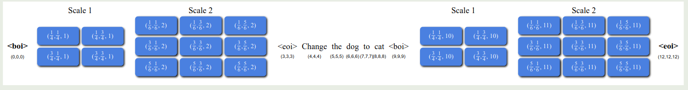
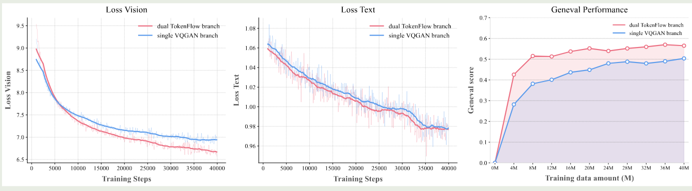
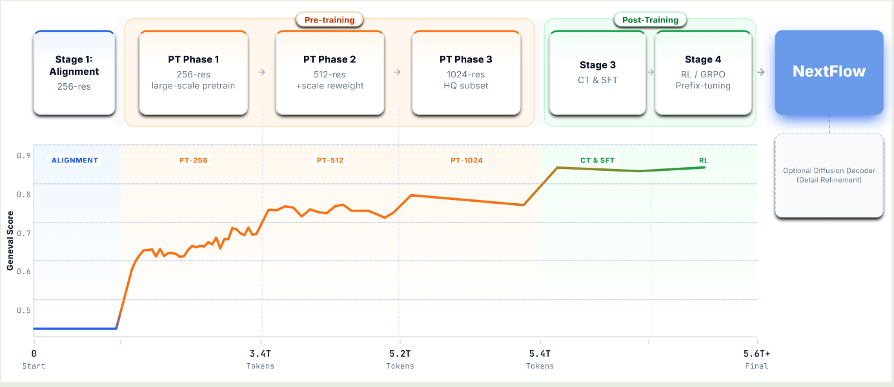

## Introduction

现在的统一理解与生成多模态大模型面临的主要问题是难以解决语义特征和图像特征之间不匹配性。diffusion model 可以较好学习图像特征，但是缺乏了对于高阶语义特征的理解和推理能力，反之 LLM 可以比较好利用高阶语义特征，而代价则是难以处理图片细节。

为了解决这个问题，目前的主流做法是分流，分流策略有两种：

1. 类似 BAGEL 在 transformer 架构上进行分流，分别处理图像模态以及文本模态特征，这也是自 BAGEL 以来比较常用的一种做法
2. 输入输出端进行分流，代表性工作有 Transfusion, 这种策略使用 encoder 将图片映射到文本空间，然后对输出进行解码，通过使用图片生成的目标函数，我们可以保证图片生成的质量

尽管基于 transformer 架构分流策略的效果比较好，但是对应地，其增加了整体训练的代价，而且并没有完成深度模态统一的目标；而基于输入输出分流的方法则因为目标函数不同很容易导致训练不稳定或者损害模型本身的表现。

在本文中，作者采取的策略为不使用分流策略，避免对模型架构产生比较大的修改。但是，这样就引入了一个新的问题，自回归生成模型的低效率性，目前主流的生成方式为 raster scan next-token prediction, 当图片非常大时，我们要生成的 token 非常多，从而整体的推理效率非常低。作者在这里举例提到 Emu3 生成一张 $1024\times 1024$ 的图片需要 10 分钟。并且，自回归生成模型对应的 tokenizer 往往基于 reconstruction 的目标进行训练，而这种训练目标产生的 token 更关注图片细节，这与 LLM 更关注语义特征并不一致，因此其效果也更差。

为了解决已有自回归生成模型的问题，作者提出了使用 VAR 提出的 next-scale prediction 策略，通过 next-scale prediction, 我们可以极大程度提高图片生成的效率，作者这里强调了 NextFlow 生成一张 $1024\times 1024$ 的图片仅需要 5 秒，这个效率是 Emu3 的 120 倍。

接下来就是作者针对提出的架构和方法进行的改进，主要包括：

1. 使用了 6T 数据进行训练
2. 使用了基于 prefix-tuning 策略的 GRPO 方法来提高模型的 reasoning 能力
3. 构建了一个基于 diffusion 的 decoder 来对输出图片进行优化

最后，作者通过实验验证了 NextFlow 的有效性，并且在效率上，相比于基于 MMDiT 架构的模型，NextFlow 使用了更少的算力进行推理。

## Method

### Architecture

NextFlow 的架构图如下所示

模型架构包括 3 个部分：

1. tokenizer: NextFlow 的 tokenizer 基于 TokenFlow, TokenFlow 通过使用两个 codebook 来分别提取对应的语义特征和图片特征进而提高 tokenizer 的表达能力
2. transformer: NextFlow 使用了 [Qwen2.5-VL](https://maosong.website/p/notes-on-qwen2.5-vl/) 7B 模型作为 base model, 作者将其 Vision Encoder 替换为了 TokenFlow tokenizer 用于提取视觉特征
3. optinal diffusion decoder: 用于进一步优化图片的细节。作者使用 TokenFLow tokenizer 的 token 表示，外接了一个 diffusion model 来优化最终的输出。

在数据格式上，作者使用了 `<boi>`, `<eoi>` 来标记图片 token, 然后每个图片通过 TokenFLow 表示为不同 scale 的 token, 如下图所示

在位置编码上，作者采用了 Multi-Scale 3D RoPE 策略，第 $t$ 个 token 如果是文本 token, 则表示为 $(t,t,t)$, 如果是图片 token, 则表示为如下形式

$$
(p_x, p_y, p_s) = \left(\frac{C}{\sqrt{HW}}(i+0.5),\frac{C}{\sqrt{HW}}(j+0.5),s\right)
$$

这里 $H, W, C, s$ 分别是 grid 对应的 size, constant range factor 以及 scale. 为了保持数据的一致性，作者还对所有的空间位置进行了归一化，避免在 SFT 时进行外推。

与 VAR 一致，作者使用了 scale length positional embedding, 即在 scale 层面使用了 Transformer 提出的 Sinusoidal encoding, 作者认为通过显示编码 scale 可以提高模型对于图片精度的认知能力。

在训练上，作者提出了两个优化策略。

首先，作者发现，不同 scale 的 token 数量不一致，small scale 对应的 token 数量较少，随着生成 token 数增加，由于 attention 存在局部依赖性（见 [NSA](https://maosong.website/p/notes-on-nsa/)）模型对于早期 token 关注度较低，为了解决这个问题，作者的做法就是使用 scale-dependent weight, 不同 scale 对应 token 的损失函数权重为

$$
k_s =\frac{1}{(h_s\times w_s)^\alpha}
$$

这里 $\alpha$ 是超参数，通过这种方式，作者保证了模型对于不同 scale token 能够一视同仁。

接下来，就是训练与推理的不一致性，训练时，模型的上下文是无损的，但是在推理时，由于模型需要基于自己的输出来预测下一个 token, 因此很容易出现误差累积。为了解决这个问题，作者的做法是使用 [[infinity]] 提出的 self-correction 机制，具体做法就是，在 encode 当前 token 时，随机加入一些噪声，制造出有损的上下文然后让模型预测下一个 token, 也就是提高模型对于误差的稳健性。但是，使用这种策略并没有带来理想中的提升，作者分析原因发现是 VAR 的 feature 与输入 feature 存在较大的不一致性，作者的解决方法就是直接使用 residual feature. 通过这种方式模型的能力有了极大的提升

### Ablation Study

作者在本节探讨了架构设计上的一些细节。

首先，作者探究了 tokenizer 的训练，原始 TokenFLow tokenizer 使用了衣蛾预训练的 semantic encoder 以及一个从零开始训练的 pixel encoder, 作者发现这种不一致性会损害模型的表现。为了解决这个问题，作者分别从零开始训练 semantic encoder 和 pixel encoder, 确保两者都在一个水平上，然后再进行 TokenFlow 的训练，通过这种多阶段训练方式，我们可以有效提高训练效率以及模型的表现。训练时，作者还随机丢弃了 $50\%$ 的 VAR scale 来提高模型的稳健性。作者进一步对比了 TokenFlow 这种 dual-codebook 和 single-codebook 之间的表现，如下图所示

结果显示，尽管 single-codebook 的重建效果更好，但是在下游任务上其表现不如 TokenFlow.

接下来，作者探讨了 output head, 也就是我们应该分别针对不同的模态设计不同的 output head 还是使用统一的 output head, 作者对比了两种架构，结果如下图所示

实验结果显示，single head 的效果更好。因此作者使用了 single head 设计

### Training

训练流程图如下所示

在 alignment 时，作者使用 TokenFlow tokenizer 替换 Qwen2.5-VL 7B 的 ViT, 作者同时训练 connector (MLP) 和 output head, 冻结其他参数，这个阶段使用了 **10M** image-text pairs.

pre-training 时，作者采用了三阶段训练策略，图片数据的精度分别为 256, 512, 1024. 共使用了 6T token.

- 256-level: 2B 文生图样本，纯文本数据，以及 147M 图文交错数据
- 512-level: 提高模型的细节生成能力，使用了 scale-dependent weight 策略
- 1024-level: 使用了 40M 高质量样本

continue pre-training 和 SFT 阶段，作者分别使用了美学相关的数据和对话数据来提高模型图片生成的质量和指令跟随能力。

RL 阶段，由于早期的 token 对最终图片生成更加重要，作者使用了一个 prefix-tuning 策略，也就是我们只计算 image token sequence 中前 $m$ 个 scale 对应的 token, 通过这种方式我们提高训练速度以及保证模型生成的质量。训练目标函数如下所示

$$
L_{GRPO}(\theta) = \mathbb{E}_{\mathbf{c} \sim \mathcal{C},\{\mathbf{s}_t^i\}_{i=1}^G \sim \pi_\theta} \frac{1}{G} \sum_{t=1}^m k_t \min\left( \frac{p_\theta(\mathbf{s}_{t+1}^i|\mathbf{s}_t^i,\mathbf{c})}{p_{\theta_{old}}(\mathbf{s}_{t+1}^i|\mathbf{s}_t^i,\mathbf{c})} A_i, \, \text{clip}\left( \frac{p_\theta(\mathbf{s}_{t+1}^i|\mathbf{s}_t^i,\mathbf{c})}{p_{\theta_{old}}(\mathbf{s}_{t+1}^i|\mathbf{s}_t^i,\mathbf{c})}, \, 1-\epsilon, \, 1+\epsilon \right) A_i \right) - \beta D_{KL}(\pi_\theta, \pi_{ref})
$$

最终，training recipe 如下图所示

## Experiments

我们主要关注 NextFlow 和 Qwen-Image, Seedream 3.0 的表现对比情况，结果如下表所示

| Benchmark   | NextFlow | NextFlow-RL | Qwen-Image | Seedream 3.0 |
| ----------- | -------- | ----------- | ---------- | ------------ |
| DPG         | 86.00    | **88.32**   | 88.32      | 88.27        |
| GenEval     | 0.83     | 0.84        | **0.87**   | 0.84         |
| WISE        | 0.59     | **0.62**    | 0.62       | -            |
| PRISM-Bench | 74.7     | 78.8        | **79.9**   | 79.6         |
| ImgEdit     | 4.44     | 4.49        | 4.27       | -            |

## Conclusion

作者在本文中提出了 NextFlow, 一个基于自回归的统一理解与生成模型，NextFlow 使用了 TokenFlow 解决了单一 tokenizer 不能同时提取语义信息和像素信息的缺点，使用了 VAR 解决了自回归图片生成范式效率低的问题。

## References

- [NextFlow: Unified Sequential Modeling Activates Multimodal Understanding and Generation](http://arxiv.org/abs/2601.02204)
