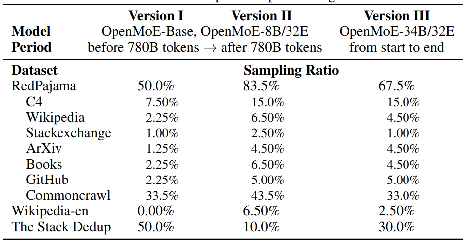

## Introduction

作者在本文中主要想完成三个目标：

1. 基于已有框架尝试训练一个 MoE 大语言模型
2. 详细分析 MoE 模型的 routing 机制
3. 为后续 MoE 模型开发提供经验

基于这三个目标，作者在本文中发布了 4 个 MoE 模型。预训练时，作者使用了 $52.25\%$ 的代码数据来提高模型的表现。作者还是用了 UL2 作为训练目标。

通过实验作者发现 MoE 机制存在以下三个性质：

1. Context-independent Specialization: 即 MoE 模型倾向于基于 token semantics 进行聚类，而不是 context
2. early routing learning:  routing 的分布情况在训练早期就已经确定了
3. drop towards the end: 使用 token dropping 策略之后，越往后的的 token 被丢弃掉的概率也就越大

## Method

### Model

作者介绍了模型使用的数据集如下

模型的 tokenizer 基于 umT5, 大小为 256K, umT5 支持多语种，并且还有 fallback 机制来处理 OOV 的 token

模型配置如下

| Model             | OpenMoE-Base/16E | OpenMoE-8B/32E | OpenMoE-34B/32E |
| ----------------- | ---------------- | -------------- | --------------- |
| total params      | 650M             | 8.7B           | 34B             |
| activated params  | 142M             | 2.1B           | 6B              |
| total experts     | 16               | 32             | 32              |
| activated experts | 2                | 2              | 2               |
| shared experts    | 1                | 1              | 1               |
| Layout            | every 4          | every 6        | every 4         |
| `hidden_dim`      | 768              | 2048           | 3072            |
| `ffn_hidden_dim`  | 3072             | 8192           | 12288           |
| `num_heads`       | 12               | 24             | 24              |
| `head_dim`        | 64               | 128            | 128             |
| `num_layers`      | 12               | 24             | 32              |

### Training

作者使用了 [Load Balancing loss](https://maosong.website/p/load-balancing-tutorial/) 和 [ST-MoE](https://maosong.website/p/st-moe/) 提出的 Router Z-loss, 最终训练的目标函数与 [ST-MoE](https://maosong.website/p/st-moe/) 一致

作者在训练时，还是用了 UL2, UL2 结合了 mask language modeling 和 casual language modeling 两种训练方式。

作者首先对各个实验配置进行了验证，其中关键接论文模型很容易在 code data 上达到比较高的准确率以及比较低的 loss, 作者认为这是因为 code data 中存在大量的特殊符号。

训练过程中，作者发现模型在训练一定步数之后，容易出现过饱和现象，因此作者将训练目标函数由 UL2 降为 CasualLM, 并未作者还将代码数据的比例降低到 $15\%$.

## Experiments

### Analysis OpenMoE

1. 作者发现，大部分专家对于不同的 domain 没有出现 specialization 情况，对于 math domain, specialization 现象比较明显，作者认为这是因为 math domain 包含更多的 special tokens
2. 对于不同的语言，有部分专家出现 specialization 现象
3. 部分专家对于 position ID 有 specialization 现象，并且连续的 token 更偏好相同的专家
4. 作者还发现，部分专家对于 Token ID 有 specialization 现象，作者将这种现象称为 **Context-independent  Specialization**.
5. 专家还会对语义相似的 token 进行聚类，并且这种聚类在训练早期就已经发生，作者认为其原因在于重新分配 token 会增加最终的 loss
6. 对于 token dropping, 作者发现月考后的 token, 其被 drop 的概率比例也越高。并且对于指令跟随数据，更多的 token 都会被丢掉，因此作者认为指令跟随数据是 MoE 模型的一种 OOD 数据

### Analysis on other MoE Models

作者还分析了 [Mixtral MoE](https://maosong.website/p/mixstral-8x7b/) 和 [DeepSeekMoE](https://maosong.website/p/notes-on-deepseekmoe/) 两个模型的专家路由情况。这两个模型采用了 dropless token routing 的机制。

首先，作者分析了这两个模型对于 TokenID 的敏感性，结果发现，DeepSeek-MoE 的 specialization 现象比较明显，而 Mixtral MoE 由于使用了 upcycling, 其 specialization 现象不太明显，作者认为这是因为 upcycling 导致每个专家的权重都差不多。最终，作者认为对于 training from stratch 的 MoE model 这个 specialization 现象更明显。

## Conclusion

作者在本文中提出了一个全开源的 MoE 大模型系列，包括 0.6B, 8.7B 和 34B 三个 size, 作者还对 MoE 中的 routing 进行了详细的分析，结果发现【【】】，这些发现有助于后续的 MoE 模型架构的研究。

## References

- [Arxiv](http://arxiv.org/abs/2402.01739)
