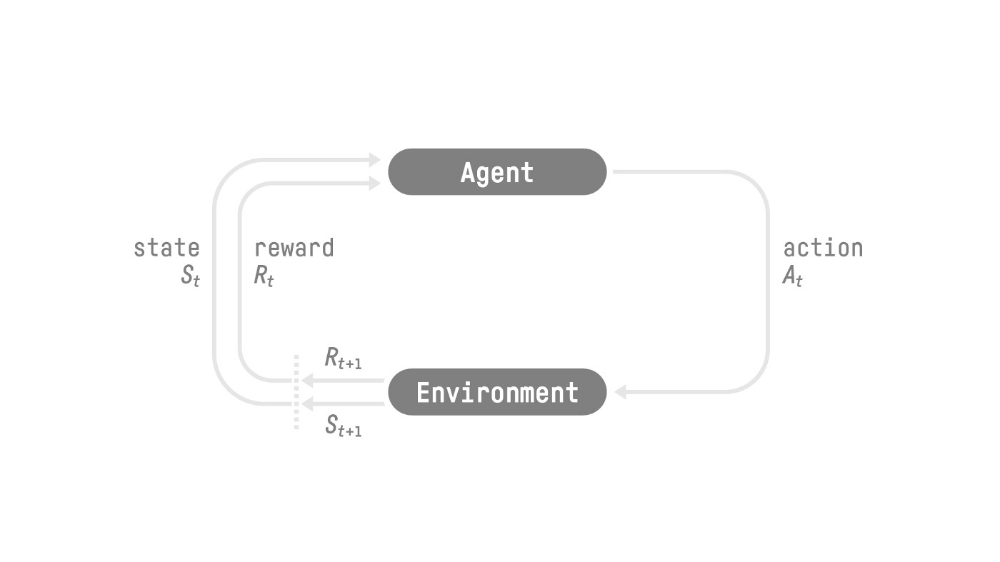

## Introduction

RL 的基本思想是通过与环境进行交互，获取奖励来进行学习

RL 的定义如下

> 强化学习是一个通过构建可以与环境进行交互的 agent 来解决控制和决策任务的学习框架，交互的方式为 agent 执行 action, 然后环境给予奖励

RL 的执行过程如下所示

## RL Basics

RL 的数学建模依赖于 Markov decision process, 下面我们先介绍相关概念

### Definition

> 一个 Markov decision process (MDP) 包含如下模块：

> 1. 时间 $t=0,1,\dots,T$.
> 2. 状态 $s_t\in\mathcal{S}\cup\{\langle term\rangle\}$, 其中 $\mathcal{S}$ 是状态空间 (state space)
> 3. 动作 $a_t\in\mathcal{A}$ , 其中 $\mathcal{A}$ 是动作空间 (action space)
> 4. 奖励 $r_t\in\mathbb{R}$, 环境对 agent 当前 action $a_t$ 给予的反馈
> 5. 终止时间 $T$, 额外定义 $s_T=\langle term\rangle$ 为终止状态
> 6. 初始状态分布 $s_o\sim p_0$.
> 7. 转换概率 (transition probability):  $r_t,s_{t+1}\sim p(\cdot,\cdot\mid s_t,a_t)$.
> 8. 轨迹 $\tau=(s_0,a_0,r_0,s_1,a_1,r_1,\dots,s_{T-1},a_{T-1}, r_{T-1}, s_T)$.
> 9. **Markov property**. $t+1$ 时刻的状态仅与 $t$ 时刻的状态与动作相关，即 $p(s_{t+1}\mid s_t,a_t,\dots,a_0,a_0)=p(s_{t+1}\mid s_t,a_t)$ 以及 $p(r_{t}\mid s_t,a_t,\dots,s_0,a_t)=p(r_t\mid s_t,a_t)$.

我们会对一些表达式进行简化：

1. 当 $r_t$ 完全由 $(s_t,a_t)$ 决定时，我们记为 $r_t=r(s_t,a_t)$
2. 我们假设状态转移函数是平稳的 (stationary), 即 $p_t(r,s'\mid s,a)=p(r,s'\mid s,a)$。
3. $a_t$ 通常由一个策略 $\pi$ 决定， 当 $\pi$ 完全由 $s_t$ 决定时，我们记为 $a_t=\pi(s_t)$, 反之，$a_t$ 从 $\pi$ 中采样得到，即 $a_t\sim\pi(\cdot\mid s_t)$.
4. 一般我们会使用一个神经网络来表示 $\pi$, 即 $\pi=\pi_\theta$, 这里 $\theta$ 就是神经网络的参数。

**state and observation**

通常来说，state 包含了当前进行决策所需要的所有信息（环境信息，历史信息，agent 自身信息），这种情况下 MDP 的 Markov 性质成立。实际上 agent 获取的可能只是一部分信息，即 agent 获取的为 observation, 这种情况下 MDP 特化为 Partially Observable Markov Decision Process (POMDP), 此时我们的 Markov 性质就不再对 observation 成立，我们的问题也变的更加困难。

> Takeaway
> State 表示整个环境的完整表示，而 observation 则是环境的部分表示

对于 LLM 来说，我们可以获取历史状态的所有信息，因此我们可以将 RL for LLM 视作一个 MDP 问题。

**action space**

action space  $\mathcal{A}$ 可以是连续的，比如上下左右四个方向，也可以是连续的，比如方向盘的角度

**episodic and continuing**

根据任务的终止时间 $T$，我们可以将任务分为 episodic task 和 continuing task, 当 $T=\infty$ 时， 我们的任务称为 continual task，比如游戏, 否则称之为 episodic task, 比如股票预测.

除了 POMDP 之外，MDP 也有一些其他的推广形式：

1. non-stationary dynamics, 即不同时间步的状态转移函数不同
2. pre-determined terminal time $T$. 终止时间指定，因为 $p_{T-1}(\langle term\rangle\mid s_{T-1}, a_{T-1})=1$ 且 $p_{t+1}(\langle term\rangle\mid s_{t}, a_{t})=0$, $\forall t\in[T-2]$, 所以此时 MDP 为 non-stationary,
3. policy $\pi_t$ may be time-dependent, 一般来说仅在 non-stationary dynamics 中有必要
4. actions may depend on states, 即 $a_t\in\mathcal{A}(s_t)$.

由于 $T$ 也是一个随机变量，因此 $\mathbb{E}[\sum_{t=0}^T\cdot]\neq\sum_{t=0}^T\mathbb{E}[\cdot]$.

为了简化，我们一般会使用一个等价的，不会停止的 MDP:

1. the MDP never stops,  即 $T=\infty$
2. $s_t\in\mathcal{S}\cup\{\langle term\rangle\}$, 这里 $\langle term\rangle$ 是一个 normal state.
3. absorbing state: 当 $s_t=\langle term\rangle$ 时， $r_t=0, s_{t+1}=\langle term\rangle$, 即状态不会离开 $\langle term\rangle$.
4. $\pi(\cdot\mid\langle term\rangle)$ 不产生任何影响

### RL Objective

RL 的最终目标为最大化累计奖励，称为 expected return, 这个目标基于**reward hypothesis**, 即*所有的目标都可以被描述为最大化 expected return*.  目标函数表达式如下

$$
\max_{\pi}\quad \mathbb{E}_{s_0\sim p_0}^\pi\left[\sum_{t=0}^{T-1}r_t\right]
$$

由于未来存在不确定性，我们会对这种不确定性施加惩罚，即时间越远，其对于当前的 reward 就越低，这其实就是经济学中的现值 (present value, PV), 因此我们实际上优化的目标函数是 expected discounted  return:

$$
\max_{\pi}\quad \mathbb{E}_{s_0\sim p_0}^\pi\left[\sum_{t=0}^{T-1}\gamma^tr_t\right]
$$

这里 $\gamma\in(0, 1]$ 是一个超参数，我们定义

$$
G_t = r_t +\gamma r_{t+1}+\cdots+\gamma^{T-1-t}r_{T-1}=\sum_{t'=t}^{T-1}\gamma^{t'-t}r_{t'}
$$

$G_t$ 被称为 **discounted  return**.
