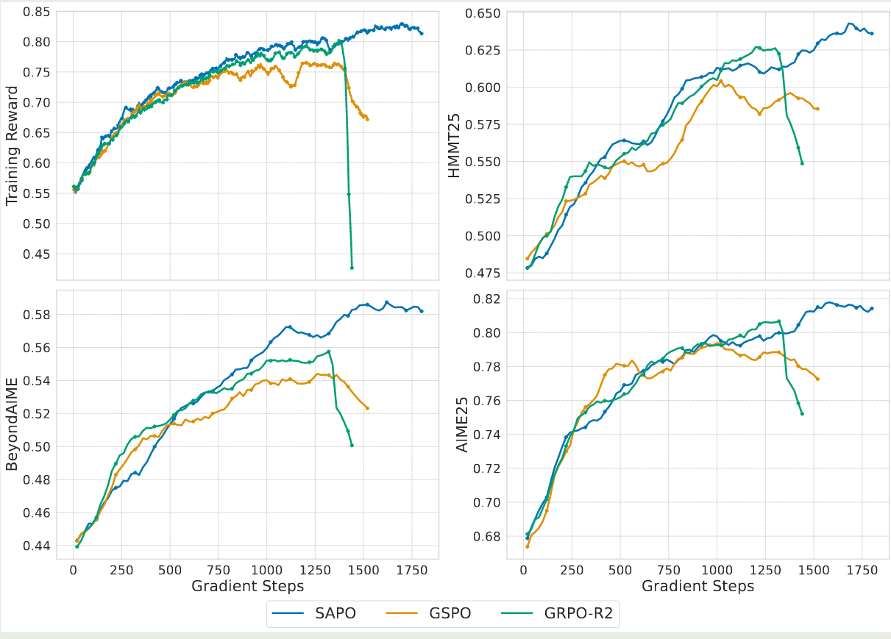

## Introduction

相关工作包括 GRPO 以及 [GSPO](https://maosong.website/p/notes-on-gspo/)

SAPO 的关键思想有两点：

1. tokne-level soft trust region 可以保证 sequence-level coherence
2. 非对称的 temperature 可以针对 postive token 和 negative token 进行不同的优化

## Method

作者首先给出了 SAPO 的目标函数如下：

$$
\mathcal{J}_{\mathrm{SAPO}}(\theta) = \mathbb{E}_{(x, y)\sim\mathcal{D},\{y_i\}_{i=1}^G\sim \pi_{\theta_{old}}(\cdot\mid x)}\left[ \frac{1}{G}\sum_{i=1}^G\frac{1}{|y_i|}\sum_{t=1}^{|y_i|}f_{i,t}(r_{i,t}(\theta))\hat{A}_{i,t} \right],
$$

其中，

$$
f_{i,t}(x) = \sigma(\tau_{i,t}(x-1))\cdot \frac{4}{\tau_{i,t}}, \tau_{i,t} = \begin{cases}
\tau_{pos}, & \text{if }\hat{A}_{i,t}>0\\
\tau_{neg}, &\text{otherwise}
\end{cases}
$$

这里

$$
\hat{A}_{i,t} = \hat{A}_{i} = \frac{r(x,y_i) - \mathrm{mean}(\{r(x,y_i)\}_{i=1}^G)}{\mathrm{std}(\{r(x,y_i)\}_{i=1}^G)},\quad r_{i,t}(\theta) = \frac{\pi_{\theta}(y_{i,t}\mid x, y_{i,< t})}{\pi_{\theta_{old}}(y_{i,t}\mid x, y_{i,< t})}
$$

$\tau_{pos}$ 和 $\tau_{neg}$ 分别是 positive token 以及 negative token 对应的温度, $\sigma(x)=1/(1+e^{-x})$ 是 sigmoid function.

对 $\mathcal{J}_{\mathrm{SAPO}}(\theta)$ 求导得到

$$
\nabla_\theta \mathcal{J}_{\mathrm{SAPO}}(\theta) = \mathbb{E}_{(x, y)\sim\mathcal{D},\{y_i\}_{i=1}^G\sim \pi_{\theta_{old}}(\cdot\mid q)}\left[ \frac{1}{G}\sum_{i=1}^G\frac{1}{|y_i|}\sum_{t=1}^{|y_i|}w_{i,t}(\theta)r_{i,t}(\theta)\nabla_\theta \log \pi_\theta(y_{i,t}\mid q, y_{i, <t}) \right]
$$

其中

$$
w_{i,t}(\theta) = 4p_{i,t}(\theta)(1-p_{i,t}(\theta)),\quad p_{i,t}(\theta) = \sigma(\tau_{i,t} (r_{i,t}(\theta)-1)),
$$

$\mathcal{J}_{\mathrm{SAPO}}(\theta)$ 和 $w_{i,t}(\theta)$ 与 $r_{i,t}(\theta)$ 的关系如下图所示

为了保证当 $r_{i,t}(\theta)=1$ 时，SAPO 等价于 $r_{i,t}(\theta)\hat{A}_{i,t}$ 而与 $\tau_{i,t}$ 无关，作者在 $f_{i,t}(x)$ 加入了系数 $4/\tau_{i,t}$.

## Comparison

作者接下来对比了 GSPO 以及 GRPO 两个算法

首先作者使用了一下统一的目标函数公式来表示三个算法

$$
\mathcal{J}(\theta) = \mathbb{E}_{(x, y)\sim\mathcal{D},\{y_i\}_{i=1}^G\sim \pi_{\theta_{old}}(\cdot\mid x)}\left[ \frac{1}{G}\sum_{i=1}^G\frac{1}{|y_i|}\sum_{t=1}^{|y_i|}f_{i,t}(r_{i,t}(\theta))\hat{A}_{i,t} \right],
$$

其中不同算法的 $f_{i,t}(\cdot)$ 不一样，三种算法的定义如下

$$
\begin{aligned}
\mathrm{SAPO}&:f_{i,t}^{\mathrm{SAPO}}(r_{i,t}(\theta))=\sigma(\tau_{i,t}(x-1))\cdot \frac{4}{\tau_{i,t}}, \tau_{i,t} = \begin{cases}
\tau_{pos}, & \text{if }\hat{A}_{i,t}>0\\
\tau_{neg}, &\text{otherwise}
\end{cases}\\
\mathrm{GRPO}&:f_{i,t}^{\mathrm{GRPO}}(r_{i,t}(\theta), \hat{A}_{i,t})=\begin{cases}
\min(r_{i,t}(\theta), 1+\epsilon) & \hat{A}_{i,t}>0\\
\max(r_{i,t}(\theta), 1-\epsilon) & \hat{A}_{i,t}\leq0
\end{cases}\\
\mathrm{GSPO}&:f_{i,t}^{\mathrm{GSPO}}(r_{i,t}(\theta), \hat{A}_{i,t})=f_{i,t}^{\mathrm{seq}}(r_{i,t}(\theta), \hat{A}_{i,t})=\begin{cases}
\min(s_{i,t}(\theta), 1+\epsilon) & \hat{A}_{i,t}>0\\
\max(s_{i,t}(\theta), 1-\epsilon) & \hat{A}_{i,t}\leq0
\end{cases}
\end{aligned}
$$

其中

$$
s_i(\theta) = \left(\frac{\pi_{\theta}(y_{i}\mid x)}{\pi_{\theta_{old}}(y_{i}\mid x)}\right)^{\frac{1}{|y_i|}}, s_{i,t}(\theta) = \mathrm{sg}[s_i(\theta)]\frac{\pi_{\theta}(y_{i,t}\mid x, y_{i,< t})}{\mathrm{sg}[\pi_{\theta}(y_{i,t}\mid x, y_{i,< t})]}
$$

首先是与 GSPO 的对比，通过一些假设和简化，我们得到

$$
\begin{aligned}
\nabla_\theta \mathcal{J}_{\mathrm{SAPO}}(\theta) &=\mathbb{E}\left[\frac1G\sum_{i=1}^G g_{\tau_i}(\log s_i(\theta))\nabla_\theta \log s_i(\theta)\hat{A}_i\right]\\
\nabla_\theta \mathcal{J}_{\mathrm{GSPO}}(\theta) &=\mathbb{E}\left[\frac1G\sum_{i=1}^G s_i(\theta)\nabla_\theta \log s_i(\theta)\hat{A}_i\right]
\end{aligned}
$$

其中 $g_{\tau_i}(\log s_i(\theta)) = \mathrm{sech}^2\left(\tau_i/2\log s_i(\theta)\right)$.  相比于 GSPO, SAPO 有两个优势：

1. smoothness and stability, soft gate 避免了 hard clipping 带来的不连续性
2. token-level adaptivity with sequence-level coherence. 当假设不成立的时候，SAPO 退化为 token-level gating, 这样可以降低 outliers 的权重

GRPO 的函数可以进一步简化为

$$
f_{i,t}^{\mathrm{GRPO}}(r_{i,t}(\theta), \hat{A}_{i,t})= \begin{cases}
1, & \text{if }\hat{A}_{i,t}>0\text{ and }r_{i,t}(\theta)\leq 1+ \epsilon\\
0, & \text{if }\hat{A}_{i,t}>0\text{ and }r_{i,t}(\theta)> 1+ \epsilon\\
1, & \text{if }\hat{A}_{i,t}\leq0\text{ and }r_{i,t}(\theta)\geq 1- \epsilon\\
0, & \text{if }\hat{A}_{i,t}\leq0\text{ and }r_{i,t}(\theta)< 1- \epsilon
\end{cases}\\
$$

可以看到，GRPO 对应一个 binary trust region. 与 GRPO 相比，SAPO 将对应的 hard indicator 替换未来一个 smooth kernel $f_{i,t}^{\mathrm{SAPO}}(r_{i,t}(\theta))=\mathrm{sech}^2\left(\tau_i/2r_{i,t}(\theta)-1\right)$, 这样可以避免 gradient vanishing 以及提高训练的稳定性。

最终结论为：

- 相比于 GSPO, SAPO 对于 off-policy 的数据利用率更高
- 相比于 GRPO, SAPO 避免了 hard token level clipping 导致的 zero-gradient 问题

## Experiments

作者对比了 SAPO, GSPO 以及 GRPO-R2(GRPO with routing replay) 三种方法，实验结果如下图所示

实验结果显示，SAPO 的表现超过了 GSPO 以及 GRPO

作者还探究了超参数 $\tau_{pos}$ 和 $\tau_{neg}$ 的影响，结果如下图所示

实验结果显示，当 $\tau_{neg}>\tau_{pos}$ 时，模型训练最稳定，这说明了 negative token 是导致训练不稳定的主要原因。

作者还在 [Qwen3-VL](https://maosong.website/p/notes-on-qwen3-vl/) 上进行了验证，结果如下图所示

实验结果显示，SAPO 的表现超过了 GSPO 以及 GRPO-R2

## Conclusion

在本文中，作者提出了 SAPO, 一个解决 hard-clipping 训练不稳定性以及低效率的策略优化算法，作者使用了基于温度的 soft gate 来代替 clipping, 以及对于 positive token 和 negative token 使用了不同的 temperature 这两点改进。结果验证了 SAPO 的有效性，作者认为使用 smooth 以及 adaptive gating 机制可以有效提高 RL 训练的稳健性以及有效性。

## References

- [arxiv](http://arxiv.org/abs/2511.20347)
