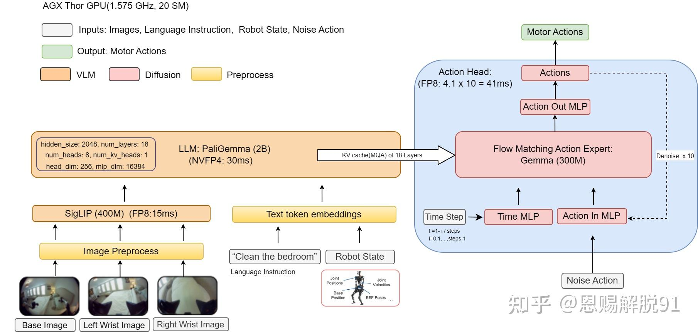
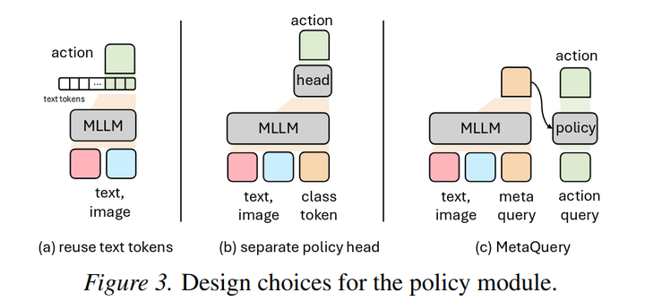
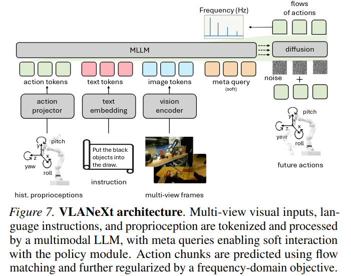
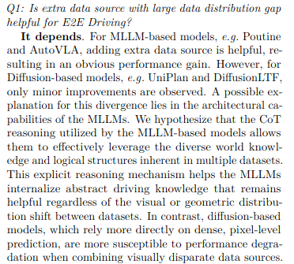
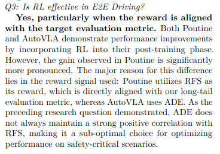
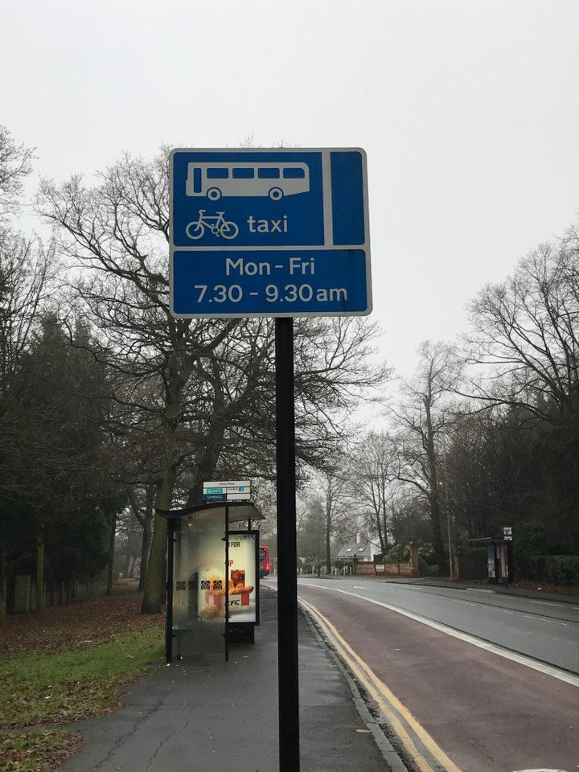

## Agenda
- 1️⃣ 什么是 VLA？ 
- 2️⃣ VLA 发展：以 π 系列做主线 
- 3️⃣ VLA模型的设计空间：分享VLANeXt 论文中的思考 
- 4️⃣ 智驾 vs 具身：共性与讨论 

## 什么是 VLA（视觉-语言-动作模型）？
VLA 代表 Vision-Language-Action（视觉-语言-动作）
VLA 的核心思想是利用多模态大模型（MLLM）的 world knowledge and reasoning capabilities，直接产生机器人的动作输出。

    输入： 机器人的摄像头图像（Vision）,机器人自身状态(Robot State)和人类的文字指令（Language）。
    处理： 基于强大的多模态大模型（MLLM）去理解场景和指令。
    输出： 直接生成控制机器人关节或末端执行器的低级动作指令（Action）。

VLA 让机器人能够像人类一样，通过观察世界、听从指令，然后直接采取行动，打破了传统机器人需要复杂的手工编码和分层多子系统的限制。

## VLA的研究进展(pi系列)-以Physical Intelligence (π)为主线(关注核心组织和人 ）
### π系列发展历程和趋势
[π](https://www.pi.website/blog)

| 阶段 | 核心架构与技术特征 | 关键突破点 |
|------|--------------------|------------|
| π₀ 2024-10 | MoT (Mixture of Transformer) + Flow Matching | 奠定了 VLA 多模态训练的基础，利用连续流匹配生成动作。 |
| FAST 2025-01 | Efficient Action Tokenization | 引入离散动作标记，提升了实时的推理速度和执行效率。 |
| π₀.₅ 2025-04 | 两者 action 建模结合 混合任务训练 层次化 VLM/VLA 架构 | 结合连续与离散建模，通过混合任务训练应对复杂、长程任务。 |
| π₀.₆* 及后续 2025-11 | RL + Memory + Agentic | 引入强化学习、长期记忆与自主决策能力，向机器人智能体迈进。 |
	

### 总结Physical Intelligence (π) VLA的进展
| 阶段 | 时间 | 版本 | 核心技术方向 |
|------|------|------|--------------|
| π系列第一阶段 | 2024-10 ~ | π₀ / π₀-FAST / π₀.₅ | Flow Matching、Efficient Action Tokenization、分层设计 VLM + VLA、混合任务训练 |
| π系列第二阶段 | 2025-11 ~ | π₀.₆* 及后续 | RL、Memory、Agentic |

## VLA模型的设计空间（VLANeXT）
[VLANeXT](https://arxiv.org/pdf/2602.18532)

### 设计VLA模型需要思考的问题：
1. action怎么生成，VLM直接输出还是额外action expert网络？
2. action训练方法，Flow matching，VAE还是DDIM？
3. VLM和action expert的怎么连接？
4. propriocetion 自身状态输入给VLM还是action expert
5. 多相机数据怎么输入给VLA，相机标定的内外参信息怎么喂给模型？图像的时序信息怎么处理？
6. 是否引入额外任务构建更稠密的loss？如预测下一帧图像，还是引入额外输出头？

### VLANEXT中探讨的VLA设计空间
| 设计维度                         | 决策组件 / 变量                            | 设计选项 (Design Options)                                                      | 实验结论摘要 (Ablation Insights)                | 最佳配方 (Final Recipe)                           |
| ---------------------------- | ------------------------------------ | -------------------------------------------------------------------------- | ----------------------------------------- | --------------------------------------------- |
| **一、基础组件 (Foundational)**    | 1. 策略模块设计 (Policy Architecture)      | A. 复用文本Token B. 独立策略头（浅层） C. 深度策略网络（MetaQuery）                       | 浅层或复用架构无法充分解耦感知与动作；MetaQuery 风格能更好处理复杂动作。 | 采用深度独立策略模块（16 query tokens + 12层 Transformer） |
|                              | 2. 动作分块 (Action Chunking)            | A. 单步预测（size=1） B. 多步预测（size=8）                                         | 预测未来多步动作显著提高动作平滑性和任务成功率。                  | 预测多步动作（Chunk size = 8）                        |
|                              | 3. 动作学习目标 (Action Objective)         | A. 离散分类（Binning / VQ-VAE） B. 回归（Regression） C. 扩散 / 流匹配（DDIM / Flow） | 离散化损失空间细节；连续建模（Flow Matching / 回归）表达力更强。  | 使用连续动作建模（优先 Flow Matching 或回归）                |
|                              | 4. VLM骨干容量 (VLM Backbone)            | 测试 LLaMA, PaliGemma, Qwen3-VL 等                                            | 骨干模型表征能力是基础，容量越大通常性能越好（需平衡资源）。            | 视算力选择最优开源骨干（如 Qwen3-VL）                       |
|                              | 5. VLM-策略连接 (VLM-Policy Link)        | A. 松散连接（Loose） B. 紧密连接（Tight） C. 软连接（Soft，引入 Query buffer）           | 软连接通过可学习 query 提供缓冲，适配性略优于紧密或松散耦合。        | 软连接策略（Soft Connection）                        |
| **二、感知要素 (Perception)**      | 6. 时序历史 (Temporal History)           | A. 仅当前帧 B. 添加过去帧                                                        | 添加过去帧反而降低性能，可能引入冗余或干扰信息。                  | 避免冗余时序历史输入（专注当前帧）                             |
|                              | 7. 相机视角 (Camera Views)               | A. 单视角 B. 多视角（第三人称 + 腕部）                                                | 多视角提供更全面空间信息，显著提升空间感知与操作精度。               | 多视角输入（第三人称 + 腕部相机）                            |
|                              | 8. 本体感觉注入 (Proprioception)           | A. 无本体 state B. VLM端注入 C. 策略端注入 D. 双端注入                           | 本体 state 对闭环控制至关重要；VLM端注入效果优于策略端。         | 本体 state 条件于 VLM 端注入                          |
| **三、动作建模 (Action Modeling)** | 9. 世界建模辅助 (World Modeling)           | 引入未来帧预测目标（如 Emu3.5）                                                        | 性能有提升，但训练成本增加约3倍，性价比低。                    | 不纳入最终配方                                       |
|                              | 10. 时序预测视角 (Time-Series Perspective) | 引入频域损失（DCT）                                                                | 将动作视为时序预测问题，引入频域损失可低成本提升动作质量。             | 引入频域辅助损失（DCT）                                 |

## 应用场景-具身VS智驾
### 具身和智驾领域VLA论文对比-->技术趋同
| 技术方向 | 具身 | 智驾 |
|-----------|------|------|
| action token | pi0-FAST、RT2、OpenVLA | AutoVLA |
| action expert（flow matching） | pi0 | DriveMoE |
| action 建模两者结合 + 强化学习 RL | pi0.5、pi0.6* | Alpamaya |
| 辅助 loss（3D 感知 / 世界模型 / 通才模型） | 蚂蚁 LingBot-VLA | DriveVLA-W0 / EMMA |
	
### Nvidia Alpamaya智驾VLA
Alpamayo-R1: Bridging Reasoning and Action Prediction for Generalizable Autonomous Driving in the Long Tail

### 从Waymo End-to-End Driving Chanllenges看未来智驾的技术趋势
添加图片注释，不超过 140 字（可选）
WOD-E2E: Waymo Open Dataset for End-to-End Driving in Challenging Long-tail Scenarios(https://arxiv.org/pdf/2510.26125)-4.4. Discussion of the Results

`1.MLLM-based Model (VLA)的好处？->数据不易饱和`  

`2.强化学习对E2E驾驶能力的提升？`  

## open discussion
### Q1. 智驾是否需要VLA吗 ？
- a.智驾特殊场景和长尾场景是否需要Language，是否是帮助提升泛化性?
- b.交互能力对于驾驶是否必须?驾驶需要需要遵循人类指令？
- c. 推理CoT对于智驾这类实时性高的场景是否必须？怎么trade-off?

### Q2. VLA vs WAM？

`VLA (Vision-Language-Action, 视觉-语言-动作模型)`  
瓶颈： VLA 模型通常缺乏对物理世界的深刻理解（没有物理常识）。它只是学到了动作和图像之间的“统计映射”。

`WAM (World Action Model, 世界动作模型)`  
核心思想： WAM 是建立在 World Model (世界模型) 之上的动作模型。世界模型的核心能力是“预测未来”。它学习物理世界的运作规律（例如，物体掉落会向下，水杯翻了水会流出）。 当接收到指令和当前视觉时，WAM 不会直接生成动作。它首先利用其世界模型“想象”：如果我采取动作A，世界会变成什么样？采取动作B，世界又会变成什么样？通过在“想象”中模拟未来，WAM 可以选择最能达成目标的动作序列。
WAM 的优势： 具有物理常识，具有“预测”和“规划”能力。

[cosmos policy](https://arxiv.org/pdf/2601.16163)
添加图片注释，不超过 140 字（可选）
添加图片注释，不超过 140 字（可选）
### Q3. VLA 是终局吗？WAM 是终局吗？两者怎么融合？
添加图片注释，不超过 140 字（可选）

## 总结
### π 系列VLA：
Physical Intelligence 的 π 系列 VLA 模型。π0​，基于VLM+Action Expert架构，Flow matching结合流匹配技术，多步去噪生成aciton; π0.5​,混合任务训练，采用两种action token建模方式，通过层次化 VLM+VLA 架构提高了复杂任务泛化能力；π0.6*及后续​，引入强化学习与记忆，推动VLA模型具有自主规划能力的具身智能体（Agentic AI）演进。
     
### VLANeXT-VLA 的关键“设计空间”： 
VLA 模型的执行效率源自深度独立的策略网络、多步动作分块、以及频域辅助损失对连续动作建模的优化；最佳配方摒弃了降低性能的历史时序输入，专注于多视角感知和连续动作流预测。
    
### 智驾与具身VLA： 
两者皆是 Physical  AI的应用，模型设计上具有极高的技术重合度。讨论 VLA是否必须？VLA还是WAM两者技术路线？

## 更多细节
- [Physical Intelligence (π)](https://www.pi.website/)
- [VLANeXT分析](https://zhuanlan.zhihu.com/p/2025605094205309303))
- [Nividia Alpamayo-R1](https://zhuanlan.zhihu.com/p/1985783547974398799)
- [理想汽车MindVLA-o1分享](https://zhuanlan.zhihu.com/p/2022348542585390814)
- [WOD-E2E](https://arxiv.org/pdf/2510.26125)
- [E2E-Driving Chanllenges](https://waymo.com/open/challenges/2025/e2e-driving/)
- [Cosmos Policy](https://arxiv.org/pdf/2601.16163)