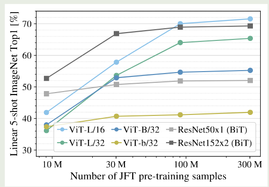
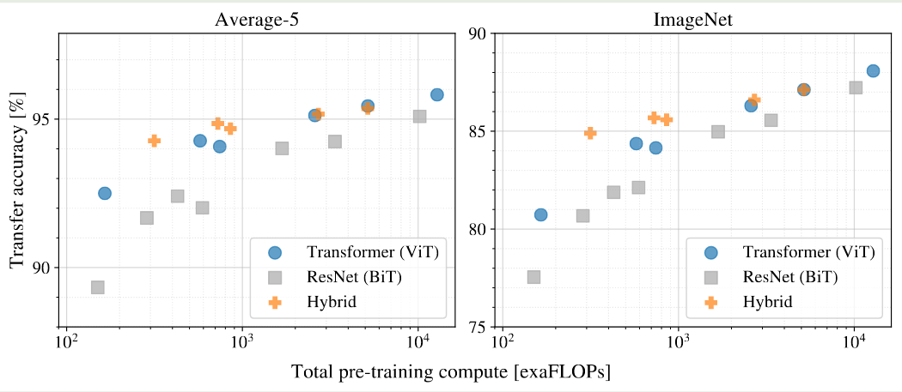
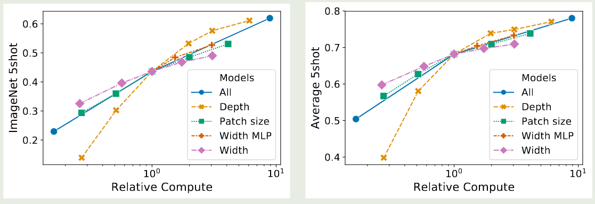

## Introduction

Transformer 架构在 NLP 领域已经成为了事实上的标准。而在 CV 领域，目前还是 CNN 架构占据了主导。

在本文中，作者就探究是否可以应用 Transformer 架构来完成图像识别的任务。

作者发现，当在小规模数据集上进行训练时，Transformer 架构的表现是不如 CNN 架构的，作者认为原因是 Transformer 架构缺乏如 translation equivariance 和 locality 等 inductive biases. 但是当数据集规模上去之后，作者发现这种 inductive bias 可以通过大规模训练抵消掉。其中，最好的模型在 ImageNet 上达到了 $88.55\%$ 的准确率。

## Method

ViT 的架构如下图所示

为了能够处理图片，对于输入的图片 $x\in\mathbb{R}^{H\times W\times C}$,  其中 $(H,W)$ 是图片大小，$C$ 是 channel 的个数。作者将其展开为一个 2D patch 序列, $x_p\in\mathbb{R}^{N\times (P^2\times C)}$, 其中 $(P, P)$ 是 image patch 的大小，$N=HW/P^2$ 是 image patch 的的个数，也是 Transformer 输入 token 的个数，Transformer 的 hidden size 为 $D$, 作者使用了一个 linear layer 来将 image patch 转换为 Transformer 的输入。

与 BERT 一致，作者使用了一个 `[class]` token 来作为输入 patch 序列的 embedding, 即 $z_0^0=x_{class}$, 其对应的输出 $z_L^0$ 作为该图片的表示。作者还使用了 1D 的 position encoding. 最终，ViT 表达式如下所示

$$
\begin{aligned}
z_0 &= [x_{class};x_p^1\mathbf{E};x_p^2\mathbf{E};\cdots;x_p^N\mathbf{E};]+\mathbf{E}_{pos}, &\mathbf{E}\in\mathbb{R}^{(P^2\cdot C)\times D},\mathbf{E}_{pos}\in\mathbb{R}^{(N+1)\times D}\\
z_{\ell}'&=\mathrm{MultiHeadAttention}(\mathrm{LayerNorm}(z_{\ell-1}))+z_{\ell-1},&\ell=1,\dots,L\\
z_{\ell} &= \mathrm{MLP}(\mathrm{LayerNorm}(z_{\ell}'))+z_{\ell}',&\ell=1,\dots,L\\
y&=\mathrm{LayerNorm}(z_L^0)
\end{aligned}
$$

作者分析认为，相比于 CNN 架构，Transformer 架构缺乏 inductive bias, 这是因为每个 patch 对其周围的 2D 临近信息用的非常少，ViT 架构必须从零开始学习这些位置以及空间关系。

作者还介绍了混合架构，即 patch embedding 由一个 linear layer 替换为一个 CNN 架构

在 finetune 时，作者移除了 pre-trained 的 prediction head, 然后加入了一个 $D\times K$ 的 feed forward layer, 其中 $K$ 是分类的类别数。

## Experiments

作者使用的数据集如下所示

| Dataset      | classes | images |
| ------------ | ------- | ------ |
| ImageNet     | 1K      | 1.3M   |
| ImageNet-21K | 21K     | 14M    |
| JFT          | 18K     | 303M   |

作者在 ImageNet, CIFAR-10/100, Oxford-IIIT Pets, Oxford Flowers-102 这些数据集上进行评测。

模型配置如下表所示

| Model     | Layers | $D$  | $D_{FFN}$ | # heads | # params |
| --------- | ------ | ---- | --------- | ------- | -------- |
| ViT-Base  | 12     | 768  | 3072      | 12      | 86M      |
| ViT-Large | 24     | 1024 | 4096      | 16      | 307M     |
| ViT-Huge  | 32     | 1280 | 5120      | 16      | 632M     |

为了简便，作者在后续实验过程中，对模型名字进行了改写，比如 ViT-L/16 就代表了 ViT-Large model, 其对应的 patch size 为 16.

ViT 的实验结果如下图所示

可以看到相比于 CNN 架构，ViT 所需要的训练时间更少，且效果更好。

为了验证 ViT 模型具有更高的训练效率，作者在不同的数据集上进行的实验，结果如下图所示

可以看到，当数据集比较小时，大部分 ViT 模型表现都比 ResNet 差，但是当数据集规模增加之后，ViT 的表现逐渐超过了 ResNet. 并且，随着数据集规模的增加，大模型的表现也比小模型好。

作者进一步在四个不同大小的随机数据集上进行了验证，结果如下图所示

实验结果显示，inductive bias 在小规模数据集上比较有效，但是当数据集规模上去之后，直接从数据集中学习相关的 pattern 更加高效和有效。

由于不同的模型参数可能不太一致，为了更加公平地对比，作者使用算力来进行对比，结果如下图所示

实验结果显示，ViT 的训练效率比 ResNet 更高，其次，hybrid model 在算力比较小的时候，其表现比 ViT 更好，但是当算力提升之后，两者表现差不多。最后，ViT 随着算力的提升，还有进一步提升的空间。

作者还对 ViT 的 attention 进行了进一步的分析，结果有以下几点：

1. row-column structure 很明显，同一行同一列的 patches 有比较相似的 embedding
2. ViT 学习到的 position embedding 对于比较近的 patches 其相似度也更高
3. 对于 attention 来说，某些 heads 在 early layer 就已经开始关注全局信息，并且随着 layer 的提升，attention distance 也在提升，说明模型关注全局信息的能力逐渐增强

作者尝试了对 Transformer 进行 scaling up, 结果如下图所示

实验结果显示，使用更多的 layer 可以有效提高模型的表现，但是当 layer 数大于 16 之后，其提升有限。另一方面，提高宽度对模型表现影响不大。作者发现，降低 patch size 也可以提高模型的表现。

作者还对比了不同类型的 position encoding, 结果发现，使用/不使用 position encoding 对模型表现影响非常大，但是不同的 position encoding 总体来说表现差别不是很大。

## Conclusion

作者在本文中提出了 ViT, 一个基于 Transformer 架构的图像识别模型，作者通过在大规模数据集上进行训练验证了 ViT 架构的有效性。

作者发现目前还存在如下挑战：

1. 如何使用自监督的方式进行训练，比如类似 BERT 的 masked patch prediction
2. 将 ViT 应用于其他的视觉任务，比如检测和分割
3. 进一步 scaling ViT

## References

- [openreview](https://openreview.net/forum?id=YicbFdNTTy)
