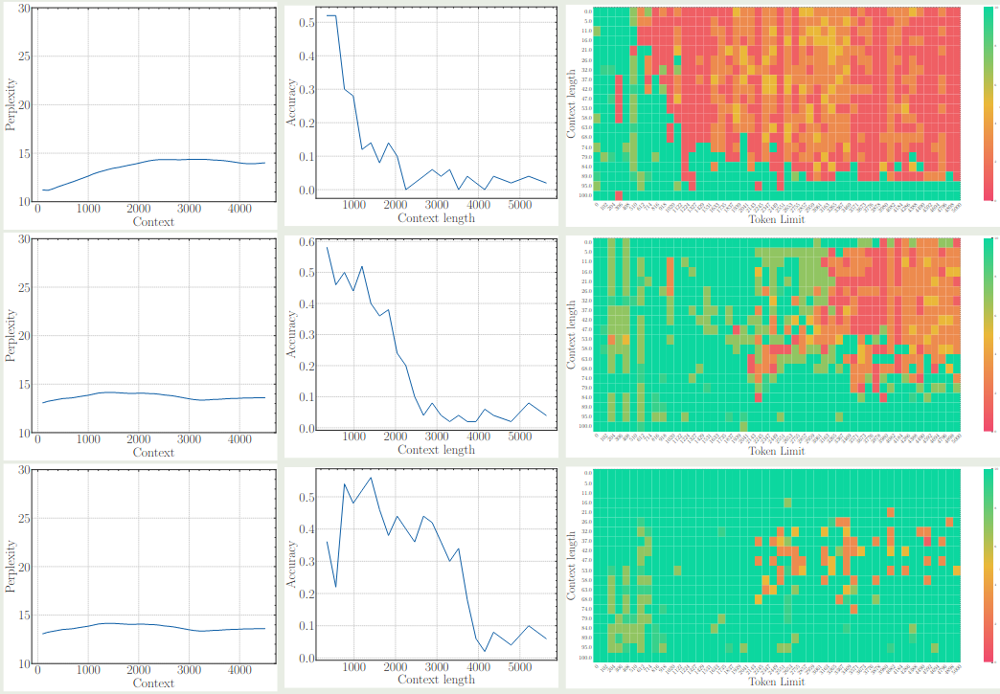
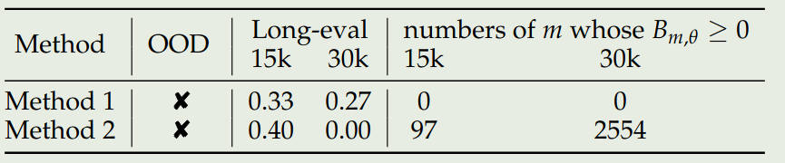

## Introduction

[RoPE](https://maosong.website/p/notes-on-position-encoding/) 已经成为了大多数 LLM 使用的 position encoding 范式，但是，RoPE 与 LLM long context 之间的关系还没有被探索清楚。在本文中，作者就探究了 base frequency 与 LLM context capability 之间的关系，并给出了一个达到指定上下文长度所需要的 base frequency 的 lower bound.

## Method

首先作者回顾了 attention 与 [RoPE](https://maosong.website/p/notes-on-position-encoding/) 的定义， 关键就是 RoPE 这部分，如下所示

$$
A_{ij} = (R_{i,\theta}q_i)^T(R_{j,\theta}k_j) = q_i^TR_{i-j,\theta}k_j
$$

这里 $\theta$ 就是 base frequency, 作者总结不同模型的 base frequency 配置如下表所示

| Model          | Llama-7B | Llama2-7B | Llama3-8B | Mistral-7B | Baichuan2-7B |
| -------------- | -------- | --------- | --------- | ---------- | ------------ |
| Base frequency | 10,000   | 10,000    | 500,000   | 1,000,000  | 10,000       |
| Context length | 2048     | 4096      | 8192      | 32,768     | 4,096        |

接下来，作者回顾了 [YARN](https://maosong.website/p/notes-on-yarn/). 其核心思想在于，预训练阶段所有可能的 $\cos(t-s)\theta_i$ 都见过，才能保证模型的 OOD 表现

作者认为 base frequency 的设置应该满足两个条件：

1. **The closer token gets more attention**: 当前的 token 应该给邻近的 token 更高的注意力
2. **The similar token gets more attention**: 当前的 token 应该给相似的 token 更高的注意力

在 [RoPE](https://maosong.website/p/notes-on-position-encoding/) 中，作者已经给出了 $A_{ij}$ 与相对距离 $|i-j|$ 之间的关系。因此第一个性质已经满足了。

接下来，作者分析了相似 token 的性质，作者定义 token 的相似性如下：

$$
\mathbb{E}_{q,k^*}[q^TR_{m,\theta}k^*] - \mathbb{E}_{q,k}[q^TR_{m,\theta}k]
$$

这里 $k^*=q+\epsilon$ 代表了相似的 token, 而 $k$ 是一个随机 token. 作者给出的结论如下

**Theorem**
假设 $q,k\in\mathbb{R}^d$ 独立同分布，它们的标准差为 $\sigma\in\mathbb{R}$, 则对于 $k^*=q+\epsilon$, $\epsilon$ 是一个随机变量满足 $\mathbb{E}[\epsilon]=0$, 则我们有

$$
\mathbb{E}_{q,k^*}[q^TR_{m,\theta}k^*] - \mathbb{E}_{q,k}[q^TR_{m,\theta}k] = 2\sigma^2\sum_{i=0}^{d/2-1}\cos(m\theta_i)
$$

作者定义 $B_{m,\theta}=\sum_{i=0}^{d/2-1}\cos(m\theta_i)$,  作者认为给定 $\theta$, 模型的上下文长度 $L_\theta$ 满足

$$
L_\theta = \sup\{L\mid B_{m,\theta}\geq 0, \forall m\in[L]\}
$$

也就是说，base frequency 决定了 LLM 的上下文长度。作者给出了不同的上下文长度对应的 base frequency 如下表所示

| Context Len. | 1k    | 2k    | 4k    | 8k    | 16k   | 32k   | 64k   | 128k  | 256k  | 512k  | 1M    |
| ------------ | ----- | ----- | ----- | ----- | ----- | ----- | ----- | ----- | ----- | ----- | ----- |
| Lower Bound  | 4.3e3 | 1.6e4 | 2.7e4 | 8.4e4 | 3.1e5 | 6.4e5 | 2.1e6 | 7.8e6 | 3.6e7 | 6.4e7 | 5.1e8 |

总的来说，远距离衰减性保证了模型会更关注邻近的 token, 而相似 token 保证了模型能够区分出真正有意义的 token.

## Experiments

作者首先分析了 base frequency 在 fine-tuning 阶段对模型上下文能力的影响，实验结果如下图所示

从实验结果可以看到，当 base frequency 低于阈值时，模型的表现急剧下降。

作者进一步探讨了 base frequency 对于模型 pre-training 阶段的影响，结果也是一样的，即非常小的 base frequency 会限制模型的 context 能力，结果下图所示 （三行分别代表了 base frequency 为 1e2, 1e4 和 1e6 的情况）

可以看到，尽管 perplexity 都差不多，但是使用更大的 base frequency 其长上下文能力明显更好。

作者进一步分析了为什么较小的 base frequency 会影响模型的长上下文能力。作者认为较小的 base frequency 会导致 $B_{m,\theta}$ 接近于 0， 从而模型难以区分随机 token 和相似 token, 这样模型只能依赖于邻近 token 进行学习，这样就限制了模型的长上下文能力

作者还进一步对比了提高 base frequency 与 Interpolation 两种做法，实验结果如下表所示

实验结果说明，Interpolation 在上下文超过 30K 之后，其 $B_{m,\theta}\leq0$ 的 次数显著增加，表明了其和上下文能力之间的关系。

## Conclusion

作者在本文中，探究了 RoPE 中 base frequency 与 LLM 上下文能力之间的关系，发现了提高模型的上下文能力需要关注 RoPE 的 base frequency 超参数，并给出了对应的 lower bound. 作者通过实验验证了这个观点。

## References

- [arxiv](http://arxiv.org/abs/2405.14591)
