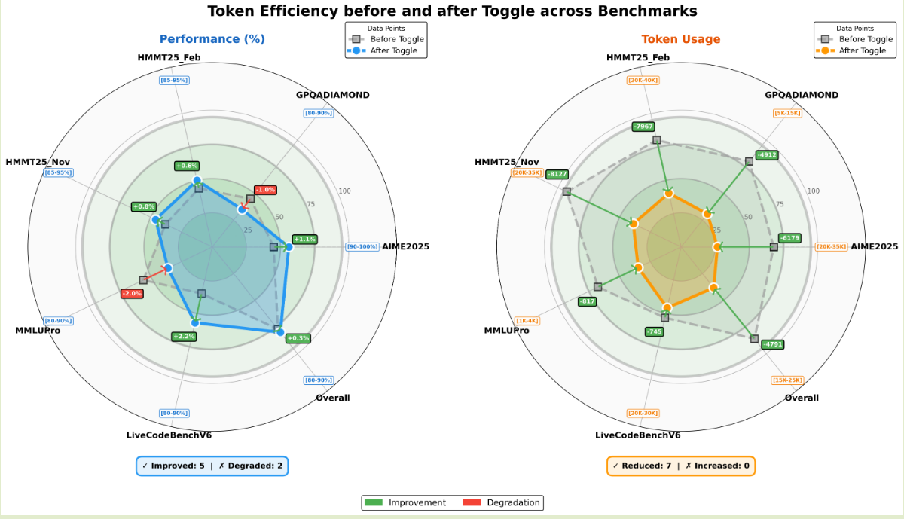
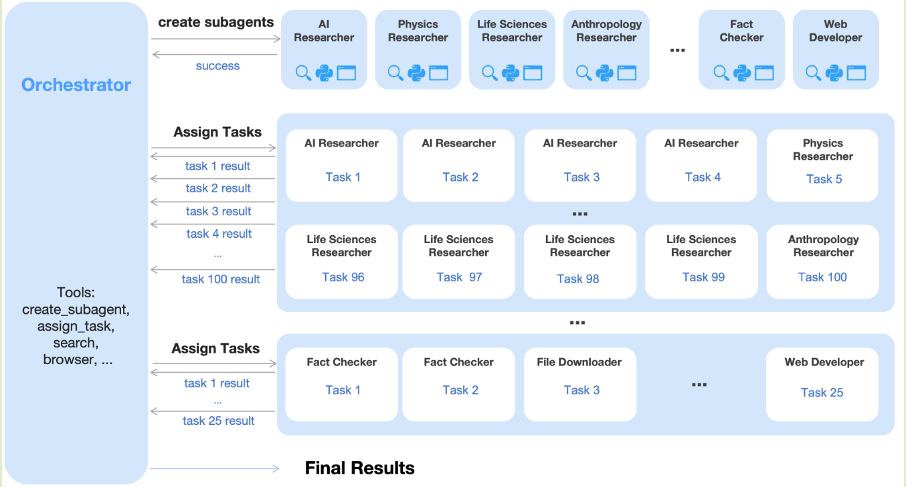
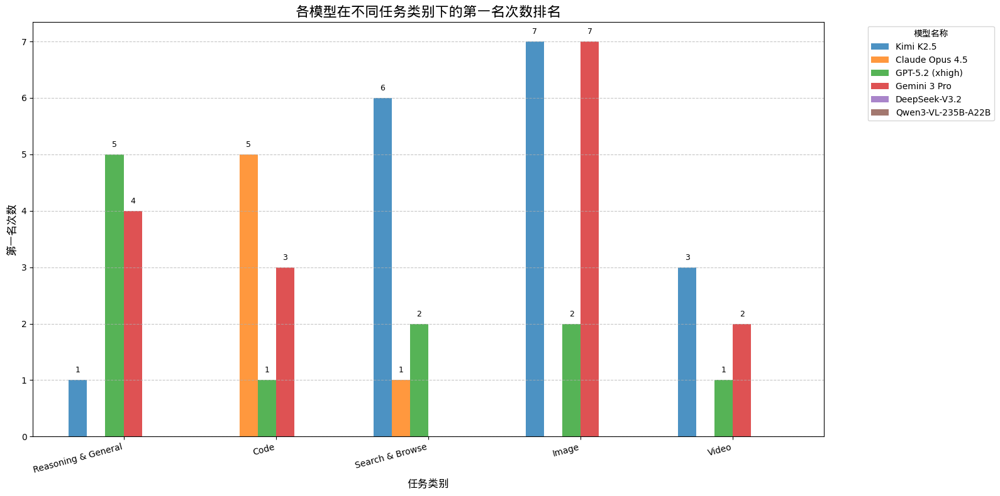

## Introduction

Kimi-K2.5 的核心有亮点：

1. native multi-modal: 通过在预训练，SFT, RL 阶段使用多模态数据来提高模型的多模态能力
2. agent: 通过并行 multi-agent 的方式来提高模型解决复杂问题的效率和能力

## Method

### Architecture

Kimi K2.5 是一个标准的 ViT-MLP-LLM 架构，其中

1. ViT, 基于 [Kimi-VL](Kimi-VL.md) 提出的 MoonViT, 并进行了改进, 参数量为 400M
2. MLP, 基于 patch merger,
3. LLM, 基于 [Kimi-k2](https://maosong.website/p/notes-on-kimi-k2/), 参数量为 1.02T-A32B

**ViT**
作者使用了 [Kimi-VL](Kimi-VL.md) 提出的 MoonViT, MoonViT 基于 [SigLIP](SigLIP.md) 提出的 SigLIP-SO-400M 开发得到，MoonViT 使用了 [NaViT](NaViT.md) 来避免切分图片和使用不同精度图片进行训练。

在 MoonViT 的基础上，Kimi-K2.5 还进一步提出了 MoonViT-3D, 将 [NaViT](NaViT.md) 的思想扩展到了 3D 用于提高模型的视频理解能力，具体做法为将连续 4 帧的视频展开为 1D sequence, 这样在图像上的注意力机制就可以无缝衔接到视频上了。并且，通过这种方式，我们可以让模型关注跨帧的信息（注意力在 4 帧的 token 之间进行），简化代码如下所示

```python
# config.json temporal_merge_kernel_size
# kimi_k25_vision_processing.py split_video_chunks
video_chunk = frames[0:4] 
patches = []
for frame in video_chunk:
    patches.extend(split_into_patches(frame))

tokens = patches
# modeling_kimi_k25.py Learnable2DInterpPosEmbDivided_fixed
positions = spatial_embedding + temporal_embedding
# modeling_kimi_k25.py MoonViT3dEncoder
output = transformer(tokens + positions)
```

最后，在进入 MLP 之前，作者还对每个 temporal chunk 内的特征进行 pooling 操作，将时序长度压缩到了原来的 1/4, 进而提高模型可处理的视频长度。

```python
# modeling_kimi_k25.py tpool_patch_merger
def tpool_patch_merger(
        x: torch.Tensor,
        grid_thws: torch.Tensor,
        merge_kernel_size: tuple[int, int] = (2, 2),
) -> list[torch.Tensor]:
    d_model = x.size(-1)

    outputs = []
    pre_sum = 0
    for t, h, w in grid_thws.tolist():
        # Get the current sequence
        seq = x[pre_sum:pre_sum + t * h * w]
        # Reshape along self.merge_kernel_size and concat to the last dimension
        kernel_height, kernel_width = merge_kernel_size
        new_height, new_width = h // kernel_height, w // kernel_width
        reshaped_seq = seq.view(t, new_height, kernel_height, new_width,
                                kernel_width, d_model)
        reshaped_seq = reshaped_seq.permute(0, 1,
                                            3, 2, 4, 5).contiguous().mean(
                                                dim=0)  # temporal pooling
        padded_seq = reshaped_seq.view(new_height * new_width,
                                       kernel_height * kernel_width, -1)
        outputs.append(padded_seq)
        pre_sum += t * h * w

    return outputs
```

**MLP**
MLP 使用了 PatchMerger, 用于减少视觉 token 个数，这个方案在之前的 Qwen-VL 系列里已经得到了应用。

**LLM**
LLM 基于 [Kimi-k2](https://maosong.website/p/notes-on-kimi-k2/) 的 MoE 模型，总参数为 1T, 激活参数为 32B

### Data

### Pre-training

预训练阶段一共使用了 15T token, 分为了三个阶段：

1. ViT-training: 单独训练 ViT, 实际用了 image caption, grounding, ocr, video 等数据进行训练，训练方式采用了类似 InternVL 的方式，即通过 cross entropy loss 来与一个清凉话的 LLM 进行对齐，这个阶段训练使用了 1T token, 然后作者使用了一个非常短的 stage 来更新 MLP 用于对齐 ViT 和 Kimi-K2
2. Joint pre-training: 训练所有参数，长下文长度为 4K, 使用了 15T token. 这里主要强调了提升代码数据的比例
3. Long context mid-training: 使用 [YARN](https://maosong.website/p/notes-on-yarn/) 来提高模型的上下文长度

最终预训练阶段 recipe 如下所示


**Native Multimodal pre-training**
在 Joint pre-training stage, Kimi-K2.5 还采用了一个与 [InternVL3](InternVL3.md) 类似的策略，即在预训练一开始直接使用多模态数据进行预训练。

传统的多模态大模型往往基于一个比较成熟的 LLM backbone 来完成多模态大模型的训练，但是其问题在于成熟的 LLM 其表示空间会收敛到语言模态上，多模态信息的迁移能力比较差。[InternVL3](InternVL3.md) 虽然也是 native multimodal pre-training, 但是其仍然依赖于成熟的 LLM. Kimi K2.5 则是使用预训练阶段的 Kimi K2 作为 backbone 来避免表示空间的塌缩，在训练一开始即直接加入少量多模态数据来保持模型的多模态能力。

作者探究了预训练阶段不同的数据对比，试验结果如下图所示

|       | Vision Injection Timing | Vision-Text Ratio | Vision Knowledge | Vision  Reasoning | OCR  | Text  Knowledge | Text  Reasoning | Code |
| ----- | ----------------------- | ----------------- | ---------------- | ----------------- | ---- | --------------- | --------------- | ---- |
| Early | 0%                      | 10%:90%           | 25.8             | 43.8              | 65.7 | 45.5            | 58.5            | 24.8 |
| Mid   | 50%                     | 20%:80%           | 25.0             | 40.7              | 64.1 | 43.9            | 58.6            | 24.0 |
| Late  | 80%                     | 50%:50%           | 24.2             | 39.0              | 61.5 | 43.1            | 57.8            | 24.0 |

结果显示，在训练早期加入少部分的多模态数据可以有效提高模型的表现。

### Post-training

Post-training 分为了 SFT 和 RL, SFT 阶段作者使用了合成的高质量数据，主要提升模型的交互式推理能力以及工具调用能力。为了解决传统 VLM 工具调用能力比较差且扩展性差的问题，Kimi-k2.5 提出了 Zero-Vision SFT, 其核心思想模型在预训练阶段已经完成了多模态对齐，因此我们可以仅使用纯文本 SFT 数据来激活 VLM 的视觉 agent 能力，具体做法就是将所有图像操作通过 IPython 的代码进行代理操作，这样视觉工具的调用就编程了程序化的图像处理指令。


在 RL 阶段，作者基于 [Kimi-k1.5](https://maosong.website/p/notes-on-kimi-k1.5/) 提出的策略优化算法加入了一个 token-level clipping 机制来减少 off-policy divergence, 目标函数如下所示

$$
\mathcal{L}(\theta)=\mathbb{E}_{x\sim\mathcal{D}}\left[\frac{1}{N}\sum_{j=1}^k\sum_{i=1}^{|y_i|}\mathrm{clip}\left(\log\frac{\pi_{\theta}(y_j^i\mid x, y_{j}^{0:i})}{\pi_{\mathrm{old}}(y_j^i\mid x, y_{j}^{0:i})},\alpha,\beta\right)(r(x, y_j) - \bar{r}(x)) - \tau\left(\log\frac{\pi_{\theta}(y_j^i\mid x, y_{j}^{0:i})}{\pi_{\mathrm{old}}(y_j^i\mid x, y_{j}^{0:i})}\right)^2\right]
$$

其中 $k$ 是针对每个回答 $x$ 的采样次数，$N=\sum_{j=1}^k|y_j|$ 是一个 batch 里总的 token 个数， $\alpha,\beta,\tau$ 为超参数，$\bar{r}(x)$ 是对 normalization 的估计，这里采用了 Kimi-K1.5 的 mean reward, 即 $\bar{r}(x)=1/k\sum_{j=1}^Kr(x,y_j)$. 这里的 clipping 机制与 PPO 不同的地方在于针对 log-ratio 进行 clipping, 而不依赖于 advantage 的计算。最终训练时使用了 [Moonlight](https://maosong.website/p/notes-on-moonlight/) 的 MuonClip 算法

对于 reward 的设计，Kimi-k2.5 也使用了基于规则和基于 reward model 的方式，前者针对答案可验证的任务，后者针对开放式的任务。

作者还构建了 length penalty 来提高模型的推理效率，作者发现 [Kimi-k1.5](https://maosong.website/p/notes-on-kimi-k1.5/) 和 [Kimi-k2](https://maosong.website/p/notes-on-kimi-k2/) 中的 length penalty 虽然可以生成更准确的 reasoning chain, 但是其很难泛化到更高的算力. 为了解决这个问题，作者提出了 **Toggle** 策略，即在 inference-time scaling 和 budget-constrained optimization 两种模式之间进行切换优化，对应的 reward 定义为

$$
\tilde{r}(x,y) = \begin{cases}
r(x,y)*\mathbb{I}\{1/k\sum_{j=1}^kr(x,y_i<\lambda \text{ or }|y_j|\leq \text{budget}(x)\},&\text{if }\lfloor t/m\rfloor\mod 2 == 0\ (\text{Phase }0)\\
r(x,y),&\text{otherwise } (\text{Phase }1)
\end{cases}
$$

其中 $\lambda, m$ 都是超参数。budget 基于正确回答的长度的 p 分位得到：

$$
\text{budget}(x) = \text{Percentile}(\{|y_j| \mid r(x,y_j)=1, j\in[k]\},\rho)
$$

两种模式每隔 $m$ 个 iteration 切换一次：

- phase 0: budget limited phase, 训练模型在给定 token budget 下解决问题，减少 reasoning chain 长度
- phase 1: scaling phase, 训练模型使用更多的算力来解决更复杂的问题，提高模型的智能程度

作者评估 Toogle 策略得到的结果如下所示



结果现实，使用 toggle 策略之后，模型的输出长度减少了 30% 左右，且模型的表现并没有明显下降。作者还发现，一些重复的 pattern 也随之降低，且 toggle 策略的泛化程度更高。

在 Zero-Vision SFT 的基础上，Kimi-k2.5 使用了 Joint multimodal RL 训练策略。现有的多模态 RL 存在的问题为：模型很容易忽略视觉输入而过度依赖于纯文本进行推理。为了解决这个问题，作者构建了需要视觉理解才能得到答案的任务来提高模型对于视觉信息的利用程度，这些任务覆盖三个 domain:

1. visual grounding and counting: 定位和计数
2. chart and document understanding: 图表文档理解
3. vision-critical STEM problems: 需要图片来完成求解的数学物理问题

作者在 visual RL 之后评估了模型的表现，发现模型在 MMLU-Pro, GPQA-Diamond 等任务上的表现都有了提升，作者认为 visual RL 可以在不损害模型纯文本能力的情况下提高模型跨模态的泛化性

### Agent Swarm

Kimi-k2.5 的另一个重大改进为使用并行机制来提高模型的 agent 能力。传统的 agent 往往序列执行 reasoning, tool-use, 这限制了模型处理复杂任务的能力，Kimi-k2.5 通过 Agent Swarm 和 Parallel Agent Reinforcement Learning (PARL) 来解决这个问题，其核心思想就是并行，框架图如下所示



agent swarm 架构包含了一个 orchestrator 和若干个 subagent, 为了解决 agent swarm 的 reward 比较难以设置的问题，PARL 构建了三个不同 level 的 reward

$$
r_{PARL}(x,y) = \lambda_1 r_{parallel} + \lambda_2r_{finish} + \lambda_3r_{perf}(x,y)
$$

其中 $r_{perf}$ 评估了 solution $y$ 的质量， $r_{parallel}$ 则是避免并行模式崩塌，从 multi-agent 崩塌为 single agent, $r_{finish}$ 则是评估模型的完成性。超参数 $\lambda_1,\lambda_2$ 随训练逐渐降为 0 来提高模型整体的表现。

作者还提出了使用 critical steps 来评估 parallel agent 的计算时间消耗，其计算公式如下

$$
CriticalSteps = \sum_{i=1}^T\left(S_{main}^{(t)}+\max_iS_{sub,i}^{(t)}\right)
$$

其中 $T$ 为一个 episode 的时间，$S_{main}^{(t)}$ 为 orchestrator 在第 $t$ 步的运行时间， $S_{sub,i}^{(t)}$ 为第 i 个 subagent 的运行时间。

为了提高模型的并行能力，作者构建了一批广度优先搜索和深度优先搜索的数据，通过这些数据的构建，我们可以提高 orchestrator 的并行调用能力。

最终，PARL 的表现如下所示


### Infra

Kimi-k2.5 的 infra 基于 [Kimi-k2](https://maosong.website/p/notes-on-kimi-k2/), 作者主要强调了 decouple encoder process (DEP) 这一改进。之前的工作将 vision encoder 和 text embedding 都做为 PP 的第一个 stage, 但是由于 vision encoder 对不同输入的处理时间不同，这个 stage 的算历和内存分配随输入变化比较大。为了解决这个问题，作者提出了 DEP, 包含三个 stage 来提高训练效率:

1. balanced vision forward: 由于 vision encoder 比较小 (400M), 因此作者将 vision encoder 复制到所有 GPU 上，然后根据负载来将 visual data 分配到不同的 GPU 上进行处理，这个阶段不保存中间激活值，处理完毕之后所有的结果作为 PP Stage0 的输入
2. backbone training: 正常进行训练，与 LLM 的训练优化一致
3. vision recomputation & backward: 这个阶段，我们重新计算 vision encoder 的 forward pass, 然后再对 vision encoder 进行反向传播

通过 DEP, Kimi-k2.5 的训练效率达到了 Kimi-k2 的 90%.

## Experiments

首先是 Kimi-k2.5 在 general & reasoning 类任务上的表现，可以看到，Kimi-k2.5 超过了 DeeoSeek-V3.2 的表现，

| Benchmark         | Kimi K2.5 | Claude Opus 4.5 | GPT-5.2 (xhigh) | Gemini 3 Pro | DeepSeek-V3.2 |
| ----------------- | --------- | --------------- | --------------- | ------------ | ------------- |
| HLE-Full          | 30.1      | 30.8            | 34.5            | 37.5         | 25.1†         |
| HLE-Full w/ tools | 50.2      | 43.2            | 45.5            | 45.8         | 40.8†         |
| AIME 2025         | 96.1      | 92.8            | 100             | 95.0         | 93.1          |
| HMMT 2025 (Feb)   | 95.4      | 92.9*           | 99.4            | 97.3*        | 92.5          |
| IMO-AnswerBench   | 81.8      | 78.5*           | 86.3            | 83.1*        | 78.3          |
| GPQA-Diamond      | 87.6      | 87.0            | 92.4            | 91.9         | 82.4          |
| MMLU-Pro          | 87.1      | 89.3*           | 86.7*           | 90.1         | 85.0          |
| SimpleQA Verified | 36.9      | 44.1            | 38.9            | 72.1         | 27.5          |
| AdvancedIF        | 75.6      | 63.1            | 81.1            | 74.7         | 58.8          |
| LongBench v2      | 61.0      | 64.4*           | 54.5*           | 68.2*        | 59.8*         |

接下来是模型在 coding 任务上的表现

| Benchmark              | Kimi K2.5 | Claude Opus 4.5 | GPT-5.2 (xhigh) | Gemini 3 Pro | DeepSeek-V3.2 |
| ---------------------- | --------- | --------------- | --------------- | ------------ | ------------- |
| SWE-Bench Verified     | 76.8      | 80.9            | 80.0            | 76.2         | 73.1          |
| SWE-Bench Pro (public) | 50.7      | 55.4*           | 55.6            | -            | -             |
| SWE-Bench Multilingual | 73.0      | 77.5            | 72.0            | 65.0         | 70.2          |
| Terminal Bench 2.0     | 50.8      | 59.3            | 54.0            | 54.2         | 46.4          |
| PaperBench (CodeDev)   | 63.5      | 72.9*           | 63.7*           | -            | 47.1          |
| CyberGym               | 41.3      | 50.6            | -               | 39.9*        | 17.3*         |
| SciCode                | 48.7      | 49.5            | 52.1            | 56.1         | 38.9          |
| OIBench (cpp)          | 57.4      | 54.6*           | -               | 68.5*        | 54.7*         |
| LiveCodeBench (v6)     | 85.0      | 82.2*           | -               | 87.4*        | 83.3          |

在 agent 任务上的表现

| Benchmark                  | Kimi K2.5 | Claude Opus 4.5 | GPT-5.2 (xhigh) | Gemini 3 Pro | DeepSeek-V3.2 |
| -------------------------- | --------- | --------------- | --------------- | ------------ | ------------- |
| BrowseComp                 | 60.6      | 37.0            | 65.8            | 37.8         | 51.4          |
| BrowseComp (w/ ctx manage) | 74.9      | 57.8            | -               | 59.2         | 67.6          |
| BrowseComp (Agent Swarm)   | 78.4      | -               | -               | -            | -             |
| WideSearch                 | 72.7      | 76.2*           | -               | 57.0         | 32.5*         |
| WideSearch (Agent Swarm)   | 79.0      | -               | -               | -            | -             |
| DeepSearchQA               | 77.1      | 76.1*           | 71.3*           | 63.2*        | 60.9*         |
| FinSearchCompT2&T3         | 67.8      | 66.2*           | -               | 49.9         | 59.1*         |
| Seal-0                     | 57.4      | 47.7*           | 45.0            | 45.5*        | 49.5*         |
| GDPVal-AA                  | 41.0      | 45.0            | 48.0            | 35.0         | 34.0          |
| OSWorld-Verified           | 63.3      | 66.3            | 8.6             | 20.7         | -             |
| WebArena                   | 58.9      | 63.4            | -               | -            | -             |

多模态表现

| Benchmark          | Kimi K2.5 | Claude Opus 4.5 | GPT-5.2 (xhigh) | Gemini 3 Pro | Qwen3-VL-235B-A22B |
| ------------------ | --------- | --------------- | --------------- | ------------ | ------------------ |
| **Image**          |           |                 |                 |              |                    |
| MMMU-Pro           | 78.5      | 74.0            | 79.5*           | 81.0         | 69.3               |
| MMMU (val)         | 84.3      | 80.7            | 86.7*           | 87.5*        | 80.6               |
| CharXiv (RQ)       | 77.5      | 67.2*           | 82.1            | 81.4         | 66.1               |
| MathVision         | 84.2      | 77.1*           | 83.0            | 86.1*        | 74.6               |
| MathVista (mini)   | 90.1      | 80.2*           | 82.8*           | 89.8*        | 85.8               |
| SimpleVQA          | 71.2      | 69.7*           | 55.8*           | 69.7*        | 56.8*              |
| WorldVQA           | 46.3      | 36.8            | 28.0            | 47.4         | 23.5               |
| ZeroBench          | 9         | 3*              | 9*              | 8*           | 4*                 |
| ZeroBench w/ tools | 11        | 9*              | 7*              | 12*          | 3*                 |
| BabyVision         | 36.5      | 14.2            | 34.4            | 49.7         | 22.2               |
| BLINK              | 78.9      | 68.8*           | -               | 78.7*        | 68.9               |
| MMVP               | 87.0      | 80.0*           | 83.0*           | 90.0*        | 84.3               |
| OmniDocBench 1.5   | 88.8      | 87.7*           | 85.7            | 88.5         | 82.0*              |
| OCRBench           | 92.3      | 86.5*           | 80.7*           | 90.3*        | 87.5               |
| InfoVQA (test)     | 92.6      | 76.9*           | 84*             | 57.2*        | 89.5               |
| **Video**          |           |                 |                 |              |                    |
| VideoMMMU          | 86.6      | 84.4*           | 85.9            | 87.6         | 80.0               |
| MMVU               | 80.4      | 77.3*           | 80.8*           | 77.5*        | 71.1               |
| MotionBench        | 70.4      | 60.3            | 64.8            | 70.3         | -                  |
| Video-MME          | 87.4      | 66.0*           | 86.0*           | 88.4*        | 79.0               |
| LongVideoBench     | 79.8      | 67.2*           | 76.5*           | 77.7*        | 65.6*              |
| LVBench            | 75.9      | 57.3            | -               | 73.5*        | 63.6               |

我们这里基于模型在不同类别任务上的排名来进行可视化，结果如下



从结果可以看出，Kimi-K2.5 的 agent 能力达到了 SOTA 级别，其多模态能力也比较强。

与 [DeepSeek-V3.2](https://maosong.website/p/notes-on-deepseek-v3.2/) 一样，作者也对比了不同模型的推理效率，结果如下图所示


可以看到，相比与 Kimi-K2, Kimi-K2.5 通过在 RL 层面进行优化，降低了输出长度，但是相比与 DeepSeel-V3.2 和 Gemini3.0 Pro 之间还存在一定差距。

## Conclusion

在本文中，作者提出了 Kimi-k2.5， 一个多模态的 agent model, Kimi-k2.5 集成了 Kimi-k2 和 Kimi-VL 的能力，扩展了模型的 agent 能力。

## References

- [huggingface](https://huggingface.co/moonshotai/Kimi-K2.5)
- [arxiv](https://arxiv.org/abs/2602.02276)
