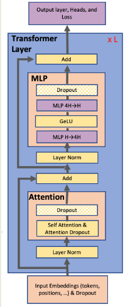
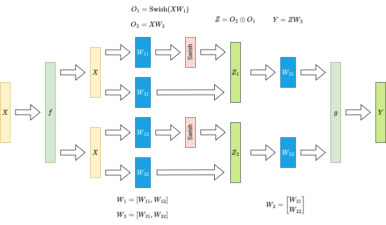
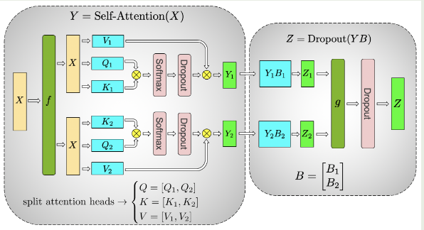

## Introduction

随着模型参数变大，现有的 GPU 已经很难使用单一 GPU 来训练模型。对于多 GPU 训练场景，目前主要采用了 pipeline parallelism, 比如 [GPipe](https://maosong.website/p/gpipe/) 等，但是，这些策略需要我们对代码进行比较大的改动，这提高了开发成本。

为了解决多 GPU 训练大规模 LLM 的效率，降低开发成本，目前主要使用了 model parallelism 策略，即对模型进行切分部署在多个 GPU 上。model parallelism 有两种范式：

1. pipeline parallelism (PP): 将模型按照 layer 进行切分，如 [GPipe](https://maosong.website/p/gpipe/) 等，这种方法的问题是需要额外的逻辑来处理通信以及存在 pipeline bubbles
2. tensor parallelism (TP): 将模型的按照权重进行切分，部署在不同的 GPU 上。

作者在本文中基于 TP 策略来对 attention, FFN layer 进行简单改动来实现训练效率的提升。

作者通过实现验证了 tensor parallelism 的有效性和高效率，结果发现在 512 张 GPU 的场景下，TP 可以达到 $76\%$ 的 scaling efficiency (相比于 1 张 GPU 带来的性能提升)

## Method

作者使用的 transformer 架构如下图所示



本文中，作者探究了 BERT 和 GPT-2 两种架构。

首先，我们假设 transformer layer 输入为 $X\in\mathbb{R}^{bs\times d}$, 这里 $b, s$ 分别为 batch size, sequence length, 接下来我们介绍如何针对 FFN, attention 以及 embedding 构建 TP 策略

### FFN

论文中使用的 FFN 为 `Linear-GeLU-Linear` 的结构，对应第一层权重为 $W_1\in\mathbb{R}^{d\times d_{ff}}$, 第二层权重为 $W_2\in\mathbb{R}^{d_{ff}\times d}$, 对应数学表达式为

$$
Y = \mathrm{GeLU}(XW_1)W_2\in\mathbb{R}^{bs\times d}
$$

我们首先对 $W_1$ 按照 column 进行切分，得到

$$
W_1 = [W_{11}, W_{12}]\in\mathbb{R}^{d\times d_{ff}}, \text{ where } W_{11}\in\mathbb{R}^{d\times d_1}, W_{12}\in\mathbb{R}^{d\times d_2}, d_1+d_2=d_{ff}
$$

这里 $d_1, d_2$ 与我们并行的 GPU 数 (x-way TP) 相关，这样，我们就有

$$
\mathrm{GeLU}(XW_1) = \mathrm{GeLU}(X[W_{11}, W_{12}]) = \mathrm{GeLU}([XW_{11}, XW_{22}]) = [\mathrm{GeLU}(XW_{11}), \mathrm{GeLU}(XW_{12})]
$$

从而我们可以分别将 $W_{11}$ 和 $W_{12}$ 部署在两个 GPU 上，然后并行计算。

论文中还介绍如果我们对 $W_1$ 按照 row 进行切分，则最终由于 $\mathrm{GeLU}(A+B)\neq \mathrm{GeLU}(A)+\mathrm{GeLU}(B)$ 计算时会产生一次额外的同步。

接下来，对于 $W_2$, 我们按照 row 进行切分得到

$$
W_2 = \begin{bmatrix}
W_{21}\\
W_{22}
\end{bmatrix}\in\mathbb{R}^{d_{ff}\times d}, \text{ where }W_{21}\in\mathbb{R}^{d_1\times d}, W_{22}\in\mathbb{R}^{d_2\times d}, d_1+d_2=d_{ff}
$$

计算时，我们有

$$
\mathrm{GeLU}(XW_1)W_2 = [\mathrm{GeLU}(XW_{11}), \mathrm{GeLU}(XW_{12})]\begin{bmatrix}
W_{21}\\
W_{22}
\end{bmatrix} = \mathrm{GeLU}(XW_{11})W_{21} + \mathrm{GeLU}(XW_{12})W_{22}
$$

可以看到，通过按照 row 进行切分，我们可以将 $W_{11}, W_{21}$ 部署在一个 GPU 上，将 $W_{12}, W_{22}$ 部署在另一个 GPU 上，分别计算出 $\mathrm{GeLU}(XW_{11})W_{21}$ 和 $\mathrm{GeLU}(XW_{12})W_{22}$ 之后，再通过一此 `all-reduce` 操作得到最终的输出结果。计算图如下所示


这里 $f$ 和 $g$ 是两个对偶算子，代表了 TP 产生的额外通信开销

| operator | forward      | backward     |
| -------- | ------------ | ------------ |
| $f$      | identity     | `all-reduce` |
| $g$      | `all-reduce` | identity     |

如果说我们使用的是 SwiGLU FFN, 即

$$
Y = (XW_3\odot \mathrm{Swish}(XW_1))W_2
$$

我们按照 column 对 $W_1, W_3$ 进行切分，按照 row 对 $W_2$ 进行切分（假设我们有 2 个 GPU），得到

$$
\begin{aligned}
W_1 &= [W_{11}, W_{12}]\in\mathbb{R}^{d\times d_{ff}}, \text{ where } W_{11}\in\mathbb{R}^{d\times d_1}, W_{12}\in\mathbb{R}^{d\times d_2}, d_1+d_2=d_{ff}\\
W_3 &= [W_{31}, W_{32}]\in\mathbb{R}^{d\times d_{ff}}, \text{ where } W_{31}\in\mathbb{R}^{d\times d_1}, W_{32}\in\mathbb{R}^{d\times d_2}, d_1+d_2=d_{ff}\\
W_2 &= \begin{bmatrix}
W_{21}\\
W_{22}
\end{bmatrix}\in\mathbb{R}^{d_{ff}\times d}, \text{ where }W_{21}\in\mathbb{R}^{d_1\times d}, W_{22}\in\mathbb{R}^{d_2\times d}, d_1+d_2=d_{ff}
\end{aligned}
$$

然后我们将 $W_{11}, W_{31}, W_{21}$ 放在第一个 GPU 上，将 $W_{12}, W_{32}, W_{22}$ 放在第二个 GPU 上，此时，

$$
\begin{aligned}
\mathrm{Swish}(XW_1) &= \mathrm{Swish}(X[W_{11}, W_{12}])
= \mathrm{Swish}([XW_{11}, XW_{12}])=[\mathrm{Swish}(XW_{11}, \mathrm{Swish}(XW_{12}]\\
XW_3\odot \mathrm{Swish}(XW_1)  &= [XW_{31}, XW_{32}]\mathrm{Swish}(XW_1) = [XW_{31}\mathrm{Swish}(XW_{11}), XW_{32}\mathrm{Swish}(XW_{12})]\\
Y = (XW_3\odot \mathrm{Swish}(XW_1))W_2&=(XW_3\odot \mathrm{Swish}(XW_1))\begin{bmatrix}
W_{21}\\
W_{22}
\end{bmatrix} = XW_{31}\mathrm{Swish}(XW_{11})W_{21}+ XW_{32}\mathrm{Swish}(XW_{12})W_{22}
\end{aligned}
$$

这样我们通过一次 `all-reduce` 也可以完成 SwiGLU FFN 的 tensor parallelism, 示意图如下所示



### Attention

Attention 的处理与 MLP 非常相似，论文中的做法就是将不同 head 部署到不同 gpu 上分别进行计算，最后在计算 output projection 时再通过一次 `all-reduce` 来合并输出，这里我们假设有 $h$ 个 heads, 每个 head 的 dimension 为 $d_h$, 我们先对 query, key, value layer 的 weight $W_Q, W_K, W_V\in\mathbb{R}^{d\times hd_h}$ 进行切分

$$
W_Q = [W_{Q1}, \dots, W_{Qh}],  W_K = [W_{K1}, \dots, W_{kh}],  W_V = [W_{V1}, \dots, W_{Vh}]
$$

其中 $W_{Qi}, W_{Ki}, W_{Vi}\in\mathbb{R}^{d\times d_h}$ 为每个 head 对应的 query, key, value weight. 我们将切分后的 $W_{Qi}, W_{Ki}, W_{Vi}$ 部署在一个 GPU 上（也可以将若干个 head 部署在一个 GPU 上），然后分别计算出每个 GPU 的 attention 结果，最后再进行汇总，如下所示

$$
\begin{aligned}
o_i &= \mathrm{softmax}\left(\frac{(XW_{Qi})(XW_{Ki})^T}{d_h}\right) XW_{Vi}, i=1,\dots,h\\
O &= [o_1,\dots,o_h]W_O
\end{aligned}
$$

下面是 multi-head attention 对应的 TP 示意图



### Embedding

对于 Input embedding, 作者将 embedding matrix $E\in\mathbb{E}^{V\times d}$ 按照 row 进行切分（论文中使用了转置，因此是按照 column 进行切分），得到 $E=[E_1,E_2]^T$, 这里 $E_i\in\mathbb{R}^{d\times V_i}$,  $V_1+V_2=V$,  接下来我们把切分后的 embedding matrix 部署在不同的 GPU 上，由于每个 GPU 只有部分结果，因此我们还需要进行 `all-reduce` 来进行汇总。

而对于 output embedding, 我们也可以使用类似的做法进行切分，每个 GPU 上计算完结果之后我们还需要一个 `all-gather` 来汇总结果。

作者在这里还额外介绍了针对 output embedding 的优化方法，由于 embedding 的输出大小为 $[bs, V]$, 而 $V$ 通常比较大，因此，为了降低通信开销，作者将 cross-entropy-loss 与 output embedding kernel 进行融合，这样我们传输的数据量就减少到了 $bs$.

## Experiments

作者首先对 GPT-2 模型进行了修正，首先将 `vocab_size` 从 50257 提升到 128 的倍数，即 51200. 对于 model+data parallelism, 作者固定 global batch size 为 512. (64-way DP)

配置如下表所示（head size 为 96）

| Hidden size | attention heads | layers | parameters (B) | TP  | TP+DP |
| ----------- | --------------- | ------ | -------------- | --- | ----- |
| 1536        | 16              | 40     | 1.2            | 1   | 64    |
| 1920        | 20              | 54     | 2.5            | 2   | 128   |
| 2304        | 24              | 64     | 4.2            | 4   | 256   |
| 3072        | 32              | 72     | 8.3            | 8   | 512   |

对应的 scaling （使用多卡训练后，每个 GPU 相对于单卡训练的利用率）如下表所示

| parallelism | TP-1 | TP-2 | TP-4 | TP-8 | TP-1+DP-64 | TP-2+DP-64 | TP-4+DP-64 | TP-8+DP-64 |
| ----------- | ---- | ---- | ---- | ---- | ---------- | ---------- | ---------- | ---------- |
|  scaling    | 100% | 95%  | 82%  | 77%  | 96%        | 83%        | 79%        | 74%        |


## Implementation

首先是 linear layer 的 TP 版本，如下所示

```python
import torch
import torch.nn as nn
import torch.distributed as dist


class ColumnParallelLinear(nn.Module):
    def __init__(self, in_features, out_features, bias=True):
        super().__init__()
        self.rank = dist.get_rank()
        self.world_size = dist.get_world_size()
        
        self.local_out = out_features // self.world_size
        self.weight = nn.Parameter(torch.empty(in_features, self.local_out))


    def forward(self, x):
        out = x @ self.weight
        
        gather_list = [torch.empty_like(out) for _ in range(self.world_size)]
        dist.all_gather(gather_list, out)
        return torch.cat(gather_list, dim=-1)


class RowParallelLinear(nn.Module):
    def __init__(self, in_features, out_features, bias=True):
        super().__init__()
        self.rank = dist.get_rank()
        self.world_size = dist.get_world_size()
        
        self.local_in = in_features // self.world_size
        self.weight = nn.Parameter(torch.empty(self.local_in, out_features))

    def forward(self, x):
        x_local = torch.chunk(x, self.world_size, dim=-1)[self.rank]

        out = x_local @ self.weight
        
        dist.all_reduce(out, op=dist.ReduceOp.SUM)
        return out
```

接下来是针对 LLM 中使用的 SwiGLU FFN 进行的优化，基于前面的介绍，我们不需要对基于 column linear 进行 all-reduce, 代码如下所示

SwiGLU

```python
import torch
from torch import nn
import torch.nn.functional as F
import torch.distributed as dist


world_size = 1
rank = 0

class ColumnParallelLinear(nn.Module):
    def __init__(self, in_features: int, out_features: int, dtype = None):
        assert out_features % world_size == 0, f"Output features must be divisible by world size (world_size={world_size})"
        self.part_out_features = out_features // world_size
        self.weight = nn.Parameter(torch.empty(part_out_features, part_in_features, dtype=dtype))

    def forward(self, x: torch.Tensor) -> torch.Tensor:
        y = x @ self.weight
        return y


class RowParallelLinear(nn.Module):
    def __init__(self, in_features: int, out_features: int, dtype = None):
        assert in_features % world_size == 0, f"Input features must be divisible by world size (world_size={world_size})"
        self.part_in_features = in_features // world_size
        self.weight = nn.Parameter(torch.empty(out_features, part_in_features, dtype=dtype))

    def forward(self, x: torch.Tensor) -> torch.Tensor:
        y = x @ self.weight
        if world_size > 1:
            dist.all_reduce(y)
        return y


class MLP(nn.Module):
    def __init__(self, dim: int, inter_dim: int):
        super().__init__()
        self.w1 = ColumnParallelLinear(dim, inter_dim)
        self.w2 = RowParallelLinear(inter_dim, dim)
        self.w3 = ColumnParallelLinear(dim, inter_dim)

    def forward(self, x: torch.Tensor) -> torch.Tensor:
        return self.w2(F.silu(self.w1(x)) * self.w3(x))
```

attention

```python
class TPMultiHeadAttention(nn.Module):
    def __init__(self, d_model: int, num_heads: int, head_dim: int = None):
        self.d_model = d_model
        self.num_heads = num_heads
        self.head_dim = head_dim if head_dim is not None else d_model // num_heads
        
        assert self.num_heads % world_size == 0, "num_heads must be divisible by world size" 
        assert self.d_model == self.num_heads * self.head_dim, "d_model must equal num_heads * head_dim"
        
        # heads of different GPU
        self.local_num_heads = self.num_heads // world_size
        self.local_qkv_dim = self.local_num_heads * self.head_dim
        
        self.qkv_proj = ColumnParallelLinear(in_features=d_model, out_features=3 * self.local_qkv_dim)
        self.out_proj = RowParallelLinear(in_features=d_model, out_features=d_model)
        
        self.scale = 1.0 / torch.sqrt(torch.tensor(self.head_dim, dtype=torch.float32))
        
    def _split_heads(self):
        batch_size, seq_len, _ = x.shape
        # [batch, seq_len, local_num_heads, head_dim]
        x = x.reshape(batch_size, seq_len, self.local_num_heads, self.head_dim)
        # [batch, local_num_heads, seq_len, head_dim]
        return x.transpose(1, 2)
        
    def forward(self, x: torch.Tensor, attn_mask: torch.Tensor = None):
        batch_size, seq_len, _ = x.shape
        # [batch, seq_len, local_qkv_dim * 3]
        qkv = self.qkv_proj(x)
        # [batch, seq_len, local_qkv_dim]
        q, k, v = torch.split(qkv, self.local_qkv_dim, dim=-1)
        # [batch, local_num_heads, seq_len, head_dim]
        q = self._split_heads(q) 
        k = self._split_heads(k) 
        v = self._split_heads(v)
        
        attn_scores = (q @ k.transpose(-2, -1)) * self.scale
        
        if attn_mask is not None: 
            attn_scores = attn_scores + attn_mask
            
        attn_weights = F.softmax(attn_scores, dim=-1)
        # [batch, local_num_heads, seq_len, head_dim]
        attn_output = attn_weights @ v
        # [batch, seq_len, local_num_heads, head_dim]
        attn_output = attn_output.transpose(1, 2)
        # [batch, seq_len, local_qkv_dim]
        attn_output = attn_output.reshape(batch_size, seq_len, self.local_qkv_dim)
        
        gather_list = [torch.empty_like(attn_output) for _ in range(world_size)] 
        dist.all_gather(gather_list, attn_output)
        # [batch, seq_len, d_model]
        full_attn_output = torch.cat(gather_list, dim=-1)
        
        out = self.out_proj(full_attn_output)
        
        return out
```

Embedding

```python
class ParallelEmbedding(nn.Module):
    def __init__(self, vocab_size: int, dim: int):
        super().__init__()
        self.vocab_size = vocab_size
        self.dim = dim
        assert vocab_size % world_size == 0, f"Vocabulary size must be divisible by world size (world_size={world_size})"
        self.part_vocab_size = (vocab_size // world_size)
        self.vocab_start_idx = rank * self.part_vocab_size
        self.vocab_end_idx = self.vocab_start_idx + self.part_vocab_size
        self.weight = nn.Parameter(torch.empty(self.part_vocab_size, self.dim))

    def forward(self, x: torch.Tensor) -> torch.Tensor:
        if world_size > 1:
            mask = (x < self.vocab_start_idx) | (x >= self.vocab_end_idx)
            x = x - self.vocab_start_idx
            x[mask] = 0
        y = F.embedding(x, self.weight)
        if world_size > 1:
            y[mask] = 0
            dist.all_reduce(y)
        return y
```

## Conclusion

作者提出了针对 transformer 架构的 tensor parallelism 策略来提高整体的训练效率，通过在训练过程加入四次 all-reduce 通信我们就可以训练更大规模的模型。

## References

- [Megatron-LM & Megatron Core Github](https://github.com/NVIDIA/Megatron-LM/tree/main#megatron-lm--megatron-core)
- [Megatron-LM: Training Multi-Billion Parameter Language Models Using Model Parallelism](http://arxiv.org/abs/1909.08053)
- [DeepSeek-V3](https://github.com/deepseek-ai/DeepSeek-V3/blob/main/inference/model.py)
