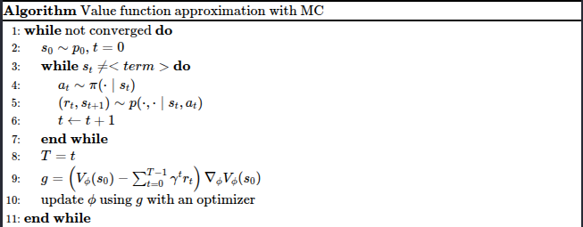
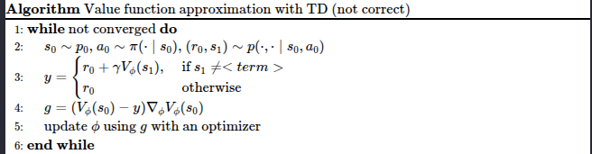
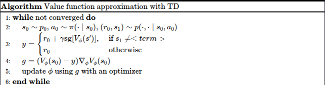
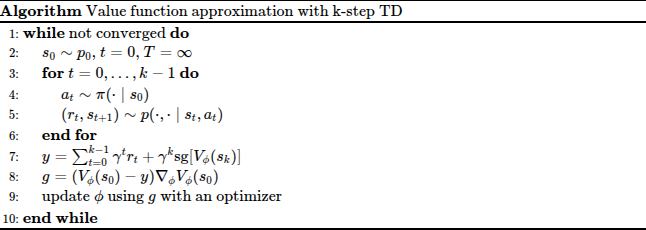
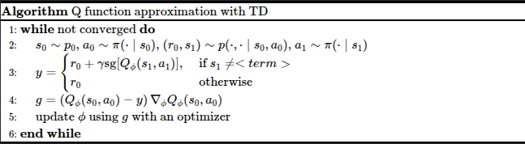
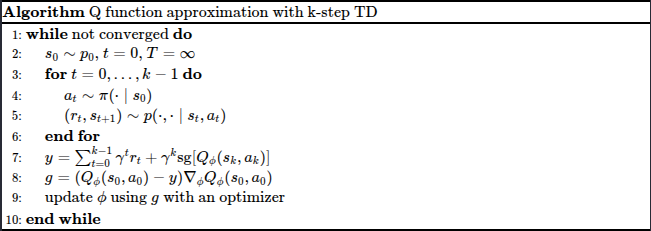

这一节我们讨论如何评估 (evaluate) 一个 policy. 要评估一个 policy $\pi$, 我们需要求出对应的 value function $V^\pi$.

## Value Function

### Monte Carlo

注意到

$$
V^\pi(s) = \mathbb{E}^\pi\left[\sum_{t=0}^{T-1}\gamma^tr_t\mid s_0=s\right]
$$

我们可以利用 Monte Carlo (MC) 方法来进行估计，即从 $s_0=s$ 出发，独立随机采样 $N$ 条轨迹

$$
\{s, a_0^{(i)},r_0^{(i)},\dots,a_{T^{(i)}-1}^{(i)},r_{T^{(i)}-1}^{(i)}, s^{(i)}_{T^{(i)}}\}, i=1,\dots,N
$$

然后我们使用样本平均来近似期望

$$
V^\pi(s) = \mathbb{E}^\pi\left[\sum_{t=0}^{T-1}\gamma^tr_t\mid s_0=s\right]\approx \frac{1}{N}\sum_{i=1}^N\sum_{t=0}^{T^{(i)}-1}\gamma^tr_t^{(i)}
$$

如果 $\mathcal{S}$ 比较小，我们可以遍历 $s\in\mathcal{S}$ 来估计 $V^\pi$.

当 $\mathcal{S}$ 非常大或者连续时，我们需要使用神经网络 $V_\phi$ 来近似 $V^\pi$,

$$
\min_{\phi} \mathcal{L}(\phi) =\mathbb{E}_{s\sim p_0}\left[\frac12\left(V_\phi(s)-V^\pi(s)\right)^2\right]
$$

对上面的目标函数求导得到

$$
\begin{align}
\nabla_\phi \mathcal{L}(\phi) &= \mathbb{E}_{s\sim p_0}\left[\left(V_\phi(s)-V^\pi(s)\right)\nabla_\phi V_\phi(s)\right]\\
&= \mathbb{E}_{s\sim p_0}\left[\left(V_\phi(s)- \mathbb{E}^\pi\left[\sum_{t=0}^{T-1}\gamma^tr_t\mid s_0=s\right]\right)\nabla_\phi V_\phi(s)\right]\\
&=\mathbb{E}_{s\sim p_0}\left[\mathbb{E}^\pi\left[\left(V_\phi(s)- \sum_{t=0}^{T-1}\gamma^tr_t\right)\nabla_\phi V_\phi(s)\mid s_0=s\right]\right]\\
&= \mathbb{E}_{s\sim p_0}^\pi\left[\left(V_\phi(s)- \sum_{t=0}^{T-1}\gamma^tr_t\right)\nabla_\phi V_\phi(s)\mid s_0=s\right]\\
\end{align}
$$

这样，我们可以结合 SGD 与 MC 来近似 $V^\pi$



### Temporal Difference

Temporal difference (TD) learning 通过相邻两步的转换关系来近似函数。注意到，

$$
V^\pi(s) =\mathbb{E}^\pi[r_0 + \gamma V^\pi(s_1)\mid s_0=s]
$$

与前面的方法类似，我们先采样然后使用 MC 来进行估计

$$
V^\pi(s) =\mathbb{E}^\pi[r_0 + \gamma V^\pi(s_1)\mid s_0=s]\approx \frac{1}N\sum_{i=1}^N\left(r_0^{(i)} + \gamma V^\pi(s_1^{(i)})\right)
$$

同样的，当 $\mathcal{S}$ 比较大或者连续时，我们构造损失函数

$$
\min_{\phi} \mathcal{L}(\phi) =\mathbb{E}_{s\sim p_0}\left[\frac12\left(V_\phi(s)-V^\pi(s)\right)^2\right]
$$

对应的梯度为

$$
\nabla_\phi \mathcal{L}(\phi) =\mathbb{E}_{s\sim p_0}^\pi\left[\left(V_\phi(s)- r_0-\gamma V^\pi(s_1)\right)\nabla_\phi V_\phi(s)\mid s_0=s\right]
$$

但是，这里存在的问题在于，我们使用了 $V^\pi(s_1)$, 而这个值是未知的，因此，一个做法是使用当前的 value function $V_\phi$ 来进行代替，即

$$
\nabla_\phi \mathcal{L}(\phi) \approx \mathbb{E}_{s\sim p_0}^\pi\left[\left(V_\phi(s)- r_0-\gamma V_\phi(s_1)\right)\nabla_\phi V_\phi(s)\mid s_0=s\right]
$$

这样，我们结合 TD 和 GSD 的算法就变成了



接下来，我们需要关注如何计算 $g$,  直接通过 $g=\left(V_\phi(s)- r_0-\gamma V_\phi(s_1)\right)\nabla_\phi V_\phi(s)$ 来进行计算，这在数学上是没有问题的，但是从自动微分的角度不对，比如 Pytorch 对应的实现应该是

```python
pred = V_phi(s0)
target = r + gamma * V_phi(s1)
td_error = pred - target    
loss = 0.5 * td_error ** 2
loss.backward()
```

可以看到，我们实际上求的梯度是

$$
\nabla_\phi\left[\frac12\left(V_\phi(s)-(r+\gamma V_\phi(s'))\right)^2\right]=(V_\phi(s)-(r+\gamma V_\phi(s'))(\nabla_\phi V_\phi(s)-\nabla_\phi V_\phi(s'))
$$

这显然与 $g$ 不相等。

为了解决这个问题，我们需要使用 [stop-gradient](stop-gradient.md) 的技巧来避免 $V_\phi(s')$ 参与反向传播，这个时候，我们的目标函数就变成了

$$
\frac12\left(V_\phi(s)-(r+\gamma\ \mathrm{sg}[V_\phi(s')])\right)^2
$$

其中 $\mathrm{sg}[\cdot]$ 是 stop-gradient operator, 满足

$$
\mathrm{sg}[x] = \begin{cases}
x &\text{forward pass}\\
0 &\text{backward pass}
\end{cases}
$$

这样其梯度就是

$$
\nabla_\phi\left[\frac12\left(V_\phi(s)-(r+\gamma\ \mathrm{sg}[V_\phi(s')])\right)^2\right]=(V_\phi(s)-(r+\gamma V_\phi(s'))\nabla_\phi V_\phi(s)=g
$$

对应的 python 代码为

```python
pred = V_phi(s0)
target = r + gamma * V_phi(s1)
td_error = pred - target.detach()  # sop gradient operator
loss = 0.5 * td_error ** 2
loss.backward()
```

最终，我们的算法实现为



上述这种做法其实是 semi-gradient methods, 这类方法在参数更新时，只计算部分梯度的方法。虽然这种方法牺牲了严格的梯度下降性质，但是其能够保证更好的表现。

### K-step TD

我们可以进一步推广 TD 到多步的场景，注意到

$$
\begin{align}
V^\pi(s) &=\mathbb{E}^\pi[r_0 + \gamma V^\pi(s_1)\mid s_0=s]\\
&=\mathbb{E}^\pi[r_0 + \gamma \mathbb{E}^\pi[r_1 + \gamma V^\pi(s_1)\mid s_1]\mid s_0=s]\\
&= \mathbb{E}^\pi[\mathbb{E}^\pi[r_0 + \gamma r_1 + \gamma^2 V^\pi(s_2) \mid s_1] \mid s_0=s]
\end{align}
$$

由重期望定理（Law of Total Expectation）：

$$
\mathbb{E}^\pi[\mathbb{E}^\pi[X \mid s_1] \mid s_0=s] = \mathbb{E}^\pi[X \mid s_0=s]
$$

 因此：

$$
V^\pi(s) = \mathbb{E}^\pi[r_0 + \gamma r_1 + \gamma^2 V^\pi(s_2) \mid s_0=s]
$$

重复这个过程 k 次,得到 k 步展开：

$$
\begin{align} V^\pi(s) &= \mathbb{E}^\pi\left[\sum_{i=0}^{k-1} \gamma^i r_i + \gamma^k V^\pi(s_k) \mid s_0=s\right] \end{align}
$$

现在，我们可以基于 k-step transition 构建目标函数

$$
\min_{\phi} \mathcal{L}(\phi) =\mathbb{E}_{s\sim p_0}\left[\frac12\left(V_\phi(s)-\left(\sum_{i=0}^{k-1} \gamma^i r_i + \gamma^k V^\pi(s_k)\right)\right)^2\right]
$$

使用前面分析的方法，我们就可以写出类似的算法



一般来说，我们会令 $k=5$.

### MC v.s. TD

TD 本质上一种 bootstrapping, 当需要使用 $V^\pi$ 时，我们使用 $V_\phi$ 来代替。两者对比如下

1. MC 需要完整的一次采样，但是 TD 可以通过 bootstrap 提高采样效率。
2. 当 $V_\phi$ 与 $V^\pi$ 差距较大时，boostraping 会导致训练不稳定，而 MC 则相对稳定

## Q-function

对于 Q-function, 我们也可以设计类似的算法。

对于 MC, 我们有

$$
Q^{\pi}(s,a) = \mathbb{E}^{\pi}\left[\sum_{t=0}^{T-1}\gamma^tr_t\mid s_0=s, a_0=a\right]\approx \frac1N\sum_{i=1}^N\sum_{t=0}^{T^{(i)}-1}\gamma^tr_t^{(i)}
$$

当使用模型来近似时，我们的目标函数为

$$
\min_{\phi} \mathcal{L}(\phi) =\mathbb{E}_{s\sim p_0, a\sim\pi(\cdot\mid s)}\left[\frac12\left(Q_\phi(s,a)-Q^\pi(s,a)\right)^2\right]
$$

对应的梯度

$$
\nabla_\phi \mathcal{L}(\phi)= \mathbb{E}_{s\sim p_0}^\pi\left[\left(Q_\phi(s_0,a_0)-\sum_{t=0}^{T-1}\gamma^tr_t\right)\nabla_\phi Q_\phi(s_0,a_0)\right]
$$

下面是对应的算法

MC



1-step Q-function TD learning


k-step Q-function TD learning



## Conclusion

在本节中，我们介绍了给定 policy $\pi$, 我们如何求解对应的 value function 和 Q-function.
