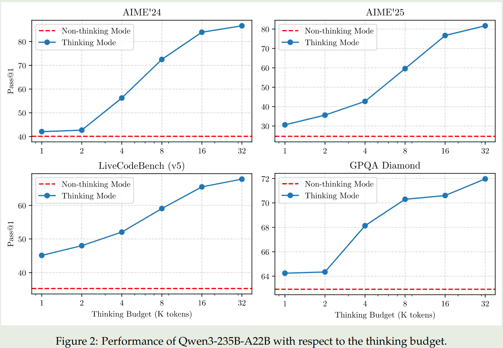
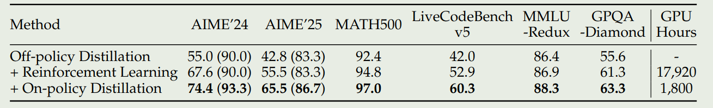
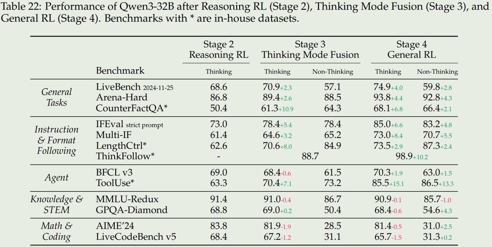

Qwen 在 2025 年 5 月发布了 Qwen3 系列大语言模型，Qwen3 包括 6 个 dense 模型和 2 个 MoE 模型，主要亮点为多语种能力，自适应快慢思考能力以及支持用户设置 thinking budget.

Qwen3 包括 6 个 dense 模型和 2 个 MoE 模型，其旗舰模型是一个 235B 的 MoE 模型，激活参数为 22B. Qwen3 系列的主要亮点如下:

1. 快慢思考融合，模型原生支持在 reasoning/non-reasoning 模式之间切换
2. Reasoning budget, 用户可以指定思考需要的 budget，来平衡 latency 和 performance
3. Distillation, 使用蒸馏的方法训练小模型，大幅度提高模型的表现
4. 多语种支持，相比于 Qwen2.5，Qwen3 支持 119 中语言和方言

## Method

### Model

Qwen3 的 dense 模型的架构与 [Qwen2.5](https://maosong.website/p/notes-on-qwen2.5/) 基本一致，包括使用 [GQA](https://maosong.website/p/notes-on-gqa/) , SwiGLU, RoPE, RMSNorm 和 pre-normalization. Qwen3 进一步移除了 QKV bias, 然 后加入了 [QK-Norm](https://maosong.website/p/notes-on-qk-norm/) 来提高训练的稳定性。

Qwen3 的 MoE 架构使用了 128 个专家，激活专家个数为 8 个。与 Qwen2.5-MoE 不同，Qwen3 里没有使用 shard experts。并且，Qwen3 加入了 global-batch load balancing loss,来提高 expert 的特化程度。

在 tokenizer 方面，Qwen 系列的 tokenizer 一直都是一样的，这也是 Qwen 系列领先的一点。

模型的具体参数如下两张表所示。

**MoE 架构**：上下文长度为 128K，128 个专家，每个 token 由 8 个专家负责处理

- Qwen3-235B-A22B, 总参数 235B，激活参数 22B
- Qwen3-30B-A3B, 总参数 30B，激活参数 3B

| Models | Layers | Heads (Q / KV) | # Experts (Total / Activated) | Context Length |
|--------|--------|----------------|-------------------------------|----------------|
| Qwen3-30B-A3B | 48 | 32 / 4 | 128 / 8 | 128K |
| Qwen3-235B-A22B | 94 | 64 / 4 | 128 / 8 | 128K |

**dense 架构**: Qwen3-32B, Qwen3-14B, Qwen3-8B, Qwen3-4B, Qwen3-1.7B, and Qwen3-0.6B

| Models | Layers | Heads (Q / KV) | Tie Embedding | Context Length |
|--------|--------|----------------|---------------|----------------|
| Qwen3-0.6B | 28 | 16 / 8 | Yes | 32K |
| Qwen3-1.7B | 28 | 16 / 8 | Yes | 32K |
| Qwen3-4B | 36 | 32 / 8 | Yes | 32K |
| Qwen3-8B | 36 | 32 / 8 | No | 128K |
| Qwen3-14B | 40 | 40 / 8 | No | 128K |
| Qwen3-32B | 64 | 64 / 8 | No | 128K |

### Pre-training

预训练数据一共包括 **36T token**，覆盖了 119 种语言。数据包括 coding, STEM, reasoning, books, multilingual texts 以及合成数据。

为了扩展训练数据，作者微调了 Qwen2.5-VL 来从 PDF 文档中提取文字，然后使用 Qwen2.5 来进行修正。最终收集到了几 T 的 token。另外，作者还使用 Qwen2.5, Qwen2.5-Math, Qwen2.5-Coder 来合成不同格式的数据，包括教科书，QA，指令以及代码片段等。最后，作者加入了更多的多语种数据。

作者从 educational value, fields, domains 以及 safety 对数据进行了标注。在数据混合时，Qwen3 在 instance 层面进行操作。

预训练阶段包括 3 个 stage：

1. General Stage (S1): 这一阶段的目的是让模型掌握世界知识，使用了 **30T** 的 token，模型上下文长度为 4096
2. Reasoning Stage (S2): 这一阶段的目的是提高模型的推理能力，使用了 **5T** 的高质量 token，模型上下文长度为 4096，数据包括 STEM, coding, reasoning 以及合成数据
3. Long Context Stage (S3): 这一阶段的目的是提升模型的长上下文能力，使用了**几百 B**的 token，模型上下文长度为 32768.训练时数据混合 75% 的长文档数据，25% 的短文本数据。作者将 RoPE 的 frequency 从 10000 提升到了 1,000,000. 作者还是用 YARN 以及 Dual Chunk Attention 来提高 inference 效率

对 pre-training 的 base model 进行评测之后，作者发现：

1. `Qwen3-235B-A22B-Base` 超过了其他 base 模型的表现，包括 `DeepSeek-V3 Base`, `Llama-4-Maverick Base`, `Qwen2.5-72B Base`
2. Qwen3-MoE 模型与相同大小的 Qwen3-Dense 模型参数相比，其只需要 1/5 的参数就可以达到相同的表现
3. Qwen3-MoE 模型与 2 倍参数量的 Qwen2.5-MoE 模型表现差不多
4. Qwen3-Dense 模型与大一个量级的 Qwen2.5-Dense 模型表现差不多

### Post-training

Qwen3 的 post-training 如下图所示：

对于旗舰模型 (`Qwen3-235B-A22B`, `Qwen3-32B`) 的训练，Qwen3 使用了一个四阶段的训练 pipeline。对于轻量化模型（其他模型）的训练，Qwen3 使用了知识蒸馏。

旗舰模型的训练包括四个阶段，前两个阶段用于提升模型的 reasoning 能力，后两个阶段用于将 reasoning 和 non-reasoning 能力结合起来。

#### Flashship Model

**Stage 1 (Long CoT Cold Start)**
这个阶段的目的是让模型掌握 reasoning 的基础。这个阶段使用了数学，代码，逻辑推理和通用的 STEM 相关问题。每个问题都有参考答案或者 test-cases. 作者使用了 Qwen2.5-72B 来过滤数据，包括 non-verifiable prompts 以及太简单的 prompt. 作者认为，这一阶段应该减少训练使用的样本和训练步数。

**Stage 2 (Reasoning RL)**
这个阶段的目的是提升模型的 reasoning 能力。该阶段使用了 3,995 条过滤得到的样本，算法为 GRPO. 作者发现提高 batch size 和每个 query 的 rollouts 可以提高模型的表现。作者通过调整模型的 entropy 来控制 exploration 和 exploitation 的平衡

**Stage 3 (Thinking Mode Fusion)**
这一阶段的目的是将 non-reasoning 能力加入到之前的 reasoning 模型中。作者在第二阶段的 model 上进行了 continual SFT，然后构建了一个 chat template 用于融合两种模式。

reasoning 数据来源于 stage1 的 rejection sampling 和 stage 2 的模型. non-reasoning 数据来源于各种任务，如 coding, math, multilingual 等。为了保证模型的多语种能力，作者还加入了一些翻译相关的数据。

作者还构建了一个 chat template, 用于统一数据格式。chat template 如下图所示

作者使用 `/think` 和 `/no_think` 来标记两种模式，对于 non-reasoning mode, 其 `<think></think>` 会被置空。模型在默认情况下处于 reasoning mode, 因此作者加入了一些不包含 `/think` 的 reasoning 数据。

作者发现，通过这种 Think mode fusion, 模型可以学会在 reasoning mode 和 non-reasoning mode 下进行回答，因此，模型也可以基于中间结果来给出最终的答案。 当超出 budget 之后，作者使用以下 Instruction

`Considering the limit time by the user. I have to give the solution based on the thinking directly now. \n</think>.\n\n`

来让模型直接终止思考二给出最终的答案。

**Stage 4 (General RL)**
这个阶段的目的是提升模型在不同场景下的能力。作者构建了一个 reward system 来覆盖 20 多种不同的任务。这些任务包括：instruction following, format following, preference alignment, agent ability 以及 abilities for specialized scenarios.

作者构建了三种不同的 rewards:

1. Rule-based rewards: 覆盖的任务包括 instruction following 和 format following
2. Model-based rewards: 作者使用 Qwen2.5-72B 来判别答案的正确性
3. Model-based Reward without reference answer: 作者训练一个 reward model 来给模型的回答进行打分

#### Lightweight Model

对于轻量化的模型，作者发现直接通过蒸馏可以有效提高学生模型的表现，并且训练效率也更高。蒸馏训练包括两个阶段：

1. Off-policy Distillation: 这个阶段的目的是让模型拥有基本的 reasoning 能力并且可以在不同的模式中进行切换。作者使用了教师模型的 reasoning 输出和 non-reasoning 输出来蒸馏学生模型
2. On-policy Distillation: 在这个阶段，学生模型生成回答，然后基于教师模型的输出，使用 KL-divergence 来更新学生模型的参数

## Evaluation

**Thinking budget**. 作者发现当我们提高 Thinking budget 之后，模型的表现是可以持续提升的。结果如下图

**Efficiency of distillation**. 作者发现使用 distillation 可以大幅度提高模型的表现和训练效率。下面是结果如下图所示

**Effects of Thinking mode fusion and RL** 作者进一步探究了三个 stage 对模型表现的影响，为此，作者构建了 in-house benchmarks 来评估模型的表现，这些 benchmarks 包括：

1. CounterFactrQA. 问题是不符合事实的，用于评估模型的幻觉
2. LengthCtrl. 有长度要求的写作任务，评估生成内容长度和给定长度之间的差别
3. ThinkFollow. 多轮对话，每轮对话随机插入 `/think` 和 `/no_think` flag，评估模型是否能在两种模式之间切换
4. Tooluse. 评估模型的工具调用能力

结果如下

结论如下：

1. Stage3 可以提高模型在两种 reasoning mode 切换的能力，并且 stage3 还可以提高模型的通用以及 instruction following 能力
2. Stage4 进一步提高模型在两种模式下的通用，instruction following 和 agent 能力
3. Stage3 和 stage4 并没有显著提高模型在 knowledge, STEM, math 和 coding 相关任务上的表现。甚至在一些竞赛如 AIME24 上模型的表现还有所下降，作者认为这是由于我们提升了模型的通用能力而导致其特化能力下降导致的，作者认为作为一个通用模型，这是可以接受的。

## Conclusion

在本文中，作者提出了 Qwen3 系列大语言模型，包括 6 个 Dense 模型和 2 个 MoE 模型。Qwen3 模型标志了一个新的 SOTA，其特点主要是快慢思考结合，thinking budget，以及多语种。

作者认为后续工作有以下几点：

1. 使用更高质量的数据来进行预训练
2. 优化模型架构和训练方式，提升模型的上下文
3. 提高针对 RL 的计算资源，来进一步提高模型的 agent 能力

## References

- [Arxiv](https://arxiv.org/abs/2505.09388)
- [Github](https://github.com/QwenLM/Qwen3)
