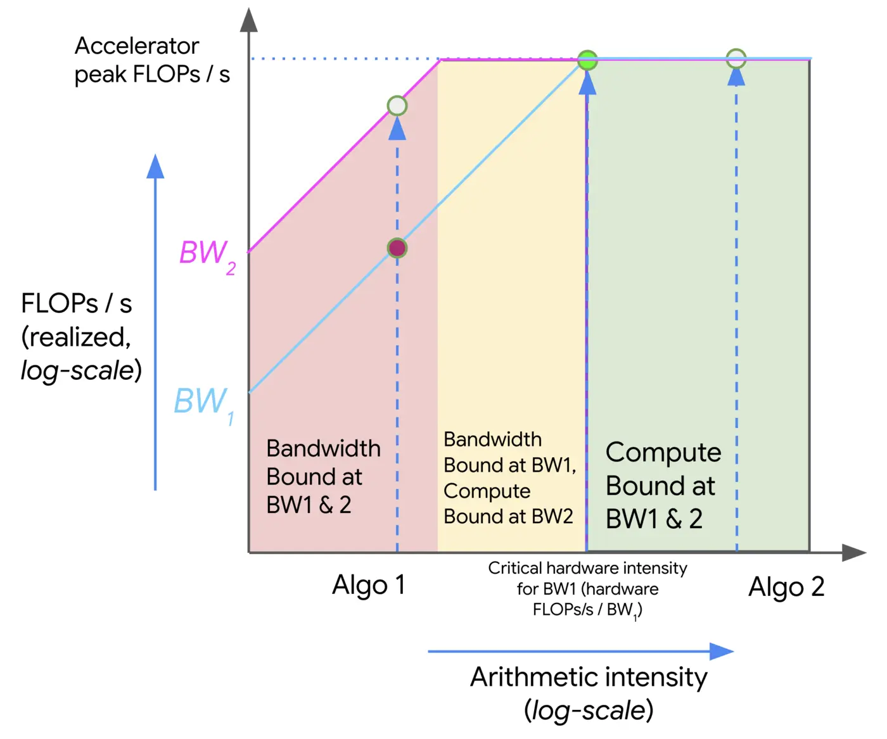

## Introduction

当我们在硬件上运行算法时，我们的算法效率取决于三个因素：

1. 计算机的计算效率，也就是每秒可执行的操作数 (OPs/s)
2. 数据移动效率，也就是每秒可传输的 bytes (bytes/s)
3. 需要的内存空间 (bytes)

通过分析这三个因素，我们可以给出一个计算的上下界

## Arithmetic Intensity

首先，我们要回答的第一个问题是，运行时间意味着什么？为什么实际运行时间比理想时间要更多？

容易知道，实际的运行时间由三部分组成

**Computation** 首先，运行时间与我们的算法和 GPU 设备相关，在深度学习中，我们的算法通常由 FLOPs 决定，GPU 决定了算法的运行时间：

$$
T_{\mathrm{math}}  =\frac{\text{Computation FLOPs}}{\text{Accelerator FLOPs/s}}
$$

**Communication within a chip** 其次，运行时间还受加载数据的速度的影响，在执行计算之前，我们需要先把数据从 HBM 加载到对应的 core 上，因此，加载数据的速度也会影响最终运行时间。我们将加载数据的速度称之为 **HBM bandwidth**.

**Communication between chips** 最后，当我们在多个 GPU 上运行模型时，我们还需要在 GPU 之间进行通信，相关的通信手段如下表所示 (intra node 代表同一台服务器，inter node 代表不同服务器)，我们将 GPU 的通信速度称之为 **Network bandwidth**.

|            | Method          | Data Path                   | BandWith          | Use cases                        |
| ---------- | --------------- | --------------------------- | ----------------- | -------------------------------- |
| Intra Node | NVLink          | Direct GPU-to-GPU           | 1.8 Tb/s (B200)   | TP                               |
|            | NVSwith         | all-to-all                  | 900 GB/s-1.8T b/s | full mesh sync in DGX            |
|            | GPUDirect P2P   | Direct over PCIe Bus        | 32-128 GB/s       | small clusters withou NVLink     |
|            | Shared Memory   | GPU -> CPU RAM -> GPU       | 20-50 GB/s        | Fallback when P2P is disabled    |
| Inter Node | InfiniBand      | GPU -> NIC -> IB Switch     | 200-400 Gbps      | Large scale LLM training         |
|            | GPU Direct RDMA | GPU -> NIC -> Network       | Same as NIC speed | Bypassing CPU for network sync   |
|            | RoCE (v2)       | RAME over Ethernet          | 100-400 Gbps      | Cost-effective Ethernet clusters |
|            | TCP/IP sockets  | GPU -> CPU -> Kernel -> Net | < 100 Gbps        | Standard networking              |

我们将 GPU 的通信 (intra-node 和 inter-node) 效率定义如下

$$
T_{\mathrm{comm}}  =\frac{\text{Communication Bytes}}{\text{Network/Memory Bandwith Bytes/s}}
$$

通常来说，我们可以通过计算 - 通信重叠来降低整体的运行时间，比如说 [DeepSeek-V3](DeepSeek-V3.md) 等模型提出的优化方法,  此时理论上的最小运行时间就是 $T_{\mathrm{math}}$ 和 $T_{\mathrm{comm}}$ 之间的最大值。另一方面，如果我们不做任何优化，则理论上最大运行时间就是 $T_{\mathrm{math}}$ 和 $T_{\mathrm{comm}}$ 之和。我们定义对应的 bound 如下

$$
\begin{aligned}
T_{lower} &= \max(T_{\mathrm{math}} ,T_{\mathrm{comm}} )\\
T_{upper} &=  T_{\mathrm{math}}+T_{\mathrm{comm}}
\end{aligned}
$$

注意到

$$
T_{upper} =  T_{\mathrm{math}}+T_{\mathrm{comm}} \leq 2\max(T_{\mathrm{math}} ,T_{\mathrm{comm}} )= 2T_{lower}
$$

也就是**最大运行时间最多为最小运行时间的两倍**。因此，我们一般直接优化 $T_{lower}$.

如果我们假设我们可以完全达到计算 - 通信重叠，则：

1. 当 $T_{\mathrm{math}}>T_{\mathrm{comm}}$ 时, 我们完全利用了 GPU 的资源，因为此时运行时间受硬件的计算效率约束，我们将其称之为 **compute bound**
2. 当 $T_{\mathrm{comm}}> T_{\mathrm{math}}$ 时, 此时运行时间受硬件的通信效率影响，GPU 的（计算）利用率不完全，我们将其称为 **communication bound**

为了评估一个算法时 compute bound 还是 communication bound, 我们可以使用 arithmetic intensity 来进行评估。我们先分析 single GPU 的情况，再分析 multi GPU 的情况

## Single GPU

**Arithmetic Intensity**
一个算法的 arithmetic intensity 定义为算法通信所需要的 FLOPs 和所需要的 bytes 之比：

$$
\text{Arithmetic Intensity} = \frac{\text{Computation FLOPs}}{\text{Communication Bytes}}
$$

arithmetic intensity 衡量了一个算法的 *FLOPs per bytes*, 当 arithmetic intensity 比较高时，说明 $T_{\mathrm{math}}>T_{\mathrm{comm}}$, 此时 GPU 的利用效率较高，反之则说明 GPU 出现了空置的情况。这两种情况的交叉点由 GPU 的 **Peak arithmetic intensity** 决定：

$$
\begin{aligned}
T_{\mathrm{math}}=T_{\mathrm{comm}} &\Leftrightarrow \frac{\text{Computation FLOPs}}{\text{Accelerator FLOPs/s}} = \frac{\text{Communication Bytes}}{\text{Bandwith Bytes/s}}\\
&\Leftrightarrow \frac{\text{Computation FLOPs}}{\text{Communication Bytes}} = \frac{\text{Accelerator FLOPs/s}}{\text{Bandwith Bytes/s}}\\
&\Leftrightarrow  \text{Intensity}(\text{Computation}) = \text{Intensity}(\text{GPU})
\end{aligned}
$$

这里 $\text{Intensity}(\text{GPU})$ 就是 GPU 达到 peak FLOPs 时对应的 arithmetic intensity.

不同 GPU Tensor Core 对应的 intensity 如下所示

| GPU  | Generation | bandwidth  | peak BF16  Tensor Core | intensity |
| ---- | ---------- | ---------- | ---------------------- | --------- |
| V100 | Volta      | 300 GB/s   | 125 TFLOPs/s           | 427       |
| A100 | Amper      | 1,935 GB/s | 156 TFLOPs/s           | 83        |
| H100 | Hopper     | 3.35TB/s   | 495 TFLOPs/s           | 147       |
| H200 | Hopper     | 4.8TB/s    | 495 TFLOPs/s           | 147       |
| B200 | Blackwell  | 576 TB/s   | 2250 TFLOPs/s          | 3.9       |

**Example**
假设我们使用 BF16 精度计算两个长度为 $N$ 的向量的内积，计算时的流程如下：

1. 从 HBM 中加载两个向量，通信量为 $2*2N$
2. 计算两个向量内积，需要 $N$ 次乘法和 $N-1$ 次加法
3. 将结果写回 HBM, 通信量为 $2$.

从而内积的 intensity 为

$$
\text{Intensity}(\text{dot product}) = \frac{\text{Total FLOPs}}{\text{Total Bytes}} = \frac{N+N-1}{2N+2N+2} = \frac{2N-1}{4N+2}\to \frac12
$$

也就是说，内积的 arithmetic intensity 最大为 $1/2$, 说明这是一个 memory-bound operation.

接下来，我们可以对 communication-bound 和 compute-bound 进行可视化，如下图所示

这里我们展示了两个算法 Algo 1 和 Algo 2 的 arithmetic intensity, 当 intensity 较小（小于硬件的 intensity）是，算法为 communication bound, 随着 intensity 增加，算法逐渐由 communication bound 过渡到 compute bound.  上面这个模型被称为 *Roofline model*, 其展示了算法计算效率与硬件之间的关系。

为了提高算法计算效率，我们可以通过提升算法的 arithmetic intensity 或者提高 memory bandwith.

**Example**

接下来我们来看一下矩阵计算的 intensity, 我们仍然假设在 BF16 精度下进行计算，假设输入矩阵为 $X\in\mathbb{R}^{b\times d}$ 以及 $Y\in\mathbb{R}^{d\times f}$ , 则输出为 $Z=XY\in\mathbb{R}^{b\times f}$. 计算过程为：

1. 从 HBM 中加载 $X$ 和 $Y$, 通信量为 $2df+2bd$ bytes
2. 计算矩阵乘法，计算量为 $2bdf$ FLOPs
3. 将结果写回到 HBM, 通信量为 $2bf$.

因此对应的 intensity 为

$$
\text{Intensity}(\text{MatMul}) = \frac{2bdf}{2bd+2df+2bf} = \frac{bfd}{bd+df+bf}
$$

假设 $b << \min(d,f)$ (在 LLM 中这个假设一般成立)，我们有

$$
\text{Intensity}(\text{MatMul}) = \frac{bfd}{bd+df+bf}\approx \frac{bdf}{df}=b
$$

因此我们就可以通过调整 $b$ (batch size) 来将算法从 memory-bound 转换为 compute bound.

## Multi GPU

在 multi GPU 的场景下，我们需要关注 GPU 之间通信的效率，一般来说，GPU 之间效率要远小于 GPU 内部通信效率，下面是不同 GPU 的内部通信（HBM bandwidth） 和 GPU 之间通信效率对比

| GPU  | Generation | HBM Type | HBM bandwidth | NVLink Generation | NVLink Bandwidth |
| ---- | ---------- | -------- | ------------- | ----------------- | ---------------- |
| V100 | Volta      | HBM2     | 300 GB/s      | 2.0               | 300 GB/s         |
| A100 | Amper      | HBM2e    | 1,935 GB/s    | 3.0               | 600 GB/s         |
| H100 | Hopper     | HBM3     | 3.35TB/s      | 4.0               | 900 GB/s         |
| H200 | Hopper     | HBM3e    | 4.8TB/s       | 4.0               | 900 GB/s         |
| B200 | Blackwell  | HBM3e    | 576 TB/s      | 5.0               | 1800 GB/s        |

**Example**
我们考虑一个分布式矩阵乘法，假设我们有两个 GPU, 计算精度为 BF16, 矩阵 $X\in\mathbb{R}^{b\times d}$ 以及 $Y\in\mathbb{R}^{d\times f}$ 分别被切分为相同大小存储在这两个 GPU 上，此时，计算流程为：

1. 在 GPU0/GPU1 上，分别从对应的 HBM 中加载 $X_1, Y_1$ 以及 $X_2, Y_2$
2. 在 GPU0/GPU1 上，分别计算对应的矩阵乘法 $A=X_1Y_1\in\mathbb{R}^{b\times f}$ 和 $B=X_2Y_2\in\mathbb{R}^{b\times f}$, 计算量为 $2bdf$.
3. 将 GPU1 的结果 $B$ 通信传输到 GPU0 上，通信量为 $2bf$.
4. 对结果进行相加，$Z=A+B$. 计算量为 $bf$.

此时，我们的 intensity 为 （注意这里计算时间除以 2 代表我们使用两张 GPU 因而效率翻倍了）

$$
\text{Intensity}(\text{MatMul (2-GPU)}) = \frac{2bfd/2}{2bf}= \frac{d}{2}
$$

可以看到，此时决定性因素在于 $d$ 而不是 $b$, 这对于我们实现并行算法至关重要
