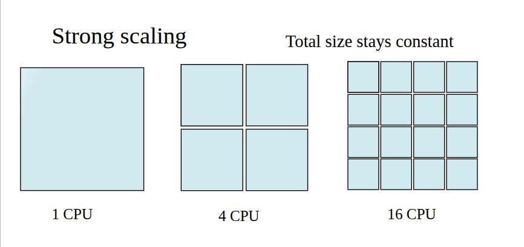
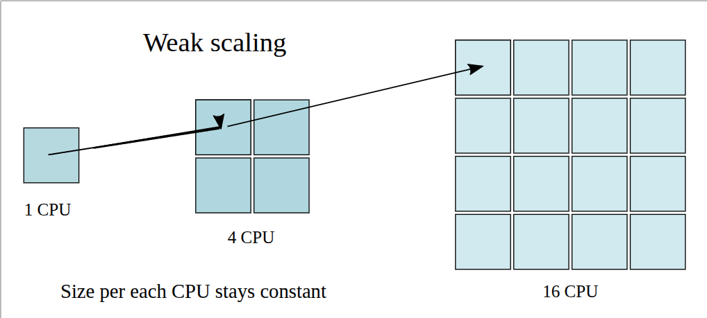

我们在本文中介绍 strong scaling 和 weak scaling

## Parallel Performance

给定一个算法，Parallel speedup 定义为在一个处理器上的运行时间 $T_S$ 和使用 $N$ 个处理器的运行时间 $T_P$ 之比，即

$$
\mathrm{speedup} = \frac{T_S}{T_P}
$$

直觉上，使用的处理器越多，我们所花费的时间越少，并且理想情况下，我们的时间应该随 $N$ 增加而线性减少。但实际上，我们并不能实现 $N$ 倍加速，因此，我们使用 efficiency 来评估我们的并行效率：

$$
\mathrm{efficiency} = \frac{\mathrm{speedup}}{N} = \frac{T_S}{T_P\cdot N}
$$

我们可以将 efficiency 理解为处理器做有用功的时间比例。

## Amdahl's Law

我们可以将一个算法或者程度的运行时间分为可并行部分以及不可并行部分，可并行部分可以运行在多个处理器上，而不可并行部分只能在一个处理器上运行。

我们将算法运行的时间分为并行部分 $P$ 和串行部分 $S$, 我们有

$$
T_s = T_SS+T_SP,\quad S+P=1
$$

当我们使用 $N$ 个处理器时，我们只能减少可并行部分的运行时间 $T_SP$， 并且由于我们使用了并行算法，我们还可能会产生额外的并行开销，记为 $K$, 则我们有

$$
T_p=T_SS+T_S\frac{P}{N}+K
$$

如果我们假设 $K<<T_S$, 则我们可以得到

$$
\mathrm{speedup} =  \frac{T_S}{T_P}=\frac{1}{S+\frac{P}{N}}
$$

这个等式称为 **Amdahl's law**. 它说明一个算法通过并行的 speedup 取决于能够被并行的那部分，即 $P$. 比如硕，如果 $P=0.5$, 则不论我们使用多少处理器，我们最多只能得到 $2$ 倍的加速。

注意到 Amdahl's law 假设我们的算法要处理的任务不随处理器数量而变化，这种 scaling 被称为 **strong scaling**.

## Gustafson's Law

但是在某些情况下，我们希望使用更多的处理器来处理更大的问题，这种 scaling 被称为 **weak scaling**,  其示意图如下所示

在这种场景下，随着 $N$ 增大，问题的规模增长，使得并行运行时间保持不变，此时在单个处理器场景下我们并行与串行部分的比例仍然不变，如果我们要处理 $N$ 倍工作量的问题，则我们的串行总时间为

$$
T_S=S+N\cdot P
$$

由于并行运行时间不变，我们可以将运行时间表示为

$$
T_P=S+P=1
$$

此时我们的 speedup 为

$$
\mathrm{speedup} = \frac{T_S}{T_P} = S+N\cdot P
$$

## References

- [Performance and Scalability](https://acenet-arc.github.io/ACENET_Summer_School_General/05-performance/index.html)
