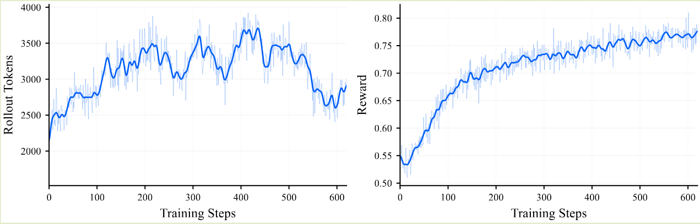

## Introduction

Step3-VL-10B 基于 [Perception Encoder](Perception%20Encoder.md) 和 [Qwen3](https://maosong.website/p/notes-on-qwen3/) 开发得到，模型在预训练阶段使用了 1.2T 多模态 token, 在 post training 阶段使用了 [PaCoRe](PaCoRe.md) 来提高模型的表现。作者强调关键改进在于高质量的预训练数据以及 RL 阶段的提升。

总的来说，感觉这是阶跃在多模态大模型领域的一次初步尝试，使用的技术路线都比较成熟。

## Method

### Architecture

Step3-VL-10B 包含 3 个模块：

- ViT: 基于 [Perception Encoder](Perception%20Encoder.md), 大小为 1.8B
- MLP: 基于 [DeepSeek-OCR](DeepSeek-OCR.md) 构建了一个两层的卷积层，将视觉 token 个数压缩为原来的 16 倍，对应代码如下

```python
# vision_encoder.py StepRoboticsVisionEncoder
self.vit_downsampler1 = nn.Conv2d(self.hidden_size, self.hidden_size * 2, kernel_size=3, stride=2, padding=1)
self.vit_downsampler2 = nn.Conv2d(self.hidden_size * 2, self.hidden_size * 4, kernel_size=3, stride=2, padding=1)

# modeling_step_vl.py _process_image_features
image_features = self.vision_model.vit_downsampler1(image_features)
image_features = self.vision_model.vit_downsampler2(image_features)
```

- LLM: 基于 [Qwen3](https://maosong.website/p/notes-on-qwen3/) 的 Qwen3-8B

对于输入的图片，Step3-VL-10B 采用了 LLaVA-OneVision 的做法，即将图片分为 $728\times 728$ 的 global thumnail 和 $504\times 504$ 的 local crop.

```python
# modeling_step_vl.py _process_image_input
image_features = self._process_image_features(image_features)
patch_image_features = self._process_image_features(
    patch_image_features) if patch_image_features is not None else None
```

### Pre-training

预训练的数据包括：

- knowledge: knowledge 数据又包括图文交错数据，image-text pairs 数据
- education: 15M K12, university, adult education 数据
- OCR: 又分为以下几类
  - image to text: 10M (real-world) + 30M (synthetic) 数据
  - image to code: 10M markup-based code (latex, matplotlib 等) 数据，15M 合成的 infographics 数据，5M reconstruction (tikz) 数据
  - document to text: 80M full-page 数据
  - document to code: HTML, markdown, latex 等数据，共 4M tables 和 100M formulas
- grounding and counting: 400M 数据
- VQA: 10M 数据
- GUI: 23M 数据

训练使用了 [AdamW](https://maosong.website/p/notes-on-adamw/) 优化器，一共训练了 1.2T token, batch size 为 8192, 上下文长度为 4096.

### Post-training

post-training 包括 SFT 和 RL 两个阶段

SFT 阶段又包括了两个小的 stage, 第一个 stage 用于提高模型的纯文本推理能力，纯文本数据和多模态数据的比例为 9:1,训练使用了 190B token; 第二个 stage 用于提高模型的多模态推理能力，纯文本数据和多模态数据的比例为 1:1. 训练使用了 36B token. SFT 训练时 batch size 为 32, 上下文长度为 128K

RL 阶段作者使用了 [PPO](PPO.md) 算法进行训练。reward function 也是分为 rule-based 和 model-based

在 RLVR 之后，作者还进行了 RLHF 来提高模型的对齐能力。

作者进一步使用了 [PaCoRe](PaCoRe.md) 来提高模型的并行推理能力。

## Experiments

Step3-VL-10B 的表现如下所示，可以看到在 10B 模型下面，Step3-VL-10B 的表现达到了 SOTA.


### Ablation Study

作者首先对比了 perception encoder 和 [DINOv3](DINOv3.md) 作为 vision encoder 的表现，结果如下表所示

|Vision Encoder|Perception BLINK|Perception Omni.|Perception MMVP|Perception OCRBench|General MMStar|General SVQA|General CCBench|General V*|General MMMU|General ReMI|
|---|---|---|---|---|---|---|---|---|---|---|
|DINOv3|42.35|43.31|28.00|57.60|41.43|22.18|56.32|34.55|46.56|24.50|
|PE-lang (Ours)|41.19|43.57|32.00|70.10|42.10|21.15|59.39|37.17|47.67|26.08|
|Δ|-1.16|+0.26|+4.00|+12.50|+0.67|-1.03|+3.07|+2.62|+1.11|+1.58|

作者分析认为由于 DINOv3 在纯视觉任务上进行训练，其表现不如使用语言监督信号的 perception encoder

作者还对比了 [AdamW](https://maosong.website/p/notes-on-adamw/) 和 [Muon](https://maosong.website/p/notes-on-moonlight/) 两种优化器，结果如下表所示

|Optimizer|Perception BLINK|Perception Omni.|Perception MMVP|Perception OCRBench|General MMStar|General SVQA|General CCBench|General V*|General MMMU|General ReMI|
|---|---|---|---|---|---|---|---|---|---|---|
|Muon|41.14|42.73|32.00|67.70|44.58|27.08|60.72|36.65|47.56|22.23|
|Adam (Ours)|40.72|44.94|29.33|71.10|41.77|20.60|60.13|39.27|46.11|25.00|
|Δ|-0.42|+2.21|-2.67|+3.40|-2.81|-6.48|-0.59|+2.62|-1.45|+2.77|

结果发现 Muon 可以解决大规模数据的噪声和不平衡问题，但是作者没有使用 Muon, 原因是 Muon 对参数的初始化比较敏感

作者还探究了 [Qwen3-VL](https://maosong.website/p/notes-on-qwen3-vl/) 使用的 Deepstack 的有效性，结果如下表所示

|Technique|Perception BLINK|Perception Omni.|Perception MMVP|Perception OCRBench|General MMStar|General SVQA|General CCBench|General V*|General MMMU|General ReMI|
|---|---|---|---|---|---|---|---|---|---|---|
|w/ DeepStack|40.72|42.92|26.00|71.20|43.31|28.66|63.94|36.65|47.44|26.96|
|w/o DeepStack (Ours)|40.61|43.57|31.33|69.30|42.44|25.20|62.80|38.22|47.78|26.96|
|Δ|-0.11|+0.65|+5.33|-1.90|-0.87|-3.46|-1.14|+1.57|+0.34|+0.00|

结果发现，尽管 DeepStack 可以加速训练，但是对于下游任务的提升非常有限，因此作者没有使用这个策略。

对于 RL 训练，作者发现随着训练进行，模型的 reward 稳步提升。但是其输出长度并不是单调提升的，如下图所示



作者分析认为这是由于模型在 reasoning 任务和 perception 任务上模型使用的模式不同导致的，reasoning 任务上模型使用更长的输出长度来解决问题，而对于 perception 任务，由于答案唯一且确定，因此模型通过多次探索后会逐渐收敛到唯一的确定性模式，直接给出对应的答案。因此，其输出长度会越来越短。作者针对这种现象给出了一个假设，即针对 perception 任务，我们的训练数据并不包含思考的过程，而这种数据则让模型只能选择直接回答或者瞎猜，而不是先思考再回答。为了解决这个问题，作者使用了 [PaCoRe](PaCoRe.md) 来让模型通过 proposal-then-refinement 策略来提高模型的思考长度

## Conclusion

作者介绍了 Step3-VL，一个 10B 的多模态大模型，作者详细介绍了模型的架构，训练以及数据。

作者认为后续工作有：

1. 通过 universal RL Scaling 提高 token efficiency:
    1. 将算力重心从 pre-training 迁移到 RL, 这一点与 [DeepSeek-V3.2](https://maosong.website/p/notes-on-deepseek-v3.2/) 一致
    2. 消除过度思考，提高模型的 reasoning efficiency
2. 提高模型理解物理世界的能力
    1. 构建 world model 帮助模型理解世界
    2. 使用 high-fidelity environment 来提高模型对于物理定律的理解能力
    3. 具身智能

## References

- [arxiv](http://arxiv.org/abs/2601.09668)
